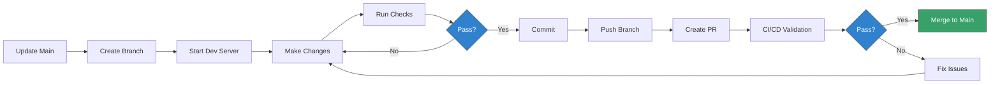
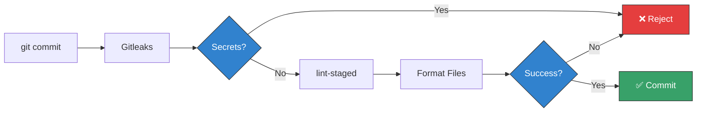

# Contributing to Team 4 Pro Coaching Website

Welcome to the contribution guide for the **Team 4 Pro Coaching** website.

> ℹ️ **Context**: This project is primarily developed by a solo maintainer for
> three professional fitness coaches. This document serves as a reference for
> **project continuity ("Bus Factor")**, ensuring that in the event of the
> primary maintainer's absence, another developer can pick up the work while
> maintaining the established quality and security standards.

## 📋 Table of Contents

- [Core Philosophy](#-core-philosophy)
- [Quick Links](#-quick-links)
- [Getting Started](#-getting-started)
- [Development Workflow](#-development-workflow)
- [Commit Convention](#-commit-convention)
- [Code Standards](#-code-standards)
- [Pull Request Process](#-pull-request-process)
- [Git Hooks](#-git-hooks)
- [Testing & Validation](#-testing--validation)
- [Content Contributions](#️-content-contributions)
- [Security Guidelines](#-security-guidelines)
- [Emergency Procedures](#-emergency-procedures)

---

## 🧠 Core Philosophy

Before contributing, please understand that this project values **reliability
over speed**. We enforce strict standards to ensure the site remains stable and
maintainable for years to come.

### Key Principles

1. **Strict Versioning**: Node.js and all dependencies are pinned to exact
   versions (see
   [ADR-0006](docs/adr/0006-enforce-strict-environment-and-dependency-pinning.md))
2. **Automated Quality**: If CI checks fail, the code cannot merge
3. **Defense in Depth**: Multiple validation layers (secrets, vulnerabilities,
   types) at different stages
4. **Documentation First**: All architectural decisions are recorded in ADRs
5. **Fail Fast**: Catch problems as early as possible in the development cycle

### Design Goals

- **Continuity**: Anyone should be able to take over without prior knowledge
- **Stability**: Builds must work identically in 6 months as they do today
- **Security**: High standards without enterprise costs (Shift-Left approach)
- **Performance**: Static HTML delivery for maximum speed and SEO

See [ARCHITECTURE.md](docs/ARCHITECTURE.md) for the complete architectural
reasoning.

---

## 🔗 Quick Links

Detailed technical instructions are organized into specialized guides:

| Document                                       | Purpose                                         |
| :--------------------------------------------- | :---------------------------------------------- |
| **[DEVELOPMENT.md](docs/DEVELOPMENT.md)**      | Setup, tooling, daily commands, troubleshooting |
| **[ARCHITECTURE.md](docs/ARCHITECTURE.md)**    | System design, technology choices, ADR index    |
| **[MAINTENANCE.md](docs/MAINTENANCE.md)**      | Deployment, secrets, dependency updates         |
| **[biome.md](docs/reference/biome.md)**        | Linting rules and code style enforcement        |
| **[renvovate.md](docs/reference/renovate.md)** | Automated dependency update strategy            |
| **[ADRs](docs/adr/)**                          | Complete log of architectural decisions         |

---

## 🚀 Getting Started

To ensure deterministic builds across all environments, you must set up your
local environment exactly as specified.

### Prerequisites

| Requirement | Version           | Verification     |
| :---------- | :---------------- | :--------------- |
| **Node.js** | `24.12.0` (exact) | `node --version` |
| **pnpm**    | `10.26.1` (exact) | `pnpm --version` |
| **Git**     | Latest            | `git --version`  |

> ⚠️ **Critical**: This project enforces **exact version matching** via `.nvmrc`
> and `package.json` engines. Installation will fail if versions don't match.
> See
> [ADR-0006](docs/adr/0006-enforce-strict-environment-and-dependency-pinning.md)
> for rationale.

### Installation Steps

1. **Install Node.js** (via nvm recommended):

   ```bash
   # Install nvm if not present
   curl -o- https://raw.githubusercontent.com/nvm-sh/nvm/v0.40.0/install.sh | bash

   # Clone repository
   git clone https://github.com/team4procoaching/website.git
   cd website

   # Install and activate correct Node version
   nvm install
   nvm use
   ```

2. **Enable pnpm** (via Corepack):

   ```bash
   # Enable Corepack (built into Node.js 16+)
   corepack enable

   # Verify pnpm is available
   pnpm --version  # Should output: 10.26.1
   ```

3. **Install dependencies**:

   ```bash
   pnpm install
   ```

4. **Setup Git hooks**:

   ```bash
   pnpm prepare
   ```

5. **Verify installation**:

   ```bash
   # Run full quality check suite
   pnpm check
   ```

   Expected output:

   ```
   ✔ TypeScript check passed
   ✔ Biome lint passed
   ✔ Biome format check passed
   ✔ Prettier format check passed
   ```

👉 **Full Setup Instructions**: See
[DEVELOPMENT.md - Prerequisites](docs/DEVELOPMENT.md#-prerequisites).

---

## 🔄 Development Workflow

We follow a strict feature-branch workflow. Direct pushes to `main` are blocked.

### Workflow Visualization



### Step-by-Step Process

#### 1. Create a Branch

Branches follow the naming convention: `<type>/<description>`

```bash
# Update main branch first
git checkout main
git pull origin main

# Create feature branch
git checkout -b feat/mobile-navigation
git checkout -b fix/contact-form-validation
git checkout -b docs/architecture-updates
git checkout -b content/new-yoga-article
```

#### 2. Start Development Server

```bash
# Start Astro dev server with hot reload
pnpm dev
```

**Access at:** `http://localhost:4321`

**Features:**

- ⚡ Instant hot reload for code changes
- 🎨 CSS changes apply without page refresh
- 🐛 TypeScript errors display in browser overlay

#### 3. Make Changes

**Project Structure:**

```
src/
├── components/     # Reusable UI components (.astro)
├── content/        # Content Collections (validated via Zod schemas)
├── layouts/        # Page templates
├── pages/          # File-based routing
└── styles/         # Global CSS
```

#### 4. Verify Changes Locally

While working, rely on automated tools to maintain code quality:

```bash
# Auto-fix linting and formatting issues
pnpm fix

# Run full quality suite (simulates CI)
pnpm check
```

**Individual Checks:**

```bash
pnpm typecheck      # TypeScript validation only
pnpm lint           # Biome linting only
pnpm format:check   # Format validation only
```

#### 5. Commit Changes

```bash
git add .
git commit -m "feat(navigation): add mobile hamburger menu"
```

**Automated Validation** (via Git hooks):

This project uses **Husky** hooks. Your commit will be automatically rejected
if:

- ❌ You have exposed secrets (Gitleaks detection)
- ❌ The commit message format is invalid (commitlint)
- ❌ The code formatting is incorrect (lint-staged)

See [Git Hooks](#-git-hooks) for details.

#### 6. Push and Create Pull Request

```bash
# Push to GitHub
git push origin feat/mobile-navigation

# Create PR via GitHub UI or CLI
gh pr create --title "feat(navigation): add mobile hamburger menu"
```

**Automated CI Checks Run:**

- Semgrep security scan
- Link validation
- GitGuardian secret detection
- Socket.dev supply chain security

#### 7. Review Deployment Preview

Every PR generates a **Netlify Deploy Preview** automatically. Use this URL to
verify changes in a production-like environment before merging.

**Preview URL Format:**

```
https://deploy-preview-{PR_NUMBER}--team4pro.netlify.app
```

---

## 📝 Commit Convention

We adhere strictly to
[Conventional Commits](https://www.conventionalcommits.org/) with **mandatory
scopes**. This enables automatic changelog generation and makes the Git history
readable.

### Format

```
<type>(<scope>): <description>

[optional body]

[optional footer]
```

### Types

| Type         | Purpose                  | Example                                        |
| :----------- | :----------------------- | :--------------------------------------------- |
| **feat**     | New feature              | `feat(contact): add email validation`          |
| **fix**      | Bug fix                  | `fix(navigation): resolve mobile menu z-index` |
| **docs**     | Documentation only       | `docs(readme): update installation steps`      |
| **style**    | Code style (not CSS)     | `style(footer): apply consistent spacing`      |
| **refactor** | Code restructuring       | `refactor(utils): extract date formatting`     |
| **perf**     | Performance improvements | `perf(images): implement lazy loading`         |
| **test**     | Test changes             | `test(contact): add form validation tests`     |
| **chore**    | Maintenance tasks        | `chore(deps): update astro to v5.16.6`         |
| **content**  | Content files changes    | `content(blog): add strength training article` |
| **ci**       | CI/CD changes            | `ci(semgrep): add new security rules`          |
| **build**    | Build system changes     | `build(netlify): optimize build cache`         |

### Scopes

Use descriptive scopes indicating which part of the codebase is affected:

**Component Scopes:**

- `navigation`, `footer`, `hero`, `testimonials`, `contact-form`, `layout`

**Content Scopes:**

- `blog`, `services`, `legal`, `about`

**System Scopes:**

- `config`, `deps`, `ci`, `styles`

### Examples

**✅ Valid Commits:**

```bash
feat(navigation): add mobile hamburger menu
fix(contact): resolve email validation regex issue
content(blog): add article about strength training
chore(deps): update astro to v5.16.6
docs(architecture): document deployment strategy
refactor(layout): extract header component
ci(semgrep): add SQL injection detection
```

**❌ Invalid Commits:**

```bash
added new menu              # Wrong format
Fixing bug                  # Wrong case
feat: add testimonials      # Missing scope
update styles               # Not descriptive
WIP                         # Not conventional
```

### Commit Message Validation

Commits are validated by **commitlint** via the `commit-msg` hook using the
`@commitlint/config-conventional` preset. Invalid commits are rejected before
entering Git history.

---

## 📐 Code Standards

We use a **Hybrid Formatting Strategy** (see
[ADR-0004](docs/adr/0004-use-hybrid-formatting-biome-and-prettier.md)) that
leverages the strengths of both Biome and Prettier.

### Formatting Tools

| Formatter    | File Types                      | Purpose                               |
| :----------- | :------------------------------ | :------------------------------------ |
| **Biome**    | `.js`, `.ts`, `.json`, `.css`   | Fast, modern formatter for code files |
| **Prettier** | `.astro`, `.md`, `.mdx`, `.yml` | Industry standard for content files   |

**Why both?** Domain separation prevents conflicts and leverages each tool's
strengths.

### Automated Formatting

**Format on Save** (VS Code):

- Configured automatically via `.vscode/settings.json`
- Biome handles code files
- Prettier handles content files

**Manual Formatting:**

```bash
# Format all files with correct tool
pnpm format

# Or use individual tools
pnpm format:biome    # JS/TS/JSON/CSS only
pnpm format:prettier # Astro/Markdown/YAML only

# Auto-fix linting + formatting
pnpm fix
```

### Linting

**Biome** enforces code quality rules for JavaScript and TypeScript:

```bash
# Check for issues
pnpm lint

# Auto-fix issues
pnpm lint:fix
```

**Key Rules Enabled:**

- **Recommended**: Standard best practices
- **Style**: Code consistency (prefer const, self-closing JSX)
- **Accessibility**: Enforced (except SVG title requirement)
- **Suspicious**: Warnings for potential bugs

For detailed rule explanations, see [biome.md](docs/reference/biome.md).

### TypeScript Standards

- **Strict Mode**: Enabled in `tsconfig.json`
- **No `any`**: Avoid using `any`; define interfaces or types explicitly
- **Props**: All Astro component props must be typed
- **Imports**: Automatically organized by Biome

**Type Checking:**

```bash
pnpm typecheck
```

---

## 🔀 Pull Request Process

### Requirements

Before a Pull Request can be merged, it must satisfy:

1. ✅ **All CI checks pass** (Semgrep, Links, GitGuardian, Socket.dev)
2. ✅ **Signed commits** (GPG or SSH signing)
3. ✅ **Conventional Commit format** (validated by commitlint)
4. ✅ **Clear PR description** (using the template)
5. ✅ **Successful build** (`pnpm build` completes without errors)
6. ✅ **Deploy preview verified** (Netlify preview works correctly)

### PR Title Format

Use the same format as commit messages:

```
<type>(<scope>): <description>

Examples:
feat(navigation): add mobile menu with hamburger icon
fix(footer): correct social media links alignment
docs(contributing): improve setup instructions
```

### PR Description Template

```markdown
## Description

Briefly explain the changes and motivation.

## Type of Change

- [ ] Bug fix (non-breaking change fixing an issue)
- [ ] New feature (non-breaking change adding functionality)
- [ ] Breaking change (fix or feature causing existing functionality to change)
- [ ] Documentation update
- [ ] Content update
- [ ] Code refactoring
- [ ] Performance improvement

## Implementation Details

How were these changes implemented? Any architectural decisions?

## Testing

- [ ] Local development server tested (`pnpm dev`)
- [ ] Production build tested (`pnpm build && pnpm preview`)
- [ ] Quality checks passed (`pnpm check`)
- [ ] Tested on mobile viewport (if UI changes)
- [ ] Deploy preview verified

## Screenshots (if applicable)

Add screenshots for visual changes.

## Related Documentation

- [ ] Updated relevant ADRs (if architectural change)
- [ ] Updated DEVELOPMENT.md (if workflow changes)
- [ ] Updated configuration docs (if config changes)

## Deployment Notes

Any special considerations for deployment? Breaking changes?

## Checklist

- [ ] Code follows project style guidelines
- [ ] Self-review completed
- [ ] Comments added for complex logic
- [ ] Documentation updated (if needed)
- [ ] No new warnings generated
- [ ] All CI checks pass
- [ ] Commits are signed
```

### Signed Commits

All commits must be signed for verification. Configure signing:

**Option 1: GPG Signing (Traditional)**

```bash
git config --global commit.gpgsign true
git config --global user.signingkey YOUR_GPG_KEY_ID
```

**Option 2: SSH Signing (Git 2.34+, Recommended)**

```bash
git config --global gpg.format ssh
git config --global user.signingkey ~/.ssh/id_ed25519.pub
```

**GitHub Setup:**
[Managing commit signature verification](https://docs.github.com/en/authentication/managing-commit-signature-verification)

### Deployment Previews

Every PR automatically triggers an isolated **Netlify Deploy Preview**. This is
a critical quality gate that:

- **Creates unique URL** for each PR (e.g.,
  `https://deploy-preview-15--team4pro.netlify.app`)
- **Runs identical build** as production (same Node version, dependencies)
- **Enables stakeholder review** (non-technical coaches can review changes)
- **Eliminates "works on my machine"** issues (runs in Netlify cloud
  environment)

Use the deploy preview to verify:

- Visual changes render correctly
- Links work as expected
- Forms function properly
- Mobile responsiveness is correct

### Merge Strategy

**Preferred Method**: Squash and merge

**Rationale:**

- Keeps `main` history clean and linear
- Preserves full development history in PR
- Final commit message matches PR title (Conventional Commits)

---

## 🪝 Git Hooks

This project uses [Husky](https://typicode.github.io/husky/) for automated Git
hooks that enforce quality standards before code reaches the repository.

### Pre-commit Hook

**Runs automatically before each commit:**



**Phase 1: Secret Scanning**

```bash
pnpm exec gitleaks protect --staged --verbose
```

**Detects:**

- API keys (AWS, GitHub, Stripe, etc.)
- Private keys and certificates
- Passwords in configuration files
- Database connection strings
- Cloud provider credentials

**Phase 2: Code Formatting** (via lint-staged)

```bash
pnpm exec lint-staged
```

**What gets formatted:**

| File Type                       | Tool     | Action                          |
| :------------------------------ | :------- | :------------------------------ |
| `.js`, `.ts`, `.jsx`, `.tsx`    | Biome    | Check + Format                  |
| `.json`, `.css`                 | Biome    | Format                          |
| `.astro`, `.md`, `.mdx`, `.yml` | Prettier | Format + Tailwind class sorting |

**Performance**: Only processes **staged files** (typically <1 second).

### Commit-msg Hook

**Validates commit message format:**

```bash
pnpm dlx commitlint --edit "$1"
```

**Validation Rules:**

- Must follow Conventional Commits format
- **Scope is mandatory** (unlike standard Conventional Commits)
- Type must be from approved list
- Description must be present and lowercase

### Bypassing Hooks (Discouraged)

In rare emergency situations:

```bash
git commit --no-verify -m "emergency: hotfix production issue"
```

> ⚠️ **Warning**: Skipped local checks will still run in CI/CD and may cause PR
> failures. Use only for urgent production fixes. Document the reason in the
> commit message.

---

## 🧪 Testing & Validation

### Manual Testing

**Development Testing:**

```bash
# Start dev server
pnpm dev

# Test in browser at http://localhost:4321
```

**Verify:**

- Responsive design (mobile, tablet, desktop)
- All navigation links work
- Forms submit correctly
- Images load properly

**Production Build Testing:**

```bash
# Build production bundle
pnpm build

# Preview production build locally
pnpm preview

# Access at http://localhost:4321
```

### Automated Quality Checks

Run the full CI/CD validation suite locally:

```bash
# All checks (same as CI/CD)
pnpm check
```

**Individual Checks:**

```bash
pnpm typecheck      # TypeScript validation
pnpm lint           # Biome linting
pnpm format:check   # Format validation
```

**Auto-fix Issues:**

```bash
pnpm fix            # Fix linting + formatting
```

### Cross-Browser Testing

Test in multiple browsers before merging:

- Chrome/Edge (Chromium)
- Firefox
- Safari (if on macOS)

---

## ✍️ Content Contributions

Content is managed via **Astro Content Collections** in `src/content/`. Each
collection has strict type validation via Zod schemas.

### Content Structure

```
src/content/
├── blog/           # Blog posts
├── services/       # Service offerings
└── config.ts       # Zod schemas for validation
```

### Adding Content

1. **Create a new Markdown file** in the appropriate collection:

   ```markdown
   ---
   title: '5 Essential Strength Training Tips'
   date: 2024-01-15
   author: 'Coach Name'
   description: 'Learn the fundamentals of strength training'
   ---

   Your content here...
   ```

2. **Ensure all required fields** are present (defined in `config.ts`)

3. **Place images** in `src/assets/` and reference them:

   ```markdown
   
   ```

4. **Run quality checks**:

   ```bash
   pnpm check
   ```

   If you miss a required field, the build will fail with a helpful error
   message describing exactly what is missing.

### Content Guidelines

- **Frontmatter**: All fields defined in Zod schema are mandatory
- **Images**: Use descriptive alt text for accessibility
- **Links**: Use relative paths for internal links
- **Formatting**: Follow Markdown best practices

---

## 🔒 Security Guidelines

### Never Commit Secrets

**Prohibited:**

- API keys
- Passwords
- Private keys
- OAuth tokens
- Database credentials

**Use Environment Variables:**

```typescript
// ❌ Bad
const API_KEY = 'hardcoded-secret-value';

// ✅ Good
const API_KEY = import.meta.env.PUBLIC_API_KEY;
```

**Astro Environment Variables:**

```bash
# .env (never commit this file, it's in .gitignore)
PUBLIC_API_KEY=your-key-here
```

See
[Astro Environment Variables](https://docs.astro.build/en/guides/environment-variables/)
for details.

### Dependency Security

**Automated Scanning:**

- **Socket.dev**: Detects malicious packages and supply chain attacks
- **GitGuardian**: Scans for secrets in Git history
- **Renovate**: Creates security patch PRs immediately (ignores schedules)

**Before Adding Dependencies:**

```bash
# Check package security
pnpm audit

# Review package on npm
https://www.npmjs.com/package/{package-name}
```

**Red Flags:**

- Recently created packages (<6 months old)
- No GitHub repository
- Very few downloads
- Security advisories

### Reporting Security Issues

**Do not open public GitHub Issues for security vulnerabilities.**

**Use GitHub Security Advisories:**

1. Navigate to repository → Security tab
2. Click "Report a vulnerability"
3. Provide detailed description

---

## 🚨 Emergency Procedures

### Production is Down

**Immediate Actions:**

1. **Check Netlify Status**: https://www.netlifystatus.com/

2. **Check Recent Deployments**:
   - Netlify Dashboard → Deploys
   - Identify failing deployment

3. **Rollback**:
   - Netlify Dashboard → Deploys → Find last successful
   - Click "Publish deploy"

4. **Revert Commit** (if needed):
   ```bash
   git log --oneline -10
   git revert <commit-hash>
   git push origin main
   ```

### Build Failures

**Diagnostic Steps:**

1. Check build logs in Netlify Dashboard
2. Test locally:
   ```bash
   rm -rf node_modules pnpm-lock.yaml
   pnpm install --frozen-lockfile
   pnpm build
   ```

**Common Causes:**

- TypeScript errors
- Missing dependencies
- Invalid environment variables
- Node version mismatch

### Accessing Critical Systems

**If you need access:**

1. **Netlify**: Contact organization owner
2. **GitHub**: Request repository access
3. **DNS**: Check MAINTENANCE.md for registrar info
4. **Secrets**: See MAINTENANCE.md for secret management

For detailed emergency procedures, see [MAINTENANCE.md](docs/MAINTENANCE.md).

---

## ❓ Questions?

**Getting Started:**

1. Read **[ARCHITECTURE.md](docs/ARCHITECTURE.md)** for the big picture
2. Follow **[DEVELOPMENT.md](docs/DEVELOPMENT.md)** to get the machine running
3. Check **[MAINTENANCE.md](docs/MAINTENANCE.md)** for operational procedures

**For Issues:**

1. Search existing GitHub Issues
2. Check relevant documentation (links above)
3. Create a new GitHub Issue with `question` label

**For Urgent Problems:**

Follow the [Emergency Procedures](#-emergency-procedures) section above.

---

**Final Note**: This project prioritizes **sustainability** and
**handoff-readiness**. Every tool, process, and documentation decision supports
continuity. When in doubt, choose the approach that is most maintainable by
someone unfamiliar with the project.
