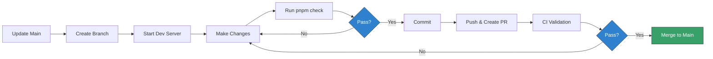

# Contributing to Team 4 Pro Coaching Website

Welcome to the contribution guide for the **Team 4 Pro Coaching** website.

> ℹ️ **Context**: This project is primarily developed by a solo maintainer for
> three professional fitness coaches. This document ensures **project continuity
> ("Bus Factor")** — another developer can take over while maintaining quality
> and security standards.

## 📋 Table of Contents

- [Core Philosophy](#-core-philosophy)
- [Getting Started](#-getting-started)
- [Development Workflow](#-development-workflow)
- [Commit Convention](#-commit-convention)
- [Code Standards](#-code-standards)
- [Pull Request Process](#-pull-request-process)
- [Content Contributions](#️-content-contributions)
- [Security Guidelines](#-security-guidelines)

---

## 🧠 Core Philosophy

This project values **reliability over speed**. We enforce strict standards to
ensure the site remains stable and maintainable for years.

### Design Goals

| Goal            | Implementation                                              |
| :-------------- | :---------------------------------------------------------- |
| **Continuity**  | Anyone can take over without prior knowledge (ADRs, docs)   |
| **Stability**   | Strict version pinning ensures identical builds over time   |
| **Security**    | Shift-Left approach with multiple automated scanning layers |
| **Performance** | Static HTML delivery for maximum speed and SEO              |

### Key Principles

1. **Strict Versioning**: Exact Node.js and dependency versions
   ([ADR-0006](docs/adr/0006-enforce-strict-environment-and-dependency-pinning.md))
2. **Automated Quality**: CI failures block merging
3. **Defense in Depth**: Secrets, vulnerabilities, and types checked at multiple
   stages
4. **Documentation First**: All architectural decisions recorded in ADRs
5. **Fail Fast**: Catch problems early via pre-commit hooks and CI

See [ARCHITECTURE.md](docs/ARCHITECTURE.md) for complete rationale.

---

## 🚀 Getting Started

For complete setup instructions, see
**[DEVELOPMENT.md](docs/DEVELOPMENT.md#-initial-setup)**.

**Quick verification after setup**:

```bash
pnpm check
```

If all checks pass without errors, your environment is correctly configured.

---

## 🔄 Development Workflow

We follow a strict **feature-branch workflow**. Direct pushes to `main` are
blocked.



### Branch Naming

```bash
<type>/<description>

# Examples:
git checkout -b feat/mobile-navigation
git checkout -b fix/contact-form-validation
git checkout -b docs/architecture-updates
git checkout -b content/new-yoga-article
```

### Daily Commands

```bash
pnpm dev          # Start dev server (localhost:4321)
pnpm check        # Validate before commit (same as CI)
pnpm fix          # Auto-fix linting and formatting
```

Full command reference:
[DEVELOPMENT.md → Available Scripts](docs/DEVELOPMENT.md#-available-scripts)

---

## 📝 Commit Convention

We use [Conventional Commits](https://www.conventionalcommits.org/) with
**mandatory scopes**.

### Format

```
<type>(<scope>): <description>

[optional body]

[optional footer]
```

### Types

| Type         | Purpose                  | Example                                        |
| :----------- | :----------------------- | :--------------------------------------------- |
| **feat**     | New feature              | `feat(contact): add email validation`          |
| **fix**      | Bug fix                  | `fix(navigation): resolve mobile menu z-index` |
| **docs**     | Documentation only       | `docs(readme): update installation steps`      |
| **style**    | Code style (not CSS)     | `style(footer): apply consistent spacing`      |
| **refactor** | Code restructuring       | `refactor(utils): extract date formatting`     |
| **perf**     | Performance improvements | `perf(images): implement lazy loading`         |
| **test**     | Test changes             | `test(contact): add form validation tests`     |
| **chore**    | Maintenance tasks        | `chore(deps): update astro to v6.1.1`          |
| **content**  | Content file changes     | `content(blog): add strength training article` |
| **ci**       | CI/CD changes            | `ci(semgrep): add new security rules`          |
| **build**    | Build system changes     | `build(netlify): optimize build cache`         |

### Scopes

**Component**: `navigation`, `footer`, `hero`, `testimonials`, `contact-form`,
`layout`

**Content**: `blog`, `services`, `legal`, `about`

**System**: `config`, `deps`, `ci`, `styles`

### Examples

```bash
# ✅ Valid
feat(navigation): add mobile hamburger menu
fix(contact): resolve email validation regex issue
chore(deps): update astro to v6.1.1
docs(architecture): document deployment strategy

# ❌ Invalid
added new menu              # Wrong format
Fixing bug                  # Wrong case
feat: add testimonials      # Missing scope
WIP                         # Not conventional
```

**Enforcement**: Commits are validated by **commitlint** via the `commit-msg`
Git hook. Invalid commits are rejected.

---

## 📐 Code Standards

We use a **Hybrid Formatting Strategy**
([ADR-0004](docs/adr/0004-use-hybrid-formatting-biome-and-prettier.md)).

For project-specific coding patterns, naming conventions, and export style, see
**[CONVENTIONS.md](docs/CONVENTIONS.md)**.

### Tool Responsibility

| Tool         | File Types                      | Purpose                             |
| :----------- | :------------------------------ | :---------------------------------- |
| **Biome**    | `.js`, `.ts`, `.json`, `.css`   | Linting + Formatting for code files |
| **Prettier** | `.astro`, `.md`, `.mdx`, `.yml` | Formatting for content files        |

### Automated Formatting

- **On Save**: VS Code auto-formats via `.vscode/settings.json`
- **On Commit**: `lint-staged` formats staged files
- **Manual**: `pnpm fix` fixes all issues

### Key Linting Rules (Biome)

- **Recommended**: Standard best practices
- **Style**: Code consistency (prefer const, self-closing JSX)
- **Accessibility**: Enforced (except SVG title requirement)
- **Suspicious**: Warnings for potential bugs

For detailed rule explanations, see [biome.md](docs/reference/biome.md).

### TypeScript Standards

- **Strict Mode**: Enabled
- **No `any`**: Define types explicitly
- **Props**: Use `type` (not `interface`) for all component props
  ([ADR-0009](docs/adr/0009-use-types-for-component-props.md))
- **Images**: Use `ImageSource` type and `SmartImage` component for content
  images; plain `` only for small decorative images (≤ 64px)
  ([ADR-0010](docs/adr/0010-use-astro-image-component-consistently.md))

---

## 🔀 Pull Request Process

### Requirements

Before merging, a PR must satisfy:

1. ✅ All CI checks pass (Semgrep, Links, GitGuardian, Socket.dev)
2. ✅ Signed commits (GPG or SSH)
3. ✅ Conventional Commit format
4. ✅ Successful build (`pnpm build`)
5. ✅ Deploy preview verified

### PR Title Format

Same as commit messages:

```
<type>(<scope>): <description>

# Examples:
feat(navigation): add mobile menu with hamburger icon
fix(footer): correct social media links alignment
```

### PR Description Template

```markdown
## Description

Briefly explain the changes and motivation.

## Type of Change

- [ ] Bug fix
- [ ] New feature
- [ ] Breaking change
- [ ] Documentation update
- [ ] Content update

## Testing

- [ ] `pnpm dev` tested locally
- [ ] `pnpm build && pnpm preview` tested
- [ ] `pnpm check` passes
- [ ] Deploy preview verified

## Screenshots (if applicable)

Add screenshots for visual changes.
```

### Signed Commits

All commits must be signed. Configure:

```bash
# Option 1: GPG
git config --global commit.gpgsign true
git config --global user.signingkey YOUR_GPG_KEY_ID

# Option 2: SSH (Git 2.34+, recommended)
git config --global gpg.format ssh
git config --global user.signingkey ~/.ssh/id_ed25519.pub
```

### Deployment Previews

Every PR triggers an isolated **Netlify Deploy Preview**:

- Unique URL: `https://deploy-preview-{PR}--team4pro.netlify.app`
- Identical build as production
- Enables stakeholder review before merge

### Merge Strategy

**Use**: Squash and merge

**Rationale**: Keeps `main` history clean; final commit matches PR title.

---

## ✍️ Content Contributions

### Where does data live?

All data lives in **TypeScript data modules** (`src/data/`). Each domain has
its own file with typed data, display labels, and section configuration.
Currently: services, coaches, success stories, testimonials, navigation,
FAQ, stats, USPs, quiz.

See [ADR-0011](docs/adr/0011-content-format-decision-framework.md) for the
decision framework. Content Collections and MDX are not currently in use but
may be reintroduced for entries with rich body text and detail pages.

### Adding data entries

1. **Find the correct data module** in `src/data/` (e.g., `successStories.ts`,
   `coaches.ts`)

2. **Add your entry** to the data array, following the existing type structure

3. **Validate**:

   ```bash
   pnpm check
   ```

   TypeScript will flag missing or mistyped fields at compile time.

### Guidelines

- **Images**: Use descriptive alt text for accessibility
- **Links**: Use relative paths for internal links

---

## 🔒 Security Guidelines

### Never Commit Secrets

**Prohibited**: API keys, passwords, private keys, OAuth tokens, database
credentials.

**Use Environment Variables**:

```typescript
// ❌ Bad
const API_KEY = 'hardcoded-secret-value';

// ✅ Good
const API_KEY = import.meta.env.PUBLIC_API_KEY;
```

### Before Adding Dependencies

```bash
pnpm audit
```

**Red Flags**:

- Recently created packages (<6 months)
- No GitHub repository
- Very few downloads
- Security advisories

### Reporting Security Issues

**Do not open public GitHub Issues.**

Use GitHub Security Advisories: Repository → Security → Report a vulnerability.

---

## 🚨 Emergency Procedures

For production emergencies, see
[MAINTENANCE.md → Emergency Procedures](docs/MAINTENANCE.md#-emergency-procedures).

**Quick Rollback**:

1. Netlify Dashboard → Deploys
2. Find last successful deploy
3. Click "Publish deploy"

---

## ❓ Questions?

1. **Technical setup**: [DEVELOPMENT.md](docs/DEVELOPMENT.md)
2. **Architecture decisions**: [ARCHITECTURE.md](docs/ARCHITECTURE.md)
3. **Operational procedures**: [MAINTENANCE.md](docs/MAINTENANCE.md)
4. **Specific questions**: Create GitHub Issue with `question` label
