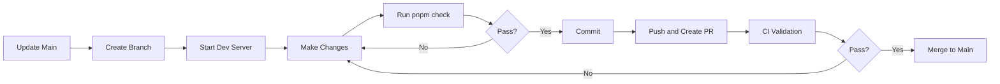

# Contributing to Team 4 Pro Coaching Website

> This project is primarily developed by a solo maintainer for three
> professional fitness coaches. This document ensures project continuity ("Bus
> Factor") — another developer can take over while maintaining quality and
> security standards.

---

## Non-Negotiable Rules

Every change to this project must satisfy all three:

1. **Conventional Commits with scope** — validated by commitlint hook
   ([reference](docs/reference/commitlint.md))
2. **Signed commits** (GPG or SSH) — unsigned commits are rejected. See
   [DEVELOPMENT.md](docs/DEVELOPMENT.md) for setup.
3. **All CI checks pass** — merging is blocked until green

All work is submitted as a PR against `main`. Direct pushes are blocked.

---

## Development Workflow

We follow a strict feature-branch workflow. Direct pushes to `main` are blocked.
For new features, start by filling out the
[Feature Template](docs/FEATURE_TEMPLATE.md) to clarify scope, affected pages,
and data flows before writing code.



### Branch Naming

```bash
<type>/<description>

# Examples:
git checkout -b feat/mobile-navigation
git checkout -b fix/contact-form-validation
git checkout -b docs/architecture-updates
git checkout -b content/new-yoga-article
```

---

## Commit Convention

We use [Conventional Commits](https://www.conventionalcommits.org/) with
mandatory scopes. Commits are validated by commitlint via the `commit-msg` Git
hook. For technical configuration details, see
[reference/commitlint.md](docs/reference/commitlint.md).

### Format

```
<type>(<scope>): <description>

[optional body]

[optional footer]
```

### Types

| Type         | Purpose                  | Example                                        |
| :----------- | :----------------------- | :--------------------------------------------- |
| **feat**     | New feature              | `feat(contact): add email validation`          |
| **fix**      | Bug fix                  | `fix(navigation): resolve mobile menu z-index` |
| **docs**     | Documentation only       | `docs(readme): update installation steps`      |
| **style**    | Code style (not CSS)     | `style(footer): apply consistent spacing`      |
| **refactor** | Code restructuring       | `refactor(utils): extract date formatting`     |
| **perf**     | Performance improvements | `perf(images): implement lazy loading`         |
| **test**     | Test changes             | `test(contact): add form validation tests`     |
| **chore**    | Maintenance tasks        | `chore(deps): update astro to v6.1.1`          |
| **content**  | Content file changes     | `content(blog): add strength training article` |
| **ci**       | CI/CD changes            | `ci(semgrep): add new security rules`          |
| **build**    | Build system changes     | `build(netlify): optimize build cache`         |

### Scopes

Scopes are **not enforced by commitlint** — new scopes can be introduced without
config changes. The examples below illustrate the naming pattern, not a fixed
list:

**Component**: `navigation`, `footer`, `hero`, `contact-form`, `layout`, `quiz`

**Content**: `services`, `legal`, `coaches`, `success-stories`

**System**: `config`, `deps`, `ci`, `styles`

---

## Code Standards

For coding patterns, naming conventions, and export style, see
[CONVENTIONS.md](docs/CONVENTIONS.md).

For environment setup, tool configuration, and Git signing, see
[DEVELOPMENT.md](docs/DEVELOPMENT.md).

---

## Pull Request Process

### Requirements

Before merging, a PR must satisfy:

1. All CI checks pass (Quality, Tests, Semgrep, Links, GitGuardian, Socket.dev)
2. Signed commits (GPG or SSH) — see [DEVELOPMENT.md](docs/DEVELOPMENT.md) for
   setup
3. Conventional Commit format
4. Successful build (`pnpm build`)
5. Deploy preview verified

### PR Title Format

Same as commit messages: `<type>(<scope>): <description>`

### PR Description Template

```markdown
## Description

Briefly explain the changes and motivation.

## Type of Change

- [ ] Bug fix
- [ ] New feature
- [ ] Breaking change
- [ ] Documentation update
- [ ] Content update

## Testing

- [ ] `pnpm dev` tested locally
- [ ] `pnpm build && pnpm preview` tested
- [ ] `pnpm check` passes
- [ ] Deploy preview verified

## Screenshots (if applicable)

Add screenshots for visual changes.
```

### Deploy Previews

Every PR triggers an isolated Netlify Deploy Preview with a unique URL. Same
build process as production. Non-technical team members can review before merge.

### Merge Strategy

Squash and merge. Keeps `main` history clean; final commit matches PR title.

---

## Content Contributions

All data lives in TypeScript data modules (`src/data/`). Each domain has its own
file with typed data, display labels, and section configuration. See
[ADR-0011](docs/adr/0011-content-format-decision-framework.md) for the decision
framework.

To add a data entry: find the correct module in `src/data/`, add the entry
following the existing type structure, then run `pnpm check`. TypeScript will
flag missing or mistyped fields at compile time.

---

## Security Guidelines

### Never Commit Secrets

Use environment variables for API keys, passwords, private keys, OAuth tokens,
and database credentials:

```typescript
// Bad
const API_KEY = 'hardcoded-secret-value';

// Good
const API_KEY = import.meta.env.PUBLIC_API_KEY;
```

### Before Adding Dependencies

Run `pnpm audit`. Red flags: recently created packages (less than 6 months), no
GitHub repository, very few downloads, security advisories.

### Reporting Security Issues

Do not open public GitHub Issues. Use GitHub Security Advisories: Repository →
Security → Report a vulnerability.

---

## Emergency Procedures

For production emergencies, see [MAINTENANCE.md](docs/MAINTENANCE.md).

Quick rollback: Netlify Dashboard → Deploys → find last successful deploy →
"Publish deploy."
