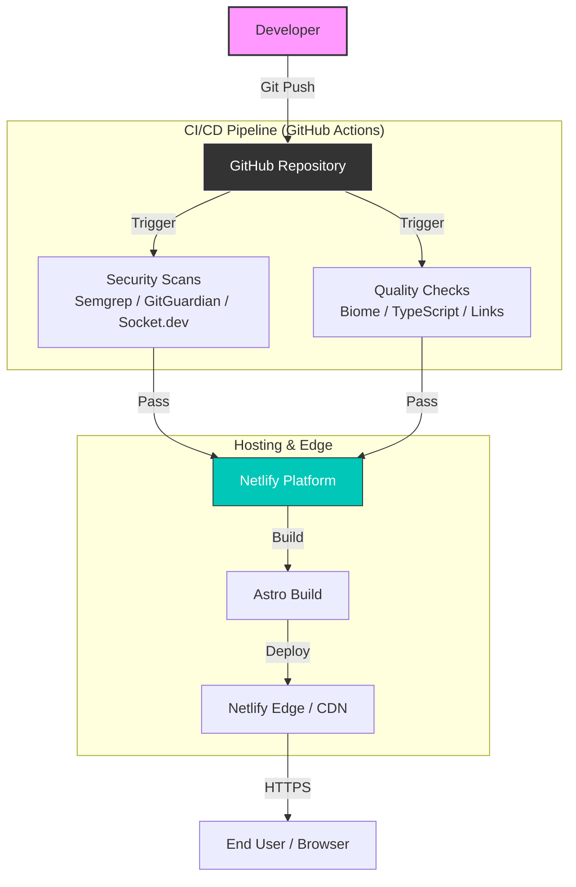
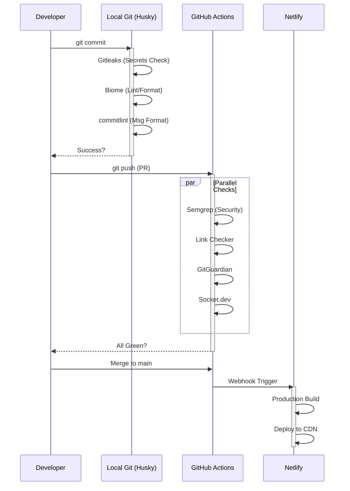

# Architecture Overview

This document provides a high-level overview of the **Team 4 Pro Coaching**
website's technical architecture, key decisions, and the rationale behind tool
choices.

It is designed to give new developers a complete understanding of how the system
works, is secured, and deployed.

## 📋 Table of Contents

- [Project Goals](#-project-goals)
- [System Context Diagram](#-system-context-diagram)
- [Project Structure](#-project-structure)
- [Technical Stack](#-technical-stack)
- [Architecture Decisions](#-architecture-decisions)
- [Development Workflow](#-development-workflow)
- [Data & Content Architecture](#-data--content-architecture)
- [Security & Quality](#-security--quality)
- [Deployment Architecture](#-deployment-architecture)
- [Design Principles](#-design-principles)
- [Future Roadmap](#-future-roadmap)
- [Related Documentation](#-related-documentation)
- [Learning Resources](#-learning-resources)

---

## 🎯 Project Goals

### Primary Objectives

1. **Continuity ("Bus Factor")**: The project must be maintainable by others if
   the primary developer is unavailable. Documentation and standard tooling are
   prioritized over "clever" code.
2. **Stability**: The project must resist "bit rot". Dependencies are strictly
   pinned to ensure the build works exactly the same way in 6 months as it does
   today.
3. **Security**: High security standards (Shift-Left) without enterprise costs.
4. **Performance**: Static HTML delivery for maximum speed and SEO.
5. **Cost Efficiency**: Minimized fixed costs

### Target Audience

- **End Users**: Fitness coaching clients
- **Content Editors**: Coaches (Non-technical content management)
- **Maintainers**: Developers ensuring the system stays online and secure

---

## 🧩 System Context Diagram

This high-level view shows how the pieces fit together:



---

## 📂 Project Structure

A quick map of the most important directories and configuration files:

```text
/
├── .github/             # CI/CD pipelines & templates
├── .husky/              # Git hooks (pre-commit automation)
├──                 # Project documentation
├── public/              # Static assets (favicons, robots.txt)
├── src/
│   ├── components/      # UI Components (.astro)
│   ├── content/         # Database-as-Code (Markdown/Zod schemas)
│   ├── layouts/         # Page wrappers
│   └── pages/           # Route definitions
├── .npmrc               # Strict package manager configuration
├── .nvmrc               # Node.js version definition
├── astro.config.mjs     # Astro framework configuration
├── biome.json           # Linter/Formatter rules
├── netlify.toml         # Netlify deployment settings
├── package.json         # Dependencies & scripts
└── pnpm-workspace.yaml  # Monorepo/Workspace definition
```

---

## 🏗️ Technical Stack

### Core Technologies

| Technology     | Purpose               | Why Chosen                                                                                     |
| -------------- | --------------------- | ---------------------------------------------------------------------------------------------- |
| **Astro.js**   | Static Site Generator | Fast, modern, excellent DX ([ADR-0001](./adr/0001-use-astro-js.md))                            |
| **pnpm**       | Package Manager       | Fast, disk-efficient, strict dependencies ([ADR-0002](./adr/0002-use-pnpm-package-manager.md)) |
| **TypeScript** | Type Safety           | Catch errors early, better IDE support                                                         |
| **Netlify**    | Hosting & Deployment  | Free tier, excellent DX, automatic deployments                                                 |

### Code Quality Stack

| Tool            | Purpose                    | Why Chosen                                                                                    |
| --------------- | -------------------------- | --------------------------------------------------------------------------------------------- |
| **Biome**       | JS/TS Linting & Formatting | Fast, batteries-included ([ADR-0004](./adr/0004-use-hybrid-formatting-biome-and-prettier.md)) |
| **Prettier**    | Astro/Markdown Formatting  | Recommended by Astro, excellent format quality                                                |
| **Husky**       | Git Hooks                  | Industry standard, reliable                                                                   |
| **lint-staged** | Staged File Processing     | Fast, only checks changed files                                                               |
| **commitlint**  | Commit Message Validation  | Enforce Conventional Commits                                                                  |

### Security & Automation Stack

| Tool             | Purpose                | Scope                   |
| :--------------- | :--------------------- | :---------------------- |
| **Semgrep**      | SAST (Static Analysis) | CI Pipeline             |
| **GitGuardian**  | Secret Detection       | CI Pipeline             |
| **Socket.dev**   | Supply Chain Security  | CI Pipeline             |
| **Gitleaks**     | Secret Detection       | Local (Pre-commit)      |
| **Renovate Bot** | Dependency Updates     | Automated Pull Requests |

### Development Tools

| Tool                | Purpose                 |
| ------------------- | ----------------------- |
| **VS Code**         | Primary IDE             |
| **Node.js v22 LTS** | Runtime                 |
| **Git**             | Version Control         |
| **nvm**             | Node version management |

---

## 🏛️ Architecture Decisions

All major architectural decisions are documented as Architecture Decision
Records (ADRs) in [`./docs/adr/`](./adr/).

### Key Decisions

#### [ADR-0001: Use Astro and MDX](<(./adr/0001-use-astro-js.md)>)

**Decision**: Use Astro as the primary web framework with MDX and Content
Collections.

**Rationale**:

- **Cost Efficiency**: Zero-cost hosting on Netlify and git-based storage.
- **Performance**: Static Site Generation (SSG) ensures excellent Core Web
  Vitals.
- **Data Integrity**: Content Collections (Zod) prevent build errors via strict
  schema validation.
- **Flexibility**: MDX allows embedding interactive components within content.

**Alternatives considered**: Gatsby (declining ecosystem), WordPress (high
maintenance/security effort).

---

#### [ADR-0002: Use pnpm](./adr/0002-use-pnpm-package-manager.md)

**Decision**: Use pnpm as the exclusive package manager.

**Rationale**:

- **Performance**: Faster installation via global content-addressable store.
- **Efficiency**: Drastically reduced disk space usage (hard links).
- **Reliability**: Strict dependency resolution prevents phantom dependencies.
- **Integration**: Native caching support on Netlify.

**Alternatives considered**: npm (flat node_modules issues).

---

#### [ADR-0004: Hybrid Formatting (Biome + Prettier)](./adr/0004-use-hybrid-formatting-biome-and-prettier.md)

**Decision**: Domain-split strategy using Biome for Logic and Prettier for
Content.

**Rationale**:

- **Biome**: Used for JS/TS/JSON/CSS. Provides extreme speed and simplified
  config.
- **Prettier**: Used for `.astro` and `.mdx`. Ensures safe handling of template
  syntax and content.
- **Risk Mitigation**: Avoids experimental Astro support in Biome.

**Alternatives considered**: Pure Biome (immature for Astro), ESLint + Prettier.

---

#### [ADR-0005: Adopt Renovate Bot & Socket.dev](./adr/0005-adopt-renovate-for-automated-dependency-management.md)

**Decision**: Use Renovate for dependency updates combined with Socket.dev for
security.

**Rationale**:

- **Noise Reduction**: Updates are grouped and scheduled (Mondays only).
- **Supply Chain Security**: Socket.dev blocks malicious packages even without
  CVEs.
- **Stability**: Mandatory 3-day stability period for new releases.
- **Automation**: Automerge enabled for safe patch/minor updates.

**Alternatives considered**: Dependabot (too noisy/less configurable), manual
updates.

---

#### [ADR-0006: Strict Environment & Pinning](./adr/0006-enforce-strict-environment-and-dependency-pinning.md)

**Decision**: Enforce exact versioning for toolchain and dependencies
(`engine-strict`, `save-exact`). **Rationale**:

- **Determinism**: Mathematically identical builds locally and on Netlify.
- **Fail-Fast**: Build fails immediately if Node/pnpm versions drift (`.npmrc`
  strictness).
- **IaC**: Infrastructure configuration (Node version) explicitly defined in
  code (`.nvmrc`, `package.json`).
- **Stability**: Prevents "works on my machine" issues common in JS development.

**Alternatives considered**: Implicit versioning (standard `^` ranges), Default
CI environments.

---

## 🔄 Development Workflow

### CI/CD Pipeline Flow

This diagram visualizes the quality gates every code change must pass:



---

## 💾 Data & Content Architecture

Since we do not use an external database yet, **Content is Data**.

- **Location**: `src/content/`
- **Structure**: Uses **Astro Content Collections**.
- **Validation**: Each collection has a `schema.ts` (Zod Schema).
  - _Why?_ If a coach forgets a mandatory field (e.g., "author" or "date"), the
    build fails immediately. This prevents broken pages in production.

---

## 🔒 Security & Quality

We implement a **Defense in Depth** strategy:

### 1. Pre-commit Protection (Local)

_Objective: Stop bad code before it's committed._

- **Gitleaks**: Scans staged files for potential secrets/keys.
- **Husky**: Triggers linting and formatting.

### 2. CI/CD Scanning (Pipeline)

_Objective: Verify safety before merge._

- **Semgrep**: Scans code patterns for vulnerabilities (XSS, Injection).
- **GitGuardian**: Scans the entire history for leaked secrets.
- **Socket.dev**: Checks if a dependency has been hijacked (Supply Chain
  Attack).
- **Link Checker**: Ensures no dead links are deployed.

### 3. Supply Chain Hardening

- **Strict Pinning**: `save-exact=true` in `.npmrc` ensures we use exactly the
  code we tested.
- **Renovate Strategy**:
  - **Runtime (Node/pnpm)**: Updates monthly (1st of month) to ensure stability.
  - **Dependencies**: Updates weekly (Mondays) to keep technical debt low.
  - **Security**: Critical vulnerability patches are created immediately
    (ignoring schedules).

---

## 🚀 Deployment Architecture

### Hosting: Netlify

We utilize Netlify's **Immutable Deployments**:

- **Atomic**: Every deployment is unique. The site never exists in a
  "half-deployed" state.
- **Rollback**: If `v2` breaks, we can instantly switch back to `v1` via the
  Netlify Dashboard.

### Configuration

- **Build Command**: `pnpm build`
- **Output**: `dist/` folder
- **Node Version**: Managed via `.nvmrc`

### Ephemeral Environments (PR Previews)

Every Pull Request automatically triggers an isolated "Deploy Preview" on
Netlify. This is a critical quality gate.

- **Unique URL**: Each PR gets a permanent, shareable URL (e.g.,
  https://deploy-preview-15--team4pro.netlify.app).
- **Production Parity**: The preview runs the exact same pnpm build process as
  the live site. If it breaks here, we know it would break production.
- **Stakeholder Review**: Non-technical team members (coaches) can review
  content and design changes in a real browser environment before the code is
  merged.
- **No "Works on my Machine"**: Since the preview runs in the cloud (Netlify
  Linux environment), it eliminates local environment discrepancies.

---

## 📐 Design Principles

### 1. Cost-Conscious Architecture

**Principle**: Maximize quality while minimizing costs.

**Implementation**:

- **Public Repository**: Unlocks free GitHub tiers for Security & Actions.
- **Free-Tier First**: Netlify (Hosting), Semgrep/GitGuardian (Security) are
  used in their free tiers.
- **Open Source**: No paid SaaS where OSS alternatives exist.

### 2. Security-First

**Principle**: Security is non-negotiable, even on a budget.

**Implementation**:

- **Defense in Depth**: Multiple scanning layers (Code, Secrets, Dependencies).
- **Signed Commits**: Required for verification.
- **Shift-Left**: Catch vulnerabilities in the PR, not in production.

### 3. Continuity & Handoff ("Bus Factor")

**Principle**: Anyone should be able to take over the project without prior
knowledge.

**Implementation**:

- **ADRs**: We document _decisions_, not just code.
- **Conventional Commits**: The history is readable.
- **No "Tribal Knowledge"**: If it's not in the docs or code, it doesn't exist.

### 4. Fail Fast

**Principle**: Catch problems as early as possible.

**Implementation**:

- **Pre-commit Hooks**: Prevent bad code from entering Git.
- **TypeScript**: Catches logic errors at compile time.
- **Renovate**: Identifies outdated/insecure dependencies automatically.

### 5. Developer Experience (DX)

**Principle**: Make development pleasant and productive to reduce friction.

**Implementation**:

- **Fast Tooling**: Biome & Astro (Rust/Go based) for speed.
- **Automated Formatting**: No discussions about code style; the tool decides.
- **Hot Reload**: Instant feedback loop during development.

### 6. Automation Over Manual Work

**Principle**: If you have to do it twice, automate it.

**Implementation**:

- **Formatting**: Automated via Git hooks.
- **Dependency Management**: Automated via Renovate.
- **Deployment**: Automated via Netlify (Git Push).

---

## 🔮 Future Roadmap

This section outlines planned improvements and technical debt that is
consciously accepted at the current stage.

### Potential Enhancements

1.  **Testing Infrastructure**
    - _Goal_: Automated regression testing.
    - _Tools_: **Vitest** for unit logic, **Playwright** for End-to-End flows.
    - _Status_: Not implemented (relying on manual testing & types).

2.  **Content Management**
    - _Goal_: Enable non-technical coaches to edit content without touching Git.
    - _Plan_: Evaluate trade-offs between:
      - **Git-based CMS (e.g., Keystatic)**: Keeps content in repo, zero cost,
        "Bus Factor" friendly.
      - **Headless CMS (e.g., Storyblok/Contentful)**: Superior visual editor,
        but introduces external dependency and potential tier limits.
    - _Status_: Currently using raw Markdown/YAML files.

3.  **Performance Monitoring**
    - _Goal_: Automated performance regressions detection.
    - _Tools_: Lighthouse CI in GitHub Actions.
    - _Status_: Manual performance checks.

4.  **Analytics**
    - _Goal_: Understand user behavior without invading privacy.
    - _Requirement_: Must be GDPR compliant (e.g., Plausible or Fathom).
    - _Status_: None.

### Scalability

**Current architecture scales well for**:

- ✅ **Content Growth**: The site can handle thousands of pages (articles,
  recipes, exercises) with no performance penalty for the end user.
- ✅ **Traffic Spikes**: Handled entirely by the Netlify CDN. The site cannot
  "crash" from load in the traditional sense.
- ✅ **Team Scaling**: Documentation and strict tooling (Biome/Renovate) allow
  new developers to onboard quickly.

**Not optimized for**:

- ❌ **Dynamic User Content**: Comments, forums, or social features are not part
  of the core architecture.
- ❌ **Real-Time Data**: No WebSockets or live-updates infrastructure exists.
- ❌ **Complex State**: There is no global client-side state management
  (Redux/Zustand), keeping the client lightweight.

Understanding the limits of the current architecture helps prevent architectural
drift.

---

## 📚 Related Documentation

For deeper dives into specific topics, refer to these documents:

- **[Development Guide](DEVELOPMENT.md)**
  - _How to run, build, and create content._
- **[Maintenance Guide](MAINTENANCE.md)**
  - _How to keep the lights on (Secrets, Domains, Billing)._
- **[Renovate Configuration](CONFIG_RENOVATE.md)**
  - _Understanding the automated update strategy._
- **[Biome Configuration](CONFIG_BIOME.md)**
  - _Linting rules and code style enforcement._
- **[ADRs](../adr/)**
  - _Log of all architectural decisions._

---

## 🎓 Learning Resources

### For New Developers

Start here to understand the project:

1.  Read this **Architecture Overview**.
2.  Review key **Architecture Decision Records (ADRs)**:
    - [ADR-0001](./adr/0001-use-astro-js.md) (Astro)
    - [ADR-0002](./adr/0002-use-pnpm-package-manager.md) (pnpm)
    - [ADR-0004](./adr/0004-use-hybrid-formatting-biome-and-prettier.md)
      (Formatting)
    - [ADR-0005](./adr/0005-adopt-renovate-for-automated-dependency-management.md)
      (Renovate)
    - [ADR-0006](./adr/0006-enforce-strict-environment-and-dependency-pinning.md)
      (Security)
3.  Follow the **[Development Guide](DEVELOPMENT.md)** to set up your machine.
4.  Explore the codebase (start with `src/pages` and `astro.config.mjs`).

### For Maintainers

To maintain the project effectively over the long term:

1.  Understand **[Renovate Configuration](CONFIG_RENOVATE.md)** (Why are PRs
    created?).
2.  Monitor security scans (**Semgrep** & **GitGuardian** in GitHub Actions).
3.  Review the **[Maintenance Guide](MAINTENANCE.md)** for emergency procedures.
4.  Keep this documentation updated when architecture changes.

---

**Philosophy**: This project prioritizes _sustainability_ over complexity. Every
tool and process serves a clear purpose aligned with project goals.
