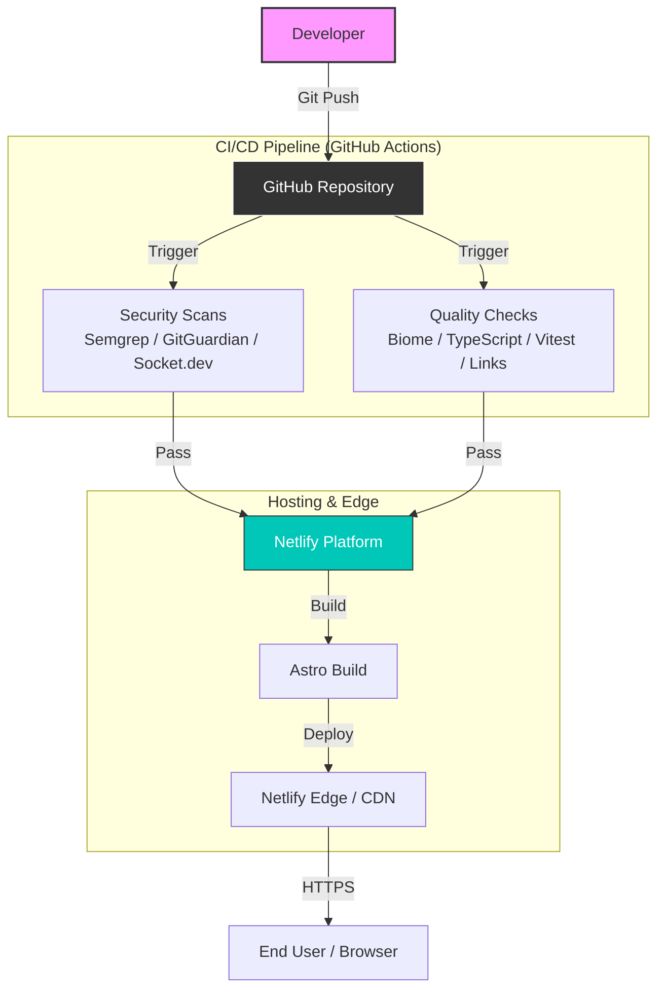
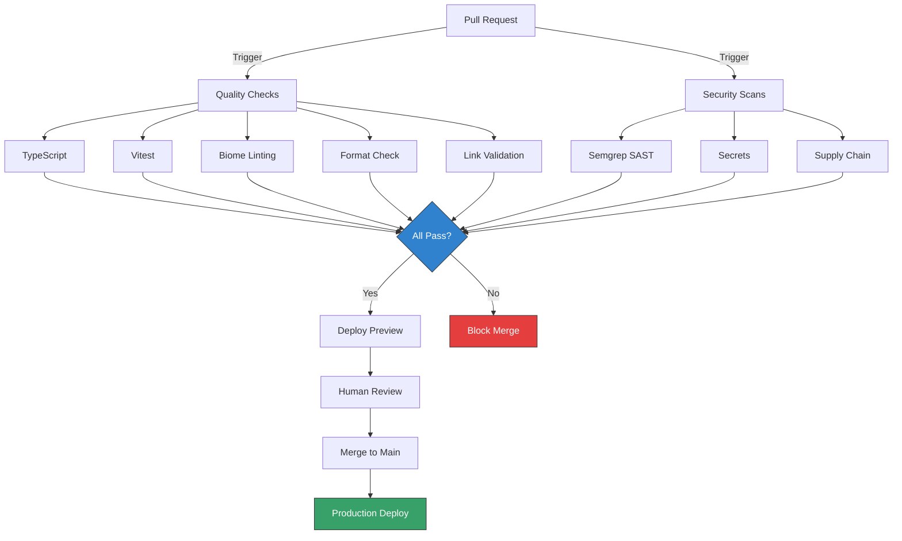

# Architecture Overview

This document provides a high-level overview of the **Team 4 Pro Coaching**
website's technical architecture, key decisions, and the rationale behind tool
choices.

It is designed to give new developers a complete understanding of how the system
works, is secured, and deployed.

## 📋 Table of Contents

- [Project Goals](#-project-goals)
- [System Context Diagram](#-system-context-diagram)
- [Project Structure](#-project-structure)
- [Technical Stack](#️-technical-stack)
- [Architecture Decisions](#️-architecture-decisions)
- [CI/CD Pipeline](#-cicd-pipeline)
- [Deployment Architecture](#-deployment-architecture)
- [Design Principles](#-design-principles)
- [Design System](#-design-system)
- [Future Roadmap](#-future-roadmap)
- [Related Documentation](#-related-documentation)

---

## 🎯 Project Goals

### Primary Objectives

| Objective           | Description                                                |
| :------------------ | :--------------------------------------------------------- |
| **Continuity**      | Maintainable by others if primary developer is unavailable |
| **Stability**       | Strict pinning ensures builds work identically over time   |
| **Security**        | High standards (Shift-Left) without enterprise costs       |
| **Performance**     | Static HTML delivery for maximum speed and SEO             |
| **Cost Efficiency** | Minimized fixed costs via free-tier services               |

### Target Audience

- **End Users**: Fitness coaching clients
- **Content Editors**: Coaches (non-technical content management)
- **Maintainers**: Developers ensuring the system stays online and secure

---

## 🧩 System Context Diagram


```mermaid
graph TD
    User[Developer] -->|Git Push| GitHub[GitHub Repository]

    subgraph "CI/CD Pipeline (GitHub Actions)"
        GitHub -->|Trigger| Security[Security Scans<br/>Semgrep / GitGuardian / Socket.dev]
        GitHub -->|Trigger| Quality[Quality Checks<br/>Biome / TypeScript / Vitest / Links]
    end

    Security -->|Pass| Netlify
    Quality -->|Pass| Netlify

    subgraph "Hosting & Edge"
        Netlify[Netlify Platform] -->|Build| Build[Astro Build]
        Build -->|Deploy| CDN[Netlify Edge / CDN]
    end

    CDN -->|HTTPS| Client[End User / Browser]

    style User fill:#f9f,stroke:#333,stroke-width:2px
    style GitHub fill:#333,stroke:#fff,color:#fff
    style Netlify fill:#00c7b7,stroke:#333,color:#fff
```

---

## 📂 Project Structure

```text
/
├── .github/             # CI/CD pipelines & templates
├── .husky/              # Git hooks (pre-commit automation)
├── .semgrep/            # Custom Semgrep rules (project-specific)
├── docs/                # Project documentation
├── public/              # Static assets (favicons, robots.txt)
├── src/
│   ├── components/      # UI Components (.astro)
│   │   ├── layout/      #   Layout helper fragments (BaseHead, SEO)
│   │   ├── navigation/  #   Navigation (Header, menus, NavLink)
│   │   ├── sections/    #   Page sections (Hero, Features, etc.)
│   │   └── ui/          #   Reusable primitives (Button, Logo, etc.)
│   ├── data/            # Typed data modules — structured business data and config (ADR-0011)
│   ├── layouts/         # Page wrappers (BaseLayout - Astro convention)
│   ├── pages/           # Route definitions
│   ├── scripts/         # Client-side controller modules (ADR-0020)
│   ├── types/           # Shared TypeScript types
│   ├── utils/           # Utility functions
│   └── styles/          # Global CSS and shared Tailwind class constants
├── .npmrc               # Strict package manager configuration
├── .nvmrc               # Node.js version definition
├── astro.config.mjs     # Astro framework configuration
├── biome.json           # Linter/Formatter rules
├── netlify.toml         # Netlify deployment settings
├── package.json         # Dependencies & scripts
└── renovate.json        # Automated dependency updates
```

### Component Organization

Components are organized into domain-based subfolders
([ADR-0007](adr/0007-component-folder-structure.md), amended by
[ADR-0008](adr/0008-clarify-layouts-vs-components-layout.md)):

**Page Wrappers** (`src/layouts/`):

| Component    | Purpose                                         |
| :----------- | :---------------------------------------------- |
| `BaseLayout` | Page wrapper with `<html>`, `<body>`, `<slot/>` |

**Components** (`src/components/`):

| Folder        | Purpose                                   | Examples                        |
| :------------ | :---------------------------------------- | :------------------------------ |
| `layout/`     | Layout helper fragments (no `<slot/>`)    | BaseHead, SEO                   |
| `navigation/` | Site navigation, menus, routing           | Header, DesktopMenu, MobileMenu |
| `sections/`   | Self-contained page sections with layout  | Hero, Features, Testimonials    |
| `ui/`         | Small, reusable primitives without layout | Button, TextLink, Logo          |

> **Rule**: If a component has `<slot/>` and wraps an entire page →
> `src/layouts/`. Everything else → `src/components/`.

### Shared Types

Reusable TypeScript types are centralized in `src/types/`:

| File            | Purpose                                       |
| :-------------- | :-------------------------------------------- |
| `components.ts` | Shared types for components (ImageProp, etc.) |

### Utility Functions

Reusable utility functions are centralized in `src/utils/`:

| File         | Purpose                                          |
| :----------- | :----------------------------------------------- |
| `slugify.ts` | Generate URL-safe slugs for IDs and anchor links |

**Usage:**

```typescript
import type { ImageProp } from '~/types/components';
import { slugify } from '~/utils/slugify';
```

This ensures consistency across components that share common patterns (e.g.,
image handling with Astro's `<Image />` component — see
[ADR-0010](adr/0010-use-astro-image-component-consistently.md)).

---

## 🏗️ Technical Stack

### Core Technologies

| Technology                 | Purpose                              | Why Chosen                                                                                                                               |
| :------------------------- | :----------------------------------- | :--------------------------------------------------------------------------------------------------------------------------------------- |
| **Astro.js**               | Static Site Generator                | Fast, modern, excellent DX ([ADR-0001](adr/0001-use-astro-js.md))                                                                        |
| **Tailwind CSS**           | Utility-First CSS                    | Rapid styling, consistent design system                                                                                                  |
| **pnpm**                   | Package Manager                      | Fast, disk-efficient ([ADR-0002](adr/0002-use-pnpm-package-manager.md))                                                                  |
| **TypeScript**             | Type Safety                          | Catch errors early, better IDE support                                                                                                   |
| **Netlify**                | Hosting & Deployment                 | Free tier, Deploy Previews, integrated forms ([ADR-0018](adr/0018-commit-to-netlify-as-production-platform.md))                          |
| **@tailwindplus/elements** | Interactive UI (Modals, Disclosures) | Headless Custom Elements from Tailwind Plus, declarative HTML API ([ADR-0019](adr/0019-use-tailwindplus-elements-for-interactive-ui.md)) |

### Code Quality Stack

| Tool                            | Purpose                    | Configuration      |
| :------------------------------ | :------------------------- | :----------------- |
| **Biome**                       | JS/TS Linting & Formatting | `biome.json`       |
| **Prettier**                    | Astro/Markdown Formatting  | Built-in           |
| **prettier-plugin-tailwindcss** | Tailwind Class Sorting     | Automatic          |
| **Vitest**                      | Unit Testing               | `vitest.config.ts` |
| **Husky**                       | Git Hooks                  | `.husky/`          |
| **lint-staged**                 | Staged File Processing     | `package.json`     |
| **commitlint**                  | Commit Message Validation  | Conventional       |

### Security & Automation Stack

| Tool             | Purpose                | Scope                   |
| :--------------- | :--------------------- | :---------------------- |
| **Semgrep**      | SAST (Static Analysis) | CI Pipeline             |
| **GitGuardian**  | Secret Detection       | CI Pipeline             |
| **Socket.dev**   | Supply Chain Security  | CI Pipeline             |
| **Gitleaks**     | Secret Detection       | Local (Pre-commit)      |
| **Renovate Bot** | Dependency Updates     | Automated Pull Requests |

---

## 🏛️ Architecture Decisions

All major decisions are documented as Architecture Decision Records (ADRs) in
[`docs/adr/`](adr/). See [CONTRIBUTING.md](../CONTRIBUTING.md) for the ADR
process (when to write one, template usage, update rules).

### ADR Quick Reference

| #                                                                      | Decision                   | Status         | Key Insight                                                   |
| :--------------------------------------------------------------------- | :------------------------- | :------------- | :------------------------------------------------------------ |
| [0001](adr/0001-use-astro-js.md)                                       | Use Astro                  | Accepted       | SSG framework, zero-JS default. MDX removed (may return).     |
| [0002](adr/0002-use-pnpm-package-manager.md)                           | Use pnpm                   | Accepted       | Strict deps, workspace-ready.                                 |
| [0004](adr/0004-use-hybrid-formatting-biome-and-prettier.md)           | Biome + Prettier           | Accepted       | Biome for JS/TS, Prettier for .astro/.md.                     |
| [0005](adr/0005-adopt-renovate-for-automated-dependency-management.md) | Renovate + Socket.dev      | Accepted       | Auto-update deps with supply chain scanning.                  |
| [0006](adr/0006-enforce-strict-environment-and-dependency-pinning.md)  | Strict pinning             | Accepted       | `.nvmrc`, `engines`, exact versions.                          |
| [0007](adr/0007-component-folder-structure.md)                         | Component folders          | Accepted       | `sections/` by domain, `ui/` for primitives.                  |
| [0008](adr/0008-clarify-layouts-vs-components-layout.md)               | Layouts vs layout/         | Accepted       | `layouts/` = page wrappers, `components/layout/` = fragments. |
| [0009](adr/0009-use-types-for-component-props.md)                      | `type` for Props           | Accepted       | Not `interface` — consistency with Astro ecosystem.           |
| [0010](adr/0010-use-astro-image-component-consistently.md)             | SmartImage + ImageSource   | Accepted       | Discriminated union for local/remote images.                  |
| [0011](adr/0011-content-format-decision-framework.md)                  | Content format framework   | Accepted       | All data currently in TS modules. Collections may return.     |
| [0012](adr/0012-client-side-script-strategy.md)                        | Script strategy (original) | **Superseded** | Replaced by ADR-0020.                                         |
| [0013](adr/0013-use-named-exports-for-data-modules.md)                 | Named exports              | Accepted       | No default exports in data/utils.                             |
| [0014](adr/0014-light-mode-section-background-system.md)               | Section backgrounds        | Accepted       | Token-based: default, muted, sage, teal.                      |
| [0015](adr/0015-animation-and-motion-system.md)                        | Animation system           | Accepted       | `data-animate` + IntersectionObserver + CSS.                  |
| [0016](adr/0016-use-vitest-for-unit-testing.md)                        | Vitest                     | Accepted       | Unit tests for data integrity, jsdom for DOM tests.           |
| [0017](adr/0017-domain-data-integrity-pattern.md)                      | Data integrity pattern     | Accepted       | `as const satisfies Record<>` for compile-time safety.        |
| [0018](adr/0018-commit-to-netlify-as-production-platform.md)           | Netlify platform           | Accepted       | Forms, Deploy Previews, credit-aware strategy.                |
| [0019](adr/0019-use-tailwindplus-elements-for-interactive-ui.md)       | @tailwindplus/elements     | Accepted       | `<el-dialog>` for modals, `<el-disclosure>` for FAQ.          |

### Active ADRs (expanded — these affect day-to-day development)

#### ADR-0020: Client-Side Script Strategy (Revised)

Module `<script>` is the **default**. `is:inline` only for Critical Early
Execution ([ADR-0020](adr/0020-client-side-script-strategy-revised.md)).

**Migration status**: `CoachDetailModal` is the last `is:inline` script —
migrate on next change. `QuizModal` and `ServiceCategoryTabs` are migrated.
`QuizModal`'s controller is extracted to `src/scripts/quizModalController.ts`.

#### ADR-0021: sessionStorage for Quiz Context Persistence

Quiz answers persist in `sessionStorage` across page navigations, with URL
parameters as fallback
([ADR-0021](adr/0021-session-storage-quiz-persistence.md)). Shared utility:
`src/utils/quizContext.ts`. Labels derived from `quiz.ts`.

#### ADR-0022: Hybrid Rendering Model

Planned: `output: 'server'` + `@astrojs/netlify` adapter. All pages stay static
(`prerender: true` default). Only Stripe API endpoints use SSR
([ADR-0022](adr/0022-hybrid-rendering-model.md)). Not yet implemented — config
change comes with Stripe PR.

---

## 🔄 CI/CD Pipeline


```mermaid
graph TD
    PR[Pull Request] -->|Trigger| CI_Quality[Quality Checks]
    PR -->|Trigger| CI_Security[Security Scans]

    CI_Quality --> TypeCheck[TypeScript]
    CI_Quality --> Tests[Vitest]
    CI_Quality --> Lint[Biome Linting]
    CI_Quality --> Format[Format Check]
    CI_Quality --> Links[Link Validation]

    CI_Security --> Semgrep[Semgrep SAST]
    CI_Security --> GitGuardian[Secrets]
    CI_Security --> Socket[Supply Chain]

    TypeCheck --> Gate{All Pass?}
    Tests --> Gate
    Lint --> Gate
    Format --> Gate
    Links --> Gate
    Semgrep --> Gate
    GitGuardian --> Gate
    Socket --> Gate

    Gate -->|Yes| Preview[Deploy Preview]
    Gate -->|No| Fail[Block Merge]

    Preview --> Review[Human Review]
    Review --> Merge[Merge to Main]
    Merge --> Production[Production Deploy]

    style Gate fill:#3182ce,stroke:#333,color:#fff
    style Production fill:#38a169,stroke:#333,color:#fff
    style Fail fill:#e53e3e,stroke:#333,color:#fff
```

### Update Strategy

| Type             | Schedule         | Rationale                        |
| :--------------- | :--------------- | :------------------------------- |
| **Runtime**      | Monthly (1st)    | Stability for Node/pnpm          |
| **Dependencies** | Weekly (Mondays) | Keep technical debt low          |
| **Security**     | Immediate        | Critical patches ignore schedule |

---

## 🚀 Deployment Architecture

### Hosting: Netlify

> For the full rationale on platform choice, credit model, and migration risk
> assessment, see
> [ADR-0018](adr/0018-commit-to-netlify-as-production-platform.md).

We utilize Netlify's **Immutable Deployments**:

- **Atomic**: Every deployment is unique. The site never exists in a
  "half-deployed" state.
- **Rollback**: If `v2` breaks, instantly switch back to `v1` via Dashboard.

Netlify uses a **credit-based pricing model** (300 credits/month on the free
plan). Each production deploy costs 15 credits. Deploy Previews are free and
unlimited. To control credit usage, auto-deploy is disabled during the launch
phase and the `ignore` script in `netlify.toml` skips builds when no relevant
files have changed.

### Configuration

| Setting           | Value                |
| :---------------- | :------------------- |
| **Build Command** | `pnpm build`         |
| **Output**        | `dist/`              |
| **Node Version**  | Managed via `.nvmrc` |

### Deploy Previews

Every Pull Request automatically triggers an isolated preview:

- **Unique URL**: Each PR gets a permanent, shareable URL
- **Production Parity**: Same build process as live site
- **Stakeholder Review**: Non-technical team can review before merge
- **No "Works on my Machine"**: Runs in Netlify cloud environment

---

## 📐 Design Principles

### 1. Cost-Conscious Architecture

**Principle**: Maximize quality while minimizing costs.

- **Public Repository**: Unlocks free GitHub tiers
- **Free-Tier First**: Netlify, Semgrep, GitGuardian in free tiers
- **Open Source**: No paid SaaS where OSS alternatives exist

### 2. Security-First

**Principle**: Security is non-negotiable, even on a budget.

- **Defense in Depth**: Multiple scanning layers (Code, Secrets, Dependencies)
- **Signed Commits**: Required for verification
- **Shift-Left**: Catch vulnerabilities in PR, not production

### 3. Continuity ("Bus Factor")

**Principle**: Anyone should be able to take over without prior knowledge.

- **ADRs**: We document _decisions_, not just code
- **Conventional Commits**: History is readable
- **No Tribal Knowledge**: If it's not documented, it doesn't exist

### 4. Fail Fast

**Principle**: Catch problems as early as possible.

- **Pre-commit Hooks**: Prevent bad code from entering Git
- **TypeScript**: Catches logic errors at compile time
- **Renovate**: Identifies outdated/insecure dependencies automatically

### 5. Developer Experience (DX)

**Principle**: Make development pleasant and productive.

- **Fast Tooling**: Biome & Astro (Rust/Go based) for speed
- **Automated Formatting**: No discussions about code style
- **Hot Reload**: Instant feedback during development

### 6. Automation Over Manual Work

**Principle**: If you have to do it twice, automate it.

- **Formatting**: Automated via Git hooks
- **Dependency Management**: Automated via Renovate
- **Deployment**: Automated via Netlify (Git Push)

---

## 🎨 Design System

### Color System

The site uses a custom color palette with semantic token names, defined in
`src/styles/global.css` under `@theme` and consumed via Tailwind CSS v4 utility
classes.

**Core Palette** (3 ramps + 2 background tones):

| Ramp               | Base Color | Role                                       |
| :----------------- | :--------- | :----------------------------------------- |
| `foreground`       | `#38070f`  | Text and UI elements (warm dark brown)     |
| `accent`           | `#bf7960`  | Primary CTAs and actions (terracotta)      |
| `teal`             | `#4a9199`  | Secondary accents and highlights           |
| `background`       | `#f7eee5`  | Standard page background (warm cream)      |
| `background-muted` | `#e8ddd6`  | Alternating section background (warm sand) |

Each ramp includes stops from 50 (lightest) to 950 (darkest).

**Section Background System**: The light mode uses **6 section background
variants** to create visual rhythm across pages — alternating between light and
dark sections. This is managed via the `SectionBackground` type and utility maps
in `src/utils/styles.ts`.

> **Full specification**: [Color System Reference](reference/color-system.md) ·
> **Decision**: [ADR-0014](adr/0014-light-mode-section-background-system.md)

### Typography

Typography tokens are defined in the same `@theme` block:

| Token          | Font Family                      | Usage         |
| :------------- | :------------------------------- | :------------ |
| `--font-sans`  | Manrope, sans-serif              | Body text, UI |
| `--font-serif` | Playfair Display, Georgia, serif | Headlines     |

The headline hierarchy is documented in `global.css` as a CSS comment block with
size specifications per level (Page Title → Section Title → Subsection → Card
Title) and responsive breakpoints.

### Dark Mode

Dark mode is supported via Tailwind's `dark:` variant. All components include
both light and dark mode classes. The dark mode palette uses:

- `background-dark` (`#1a1412`) for standard backgrounds
- `background-dark-muted` (`#241c19`) for alternating sections
- White text and `gray-300`/`gray-400` for secondary text

> **Note**: The section background variants (`teal`, `silver`, `sage`,
> `charcoal`) are light-mode only. In dark mode, all variants fall back to
> `background-dark` or `background-dark-muted`.

### Animation & Motion

The site uses scroll-triggered reveal animations and hover micro-interactions to
create a polished, Apple-inspired browsing experience. The system is implemented
with zero external dependencies — vanilla CSS transitions + a global
IntersectionObserver.

**Key principles**:

- Every section animates on scroll into viewport (fade-up is the standard)
- Hover effects only on fully interactive elements (stretched-link cards,
  buttons, standalone links)
- `prefers-reduced-motion: reduce` disables all movement
- Scroll-animate and hover classes must **never** share the same DOM element
  (CSS transition shorthand conflict)

**Files**: Animation CSS in `global.css`, observer in
`components/layout/ScrollAnimations.astro`.

> **Full specification**:
> [Animation System Reference](reference/animation-system.md) · **Decision**:
> [ADR-0015](adr/0015-animation-and-motion-system.md)

---

## 🔮 Future Roadmap

### Upcoming Features (from coaches)

| Feature                      | Scope                                     | Complexity                                               |
| :--------------------------- | :---------------------------------------- | :------------------------------------------------------- |
| Stripe integration           | New API endpoints, checkout flow          | High — ADR-0022 decision made, needs adapter + endpoints |
| Success Stories modal        | `/success-stories`                        | Medium — new modal component                             |
| Service additional info      | `/services` — expandable details per card | Medium — new disclosure/panel                            |
| Curtain reveal effect        | Site-wide — opening animation             | Medium — CSS animation + scroll trigger                  |
| "Standard" → "Monthly" label | `/services` — pricing cards               | Low — data change in services.ts                         |
| Home menu item               | Navigation                                | Low — add to nav data + routes.ts                        |
| Category selection rework    | `/services` — tab/filter behavior         | Medium — ServiceCategoryTabs changes                     |
| How It Works expansion       | `/how-it-works` — more content            | Low–Medium — data + possible new sections                |
| Color changes                | Specific location (TBD)                   | Low — Tailwind theme tokens                              |

### Infrastructure Enhancements

| Enhancement                | Goal                                      | Status                            |
| :------------------------- | :---------------------------------------- | :-------------------------------- |
| **Testing Infrastructure** | Vitest + Playwright for regression        | Unit tests implemented (ADR-0016) |
| **Content Management**     | Git-based CMS (Keystatic) or Headless CMS | Raw Markdown                      |
| **Performance Monitoring** | Lighthouse CI in GitHub Actions           | Manual checks                     |
| **Analytics**              | GDPR-compliant (Plausible/Fathom)         | None                              |

### Scalability Assessment

**Current architecture scales well for**:

- ✅ Content Growth (thousands of pages, no performance penalty)
- ✅ Traffic Spikes (handled by CDN)
- ✅ Team Scaling (docs + strict tooling enable quick onboarding)

**Not optimized for**:

- ❌ Dynamic User Content (comments, forums)
- ❌ Real-Time Data (no WebSockets)
- ❌ Complex State (no Redux/Zustand)

---

## 📚 Related Documentation

| Document                                              | Purpose                                   |
| :---------------------------------------------------- | :---------------------------------------- |
| **[CLAUDE.md](../CLAUDE.md)**                         | AI quick reference — read this first      |
| **[FEATURE_TEMPLATE.md](FEATURE_TEMPLATE.md)**        | Template for scoping new features         |
| **[CONVENTIONS.md](CONVENTIONS.md)**                  | Coding patterns, naming, export style     |
| **[DEVELOPMENT.md](DEVELOPMENT.md)**                  | Setup, tooling, daily workflow            |
| **[MAINTENANCE.md](MAINTENANCE.md)**                  | Dependency updates, security, emergencies |
| **[CONTRIBUTING.md](../CONTRIBUTING.md)**             | Contribution guidelines, PR process       |
| **[Color System](reference/color-system.md)**         | Light-mode color specification            |
| **[Animation System](reference/animation-system.md)** | Scroll reveals, hover effects, motion     |
| **[ADRs](adr/)**                                      | Complete log of architectural decisions   |

### For New Developers

1. Read **[CLAUDE.md](../CLAUDE.md)** for a quick project overview
2. Read this **Architecture Overview** for the full picture
3. Review the ADR Quick Reference table above — read active ADRs (0020–0022) in
   full
4. Read **[CONVENTIONS.md](CONVENTIONS.md)** for coding patterns and naming
5. Follow **[DEVELOPMENT.md](DEVELOPMENT.md)** to set up your machine
6. Explore the codebase (start with `src/pages` and `astro.config.mjs`)

### For Maintainers

1. Understand **[Renovate Configuration](reference/renovate.md)**
2. Monitor security scans (Semgrep & GitGuardian in GitHub Actions)
3. Review **[MAINTENANCE.md](MAINTENANCE.md)** for operational procedures
4. Keep documentation updated when architecture changes

---

**Philosophy**: This project prioritizes _sustainability_ over complexity. Every
tool and process serves a clear purpose aligned with project goals.
