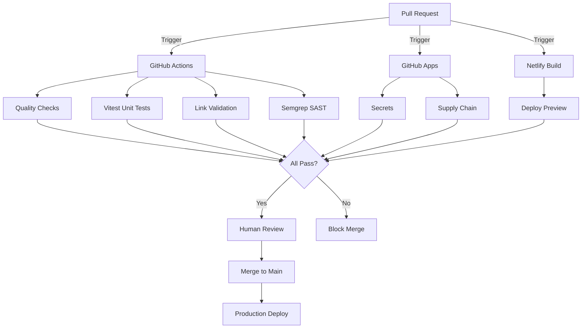

# Architecture Overview

Single source of truth for _what the project is, how it works, and where it is
headed_. This document is referenced by both human documentation and AI working
instructions.

---

## Project Overview

Marketing website for Team 4 Pro Coaching — three IFBB Pro coaches (Helle
Trevino, Gina Cavaliero, Irene Andersen) offering online fitness coaching. Built
with Astro 6, Tailwind CSS v4, TypeScript, deployed on Netlify. Solo developer
(solo maintainer). Static site with planned hybrid rendering for Stripe
(ADR-0022).

---

## Where to Find Coding Rules

Subagents touching code: jump straight to the relevant rule set in
CONVENTIONS.md. The bullets below mirror the task-oriented entries in the
[CONVENTIONS.md Topic Hub Index](CONVENTIONS.md#topic-hub-index) and resolve to
the same sections; the canonical rule prose lives in CONVENTIONS.md.

- **When writing a new ID-keyed dataset** — see CONVENTIONS.md § Data Integrity:
  `as const satisfies Record<>` Pattern.
- **When choosing a section background variant or rendering a `<Section>`
  wrapper** — see CONVENTIONS.md § Section Backgrounds.
- **When composing a component that must work on both light and dark section
  backgrounds** — see CONVENTIONS.md § Component Composition → Dark Background
  Handling.
- **When adding a `<script>` to a component** — see CONVENTIONS.md § Client-Side
  Scripts.
- **When adding cross-page state that survives a navigation** — see
  CONVENTIONS.md § Cross-Page State Persistence.
- **When adding a server endpoint or touching the rendering mode** — see
  CONVENTIONS.md § Server Endpoints and Hybrid Rendering.
- **When choosing between FilterBar and SegmentedControl** — see CONVENTIONS.md
  § Client-Side Scripts → Data Attribute Naming and § Component Composition.
- **When building or extending a filterable catalog page** — see CONVENTIONS.md
  § Filterable Catalog Pattern.
- **When wiring a controller that must run on cold loads** — see CONVENTIONS.md
  § Client-Side Scripts → Rules (Dual-Dispatch sub-rule).
- **When wiring a modal trigger or registering a new modal id** — see
  CONVENTIONS.md § Cross-Component DOM ID Registry (`MODAL_IDS`).
- **When touching `astro.config.mjs`, post-build hooks, or any inline `<script>`
  / `<style>`** — see CONVENTIONS.md § CSP Hash Strategy.
- **When extracting a section component or deciding inline-vs-extract** — see
  CONVENTIONS.md § Component Composition → Extract-First.
- **When writing a section adapter or any component that forwards a slot to gate
  visible markup** — see CONVENTIONS.md § Component Composition → Section
  Components Wrap `Content.astro`.
- **When writing a component test whose correctness is Prop-to-DOM, not
  function-to-return-value** — see CONVENTIONS.md § Component Tests with Astro
  Container API.
- **When adding a dynamic detail route (`/<domain>/[slug]`)** — see
  CONVENTIONS.md § Dynamic Detail Routes.
- **When adding a new entry-point script under `scripts/`** — see CONVENTIONS.md
  § Script Entry-Point Naming.
- **When writing a component under `src/components/ui/` or
  `src/components/navigation/`** — see CONVENTIONS.md § Testing Conventions →
  Component-Level Accessibility Tests.
- **When composing a session-mode service detail page or adding a new
  session-mode service** — see CONVENTIONS.md § Component Composition →
  Session-Service Detail Pages Compose the Configurator.
- **When adding a placeholder string to `src/data/services.ts` or
  `src/data/servicesMission.ts`** — see CONVENTIONS.md § Data Integrity →
  Placeholder-Prefix Convention is File-Local.
- **When touching how coaches are presented on the Services overview** — see
  CONVENTIONS.md § Component Composition → Services Overview Coach Presentation.
- **When creating or modifying a component in `src/components/`** — see
  CONVENTIONS.md § Component Reuse Annotations.
- **When authoring a `SKILL.md` for a cross-cutting discipline** — see
  CONVENTIONS.md § SKILL Authoring.
- **When changing logic in a positive-listed `src/data/` file** — see
  CONVENTIONS.md § Mutation Testing (Stryker).

The flat ADR Quick Reference table further down is the index of record for _all_
ADRs by number, including ADRs that do not govern a code-writing surface and
therefore have no Hub Index entry.

---

## Design Philosophy

The goal is code that looks boring on first reading — not because the problems
are trivial, but because every abstraction earns its place, every indirection
has a reason, and nothing is clever when simple would do.

When in doubt between "more structured" and "more direct", choose direct until
proven otherwise. Structure exists to solve a problem — when the problem
disappears, the structure should follow. This philosophy applies equally to
adding and removing abstractions.

Technical debt is not a backlog — it is friction that compounds. When an issue
is identified and the fix is straightforward, the default is to fix it now, not
to track it for later.

### Operational Principles

| Principle               | Implementation                                                                                                                                                                                                                                    |
| :---------------------- | :------------------------------------------------------------------------------------------------------------------------------------------------------------------------------------------------------------------------------------------------ |
| Cost-Conscious          | Public repository, free-tier services (Netlify, Semgrep, GitGuardian), no paid SaaS                                                                                                                                                               |
| Security-First          | Defense in depth, signed commits, shift-left scanning in PRs                                                                                                                                                                                      |
| Continuity (Bus Factor) | ADRs document decisions (see [ADR-0035](adr/0035-adopt-subagent-architecture.md) for the agent architecture rationale), conventional commits, agent architecture documented in `docs/AGENTS.md`, English-only infrastructure, no tribal knowledge |
| Fail Fast               | Pre-commit hooks, TypeScript strict mode, Renovate for outdated deps                                                                                                                                                                              |
| Developer Experience    | Fast tooling (Biome, Astro), automated formatting, hot reload                                                                                                                                                                                     |
| Automation Over Manual  | Git hooks for formatting, Renovate for deps, Netlify for deployment                                                                                                                                                                               |

---

## Project Structure

This is the canonical project tree. All other documents reference this section
rather than maintaining their own copy.

```
/
├── .claude/             # Claude Code agent architecture (see docs/AGENTS.md)
│   ├── agents/          #   Subagent system prompts (7 roles)
│   ├── skills/          #   Cross-cutting discipline skills (SKILL.md, committed; ADR-0055)
│   ├── work/            #   In-flight task docs (worktree-local, gitignored)
│   ├── worktrees/       #   Feature worktrees (local-only, gitignored)
│   └── settings.json    #   Bash permission policy (positive-list, deny, ask)
├── .github/             # CI/CD workflows (no issue/PR templates yet)
├── .husky/              # Git hooks (pre-commit, commit-msg)
├── .semgrep/            # Custom Semgrep rules
├── .sonarlint/          # SonarLint Connected Mode binding (org + project key)
├── .vscode/             # Editor settings and recommended extensions
├── docs/                # Project documentation
│   ├── adr/             #   Architecture Decision Records
│   │   └── _archive/    #     Archived ADRs (superseded, deprecated, consolidated)
│   ├── debt/            #   Debt register + audit/notes reports
│   ├── reference/       #   Reference docs (animation, color, biome, commitlint, renovate)
│   └── task-templates/  #   Templates for requirements, concept, review documents
├── public/              # Static assets (favicons, robots.txt)
├── scripts/             # Build and CI tooling — entry-point `.mjs` follow `check-*`/`generate-*`/`query-*` prefix convention (ADR-0050)
│   ├── biome-rules/     #   Biome rule-baseline canary lib + tests (ADR-0041)
│   ├── conventions/     #   Convention check functions + unit tests
│   └── sonar-findings/  #   Agent-side SonarCloud findings query: `issues.mjs`, `hotspots.mjs`, `duplications.mjs`, `query.mjs` + tests + fixtures (ADR-0042, ADR-0046)
├── src/
│   ├── components/      # Astro components (.astro)
│   │   ├── layout/      #   Layout helper fragments (BaseHead, SEO)
│   │   ├── navigation/  #   Header, Footer, NavLink, menus
│   │   ├── sections/    #   Page sections by domain
│   │   │   ├── coaches/
│   │   │   ├── contact/
│   │   │   ├── howItWorks/
│   │   │   ├── quiz/
│   │   │   ├── services/
│   │   │   ├── successStories/
│   │   │   └── usps/
│   │   └── ui/          #   Reusable primitives (Button, Modal, FormSelect, etc.)
│   ├── data/            # Typed data modules — business data and config
│   ├── layouts/         # BaseLayout (single page wrapper)
│   ├── pages/           # File-based routing
│   ├── scripts/         # Client-side controller modules (extracted from components)
│   ├── styles/          # Global CSS + shared Tailwind class constants
│   ├── test-utils/      # Shared test helpers (assertNotNull, assertDefined)
│   ├── types/           # Shared TypeScript types (ImageSource, CtaAction, etc.)
│   └── utils/           # Utility functions (slugify, quizContext, counter, etc.)
├── .env.local.example   # Template for the per-developer SONAR_TOKEN
├── astro.config.mjs     # Astro config (integrations, image domains, CSP hook)
├── biome.json           # Biome formatter + linter config
├── commitlint.config.mjs # Conventional Commits rules
├── netlify.toml         # Build, headers, CSP, redirects
├── package.json         # Scripts and dependencies
├── renovate.json        # Automated dependency updates
├── stryker.config.mjs   # Stryker mutation testing config (ADR-0058)
├── tsconfig.json        # TypeScript compiler config
├── tsconfig.stryker.json # TypeScript config for Stryker checker (ADR-0058)
└── vitest.config.ts     # Vitest runner config
```

---

## Technical Stack

### Core Technologies

| Technology                 | Purpose                              | Decision                                                             |
| :------------------------- | :----------------------------------- | :------------------------------------------------------------------- |
| **Astro 6**                | Static Site Generator                | [ADR-0001](adr/_archive/0001-use-astro-js.md)                        |
| **Tailwind CSS v4**        | Utility-First CSS                    | `@theme` in `global.css` for custom tokens                           |
| **pnpm**                   | Package Manager                      | [ADR-0002](adr/_archive/0002-use-pnpm-package-manager.md)            |
| **TypeScript**             | Type Safety                          | Strict mode enabled                                                  |
| **Netlify**                | Hosting and Deployment               | [ADR-0018](adr/0018-commit-to-netlify-as-production-platform.md)     |
| **@tailwindplus/elements** | Interactive UI (Modals, Disclosures) | [ADR-0019](adr/0019-use-tailwindplus-elements-for-interactive-ui.md) |

**Why Astro and pnpm.** Astro is the static-site generator because the
zero-JS-by-default rendering model fits a marketing site whose performance
budget is set by Core Web Vitals, the Netlify-native build path keeps cost at
zero on the credit-based plan, and the MDX integration leaves a path open for
content-collection growth. Gatsby was rejected on community-activity decline at
the time of the decision; WordPress was rejected on maintenance-effort and
PHP-hosting cost. pnpm is the exclusive package manager because strict-deps
catches phantom imports at install time (the mode npm permits silently), the
content-addressable store gives parity between local and Netlify builds, and
Netlify detects `pnpm-lock.yaml` and caches the store natively. The exclusivity
is enforced by committing `pnpm-lock.yaml` and pinning the `packageManager`
field in `package.json` through Corepack.

### Code Quality

| Tool                            | Purpose                      | Configuration                                                                                                                                    |
| :------------------------------ | :--------------------------- | :----------------------------------------------------------------------------------------------------------------------------------------------- |
| **Biome**                       | JS/TS Linting and Formatting | `biome.json`                                                                                                                                     |
| **Prettier**                    | Astro/Markdown Formatting    | Built-in                                                                                                                                         |
| **prettier-plugin-tailwindcss** | Tailwind Class Sorting       | Automatic                                                                                                                                        |
| **Vitest**                      | Unit Testing                 | `vitest.config.ts`                                                                                                                               |
| **Husky**                       | Git Hooks                    | `.husky/`                                                                                                                                        |
| **lint-staged**                 | Staged File Processing       | `package.json`                                                                                                                                   |
| **commitlint**                  | Commit Message Validation    | `commitlint.config.mjs` ([ref](reference/commitlint.md))                                                                                         |
| **jscpd**                       | Local Duplication Detection  | `.jscpd.json`, pre-push hook ([ADR-0045](adr/0045-local-jscpd-duplication-gate.md), [ADR-0056](adr/0056-duplication-gate-as-advisory-signal.md)) |
| **Stryker**                     | Mutation Testing (on-demand) | `stryker.config.mjs`, `tsconfig.stryker.json` ([ADR-0058](adr/0058-mutation-testing-with-stryker.md))                                            |

### Security and Automation

| Tool             | Purpose                | Scope                   |
| :--------------- | :--------------------- | :---------------------- |
| **Semgrep**      | SAST (Static Analysis) | CI Pipeline             |
| **GitGuardian**  | Secret Detection       | CI Pipeline             |
| **Socket.dev**   | Supply Chain Security  | CI Pipeline             |
| **Gitleaks**     | Secret Detection       | Local (Pre-commit)      |
| **Renovate Bot** | Dependency Updates     | Automated Pull Requests |

> **History.** § Technical Stack consolidates
> [ADR-0001 — Use Astro](adr/_archive/0001-use-astro-js.md), which records the
> original framework rationale (cost-conscious hosting, SSG performance, MDX
> flexibility, rejected Gatsby/WordPress alternatives), and
> [ADR-0002 — Use pnpm](adr/_archive/0002-use-pnpm-package-manager.md), which
> records the package-manager rationale (strict-deps, store hard-linking,
> Netlify detection). Both are preserved in `_archive/` for historical lookup.

---

## Component Organization

Components are organized into domain-based subfolders (see
[docs/CONVENTIONS.md § File Naming](CONVENTIONS.md#file-naming) for the
four-folder classification and the `src/layouts/` vs `components/layout/` rule).

**Rule**: If a component has `<slot/>` and wraps an entire page →
`src/layouts/`. Everything else → `src/components/`.

| Folder        | Purpose                                       | Examples                                                               |
| :------------ | :-------------------------------------------- | :--------------------------------------------------------------------- |
| `layouts/`    | Page wrappers with `<html>`, `<body>`         | BaseLayout                                                             |
| `layout/`     | Layout helper fragments (no `<slot/>`)        | BaseHead, SEO, ScrollAnimations                                        |
| `navigation/` | Site navigation and routing                   | Header, Footer, DesktopMenu, MobileMenu                                |
| `sections/`   | Page sections and their domain-specific parts | Hero, Services, CoachDetailModal, QuizModal                            |
| `ui/`         | Generic reusable primitives                   | Button, Modal, TextLink, FormSelect, FilterBar, SegmentedControl, Logo |

Domain-specific components live in subfolders under `sections/` (e.g.,
`sections/coaches/CoachDetailModal.astro`, `sections/quiz/QuizModal.astro`).
Generic shells like `Modal.astro` stay in `ui/` — domain modals build on them.

Section components delegate their layout to `Content.astro` and inject
domain-specific content via slots. This keeps layout logic (padding, max-width,
section backgrounds) in one place. Components that expose a forwardable slot
gating visible markup follow
[ADR-0036](adr/0036-content-aware-slot-detection-in-forwarded-slots.md) for
presence detection. For details on composition patterns, dark background
handling, and client-side script conventions, see
[CONVENTIONS.md](CONVENTIONS.md).

---

## Page and Component Map

| Page               | Key Components                                                                                                                                                            | Data Sources                                                                                          |
| :----------------- | :------------------------------------------------------------------------------------------------------------------------------------------------------------------------ | :---------------------------------------------------------------------------------------------------- |
| `/` (Homepage)     | HeroSplit, Services, Stats, Usps, Coaches, SuccessStories, FeaturedTestimonial, ClientChatScreenshots, CTA, CoachDetailModal, SuccessStoryReadMoreModal, QuizModal        | clientChatScreenshots, coaches, cta, ids, routes, services, stats, successStories, testimonials, usps |
| `/services`        | HeroFullscreen, ServicesCatalog (FilterBar, SegmentedControl, ServiceCard), CTA, QuizModal                                                                                | ids, routes, services                                                                                 |
| `/services/[slug]` | Breadcrumb, ServiceDetailHero, ServiceWhoIsFor, ServiceWhatsIncluded, ProcessSteps, ServiceSocialProof, Accordion, ServicePricingBlock, SessionConfigurator (PackageCard) | routes, services, testimonials                                                                        |
| `/coaches`         | HeroSplit, Coaches (expanded), Testimonial, Content, PullQuote, CTA, CoachDetailModal                                                                                     | coaches, routes                                                                                       |
| `/how-it-works`    | HeroFullscreen, ProcessSteps, Accordion, CTA                                                                                                                              | howItWorks, routes                                                                                    |
| `/success-stories` | HeroFullscreen, SuccessStoryOverviewCard, TestimonialGrid, SectionHeader, CTA, SuccessStoryReadMoreModal                                                                  | routes, successStories, testimonials                                                                  |
| `/contact`         | Contact, ContactForm (FormSelect, QuizContextBox, ConfiguratorContextBox)                                                                                                 | contact                                                                                               |
| `/contact/thanks`  | Button                                                                                                                                                                    | thanks                                                                                                |
| `/privacy`         | BaseLayout only — placeholder content pending real legal copy                                                                                                             | routes                                                                                                |
| `/terms`           | BaseLayout only — placeholder content pending real legal copy                                                                                                             | routes                                                                                                |

---

## CTA Map

All CTAs are defined in `src/data/routes.ts`. See also `src/data/cta.ts` for
shared CTA configurations.

| Page                   | Primary CTA               | Target              | Secondary CTA      | Target                |
| :--------------------- | :------------------------ | :------------------ | :----------------- | :-------------------- |
| Homepage Banner        | —                         | —                   | Meet our coaches   | `#coaches` (on-page)  |
| Homepage Hero          | Work With Us              | `/contact`          | Explore Services   | `#services` (on-page) |
| Homepage Quiz          | Find Your Fit             | QuizModal           | —                  | —                     |
| Homepage Bottom        | Start Your Journey        | `/contact`          | Explore Services   | `/services`           |
| Services Hero          | Find Your Fit             | QuizModal           | Explore Categories | `#categories`         |
| Services Bottom        | Find Your Fit             | QuizModal           | Contact Us         | `/contact`            |
| Coaches Hero           | Meet the Coaches          | `#meet-the-coaches` | Explore Services   | `/services`           |
| Coaches Bottom         | Find Your Coach           | `/contact`          | Explore Services   | `/services`           |
| How It Works Hero      | Book Consultation         | `/contact`          | See How It Works   | `#how-it-works`       |
| How It Works Bottom    | Book Consultation         | `/contact`          | Explore Services   | `/services`           |
| Success Stories Hero   | Start Your Transformation | `/contact`          | Explore Stories    | `#stories`            |
| Success Stories Bottom | Ready to Be Next?         | `/contact`          | Explore Services   | `/services`           |

---

## Key Data Flows

### Quiz to Contact (ADR-0021)

```
QuizModal (4 steps) → saveQuizAnswers(sessionStorage) → Result screen
  ├─ "Get in Touch" → /contact?goal=...&service=...&experience=...&timeline=...
  │   → ContactForm reads sessionStorage (priority) or URL params (fallback)
  │   → Summary card + service dropdown preselect + hidden fields for Netlify
  └─ "View This Service" → /services?category=...&service=...
      → servicesFilterController narrows catalog to that category + highlights card
      → User clicks "Get Started" → /contact?service=...
      → ContactForm reads sessionStorage (quiz context survives)
```

### Configurator to Contact

```
Service detail page (configurator) → "Get this package" deep link
  → /contact?service=posing&duration=60min&package=5
  → ContactForm parses URL via parseConfiguratorParams (~/utils/configuratorContext)
  → Configurator context box (service name + configuration line + total price + back-link)
  → Service dropdown preselected to the parsed service ID
```

Only services typed as `SessionService` (`pricingModel === 'session'`, see
ADR-0047) are valid Configurator targets — `parseConfiguratorParams` rejects any
other service ID, so a Configurator URL pointing at a subscription service falls
through to the quiz / `?service=` prefill branches and the Configurator box
stays hidden.

Conflict resolution priority — Configurator wins over Quiz: when a URL carries
both a valid Configurator triple and quiz parameters, the Configurator branch
populates its box, preselects the service dropdown, and short-circuits the quiz
branch so quiz hidden fields are never injected on a Configurator submission. A
bare `?service=<id>` is treated as a ServiceCard prefill (the parser returns
null on missing `duration` or `package`), preserving the existing ServiceCard →
Contact flow unchanged.

### Quiz to Services Deep-Link

```
Quiz result href → /services?category=bodybuilding&service=competition-prep
  → servicesFilterController resolves ?service= to its category (priority over ?category=)
  → narrows catalog to that category + scrolls to card + .quiz-highlight pulse (3s via HIGHLIGHT_DURATION_MS)
```

---

## Known Coupling Points

Places where changes in one file require manual sync in another:

- **`styles/quizClasses.ts`** and `QuizStepPanel.astro` +
  `quizModalController.ts` — radio-card label classes shared between
  server-rendered and client-rendered options
- **`quiz.ts` `SerializedQuizData`** and `quizModalController.ts` — the type
  describes the JSON shape passed via `<template data-json>`
- **`quiz.ts` results** and `quizContext.ts` `answerLabels` — labels are derived
  from quiz.ts at module load, not duplicated manually

---

## Design System

### Color System

Custom color palette with semantic token names, defined in
`src/styles/global.css` under `@theme` and consumed via Tailwind CSS v4 utility
classes.

| Ramp               | Base Color | Role                                       |
| :----------------- | :--------- | :----------------------------------------- |
| `foreground`       | `#38070f`  | Text and UI elements (warm dark brown)     |
| `accent`           | `#bf7960`  | Primary CTAs and actions (terracotta)      |
| `teal`             | `#4a9199`  | Secondary accents and highlights           |
| `background`       | `#f7eee5`  | Standard page background (warm cream)      |
| `background-muted` | `#e8ddd6`  | Alternating section background (warm sand) |

The light mode uses six section background variants to create visual rhythm,
managed via `SectionBackground` type and utility maps in
`src/styles/sectionStyles.ts`.

Full specification: [Color System Reference](reference/color-system.md).
Decision: [ADR-0014](adr/0014-light-mode-section-background-system.md) (silver
revised by [ADR-0032](adr/0032-revise-silver-surface-for-aa.md)).

### Typography

| Token          | Font Family                      | Usage         |
| :------------- | :------------------------------- | :------------ |
| `--font-sans`  | Manrope, sans-serif              | Body text, UI |
| `--font-serif` | Playfair Display, Georgia, serif | Headlines     |

### Dark Mode

Dark mode is supported via Tailwind's `dark:` variant. All components include
both light and dark mode classes. Section background variants (teal, silver,
sage, charcoal) are light-mode only — in dark mode, all variants fall back to
`background-dark` or `background-dark-muted`.

### Animation and Motion

Scroll-triggered reveal animations and hover micro-interactions. Implemented
with zero external dependencies — vanilla CSS transitions + a global
IntersectionObserver.

Key rules: every section animates on scroll, hover effects only on fully
interactive elements, `prefers-reduced-motion: reduce` disables all movement,
scroll-animate and hover classes must never share the same DOM element.

Full specification: [Animation System Reference](reference/animation-system.md).
Decision: [ADR-0015](adr/0015-animation-and-motion-system.md).

---

## Architecture Decisions

All major decisions are documented as Architecture Decision Records (ADRs) in
`docs/adr/`.

### When to Write an ADR

Write an ADR when a decision meets any of these criteria:

- It affects multiple files or components (not just a local refactor)
- It chooses between two or more viable alternatives
- Reversing it later would be expensive
- A future developer (or AI tool) would ask "why was it done this way?"

Not every decision needs an ADR. Adding a new component or fixing a bug does not
qualify. Introducing sessionStorage as a cross-page persistence layer, or
switching the rendering model — those do.

### ADR Process

Copy `docs/adr/0000-template.md`. Include the ADR in the same PR as the
implementation. Add a summary to the quick reference table below.

ADRs are immutable once accepted. Exceptions: status change to "Superseded",
status notes as blockquotes, and migration tracking tables. If a decision was
wrong, write a new ADR that supersedes it.

### ADR Lifecycle

ADRs live in two locations:

- **`docs/adr/`** — active ADRs that document a current architectural decision
  and whose reasoning is still worth carrying forward as a separate document.
  New ADRs are always created here.
- **`docs/adr/_archive/`** — archived ADRs that have left active circulation.
  They remain in the repository for historical lookup but are not consulted as
  part of the day-to-day reference set.

An ADR moves to `_archive/` in three cases, each indicated by the ADR's Status
line:

1. **Superseded by [ADR-XXXX](XXXX-....md)** — a later ADR has replaced this
   decision. The successor ADR's `Supersedes:` metadata points back here.
   Cross-references in active documents should point to the successor, not to
   the archived ADR.
2. **Deprecated** — the decision no longer applies because the underlying
   concern has been removed (a tool was dropped, a feature was retired). No
   successor ADR is required, but the Status line should explain why.
3. **Consolidated into [target document section]** — the substance of the
   decision has been fully absorbed into a living document (typically
   `docs/CONVENTIONS.md` or `CLAUDE.md`) and the historical reasoning is no
   longer worth carrying forward as a separate ADR. The Status line names the
   consolidation target with a Markdown anchor (e.g.,
   `Consolidated into docs/CONVENTIONS.md#imports`).

When archiving an ADR, three things happen in the same commit:

1. The ADR file moves from `docs/adr/` to `docs/adr/_archive/` (Git tracks this
   as a rename).
2. The ADR's Status line is updated to one of the three values above.
3. All cross-references to the archived ADR are reviewed: links from active ADRs
   and from documents like `CLAUDE.md`, `CONVENTIONS.md`, and this file are
   updated to either the successor (in the Superseded case) or to the
   consolidation target. Dead links to `docs/adr/XXXX-....md` after archiving
   are a documentation defect.

Active documents should not link into `_archive/` except for explicit historical
references (e.g., a successor ADR's `Supersedes:` metadata, or a consolidation
note in CONVENTIONS.md). The everyday rule of thumb: if a current convention or
rule depends on an ADR, that ADR belongs in `docs/adr/`, not in `_archive/`.

The ADR Quick Reference below tracks active ADRs only. A separate listing of
archived ADRs is not maintained — Git history and the `_archive/` directory
itself are the historical record.

**Numbering gaps are expected.** A missing ADR number in the active sequence
reflects one of four lifecycle events: an ADR that was archived (moved to
`_archive/`, as covered above), a number reserved for an in-flight stream that
has not yet merged, a collision-driven renumber between parallel streams, or a
stream that was abandoned after the number was assigned. Gaps are never
backfilled — the Orchestrator always assigns the next free integer, leaving the
prior gap visible.

### ADR Quick Reference

| #    | Decision                                    | Status   | Key Insight                                                                                                                                                                                                                            |
| :--- | :------------------------------------------ | :------- | :------------------------------------------------------------------------------------------------------------------------------------------------------------------------------------------------------------------------------------- |
| 0004 | Biome + Prettier                            | Accepted | Biome for JS/TS, Prettier for .astro/.md                                                                                                                                                                                               |
| 0010 | SmartImage + ImageSource                    | Accepted | Discriminated union for local/remote images                                                                                                                                                                                            |
| 0011 | Content format framework                    | Accepted | All data currently in TS modules. Collections may return                                                                                                                                                                               |
| 0014 | Section backgrounds                         | Accepted | Token-based: default, muted, teal, silver, sage, charcoal (silver partially superseded by 0032)                                                                                                                                        |
| 0015 | Animation system                            | Accepted | `data-animate` + IntersectionObserver + CSS                                                                                                                                                                                            |
| 0017 | Data integrity pattern                      | Accepted | `as const satisfies Record<>` for compile-time safety                                                                                                                                                                                  |
| 0018 | Netlify platform                            | Accepted | Forms, Deploy Previews, credit-aware strategy                                                                                                                                                                                          |
| 0019 | @tailwindplus/elements                      | Accepted | `<el-dialog>` for modals, `<el-disclosure>` for FAQ                                                                                                                                                                                    |
| 0020 | Script strategy (revised)                   | Accepted | Module scripts default, `is:inline` for Critical Early Exec                                                                                                                                                                            |
| 0021 | sessionStorage persistence                  | Accepted | Quiz answers persist across pages, URL params as fallback                                                                                                                                                                              |
| 0022 | Hybrid rendering                            | Accepted | SSG default, SSR only for Stripe endpoints                                                                                                                                                                                             |
| 0023 | Filter vs. Selection primitives             | Accepted | Two distinct UI primitives for selection and filter patterns                                                                                                                                                                           |
| 0024 | Category filter semantics                   | Accepted | `toolbar` + `aria-pressed` instead of `tablist` for Services filter                                                                                                                                                                    |
| 0025 | Filterable catalog pages                    | Accepted | Server renders full list, client filters — SEO + static gen friendly                                                                                                                                                                   |
| 0026 | Dual-dispatch controller init               | Accepted | `bootstrapOnLoad` helper dispatches on both DOMContentLoaded + astro:page-load                                                                                                                                                         |
| 0027 | Invokers API modal triggers                 | Accepted | `command`/`commandfor` against `<dialog>` as the single modal-trigger mechanism                                                                                                                                                        |
| 0029 | Services toolbar-filter                     | Accepted | `FilterBar` primitive + services-specific controller + inline template contract                                                                                                                                                        |
| 0030 | CSP hash strategy                           | Accepted | Post-build script generates SHA-256 hashes for inline scripts/styles                                                                                                                                                                   |
| 0031 | Native view transitions                     | Deferred | Remove ClientRouter; would supersede ADR-0026 and simplify ADR-0030 if accepted                                                                                                                                                        |
| 0032 | Silver surface AA revision                  | Accepted | Silver hex #acacac → #6e6e6e; cards no longer required on silver                                                                                                                                                                       |
| 0034 | Extract-first for AI-assisted               | Accepted | Every identifiable UI section is extracted except layout wrappers and trivial single-element blocks                                                                                                                                    |
| 0035 | Adopt subagent architecture                 | Accepted | Phase-isolated subagents with tool whitelists and committed handover artefacts between phases                                                                                                                                          |
| 0036 | Content-aware slot detection                | Accepted | Render-and-trim over `Astro.slots.has` for forwardable slots that gate visible markup                                                                                                                                                  |
| 0037 | Astro Container API for tests               | Accepted | Prop-to-DOM render-and-query tests for component templates                                                                                                                                                                             |
| 0038 | Dynamic detail route pattern                | Accepted | Typed `getStaticPaths`, launch-gate predicate, co-located `*DetailHref` helper, breadcrumb header                                                                                                                                      |
| 0039 | `<Section>` wrapper boundary                | Accepted | `<Section>` wrapper as the call-site boundary for ADR-0014 background tokens                                                                                                                                                           |
| 0040 | Length-constrained domain tuple types       | Accepted | Tuple types at the content authoring surface for length-bounded visual contracts                                                                                                                                                       |
| 0041 | SonarLint Connected Mode                    | Accepted | VS Code Connected Mode as the local prevention layer; Biome rule registry insufficient to mirror SonarCloud                                                                                                                            |
| 0042 | Agent-side SonarCloud findings query        | Accepted | Third local-prevention layer: agents query SonarCloud directly via `pnpm query:sonar-findings`                                                                                                                                         |
| 0043 | ServiceCard interim contact-routing         | Accepted | Pre-Stripe phase: ServiceCard CTAs route to contact form deep-links instead of checkout                                                                                                                                                |
| 0044 | Success-story → service cross-reference     | Accepted | Replace `program: ProgramId` with `serviceId: ServiceId`; display labels and link targets resolve via the services catalog                                                                                                             |
| 0045 | Local jscpd duplication gate                | Accepted | Fourth local-prevention layer: pre-push Husky hook runs jscpd at `mode: strict, minTokens: 100` (blocking-behaviour clause partially superseded by 0056)                                                                               |
| 0046 | SonarCloud branch-aware + duplications      | Accepted | Branch-axis threading on every endpoint, `duplications.mjs` extension, and one-file-per-endpoint split under `scripts/sonar-findings/`                                                                                                 |
| 0047 | Session-based service treatment             | Accepted | Posing card opts out of the global pricing toggle via a "Session-based" pill and a `from €X / session` price copy                                                                                                                      |
| 0048 | Debt-report filename convention             | Accepted | `docs/debt/`: `audit-<date>-<scope>.md` for systematic-findings reports, `notes-<date>-<scope>.md` for hand-curated bundles                                                                                                            |
| 0050 | Script entry-point naming convention        | Accepted | `check-*` sensor / `generate-*` transformer / `query-*` lookup three-prefix convention for entry-point scripts under `scripts/`                                                                                                        |
| 0051 | Session-service detail-page launch gate     | Accepted | Predicate split by `pricingModel`; session arm replaces long-form arity gates with configurator-substance gates; `SessionConfigurator` replaces `ServicePricingBlock` 1:1                                                              |
| 0052 | Component-level a11y testing (axe-core)     | Accepted | `expectNoA11yViolations` helper over Container API render; WCAG 2.1 AA tags; `ui/` and `navigation/` coverage floor                                                                                                                    |
| 0053 | Performance / quality gates (Lighthouse CI) | Accepted | Explicit-only 12-assertion Lighthouse gate (4 category + 4 CWV + 4 resource budgets; Desktop CLS deferred), path-gated PRs + nightly on 9 URLs, monitor→required after 3 clean nightly runs, WARN→ERROR resource budgets after 4 weeks |
| 0054 | Component reuse annotations                 | Accepted | Every component in `src/components/` carries a JSDoc block above `type Props` with mandatory `@useWhen` / `@dontUseWhen` and optional cross-reference and example annotations                                                          |
| 0055 | Skill layer for cross-cutting disciplines   | Accepted | Cross-cutting AI-working disciplines extracted to committed `.claude/skills/<name>/SKILL.md` carriers; the `SKILL.md` is the single authoritative source, agent prompts reference it                                                   |
| 0056 | Duplication gate as advisory signal         | Accepted | Pre-push jscpd hook demoted from blocking to advisory: prints the cluster delta, never fails the push; SonarCloud PR-side CPD remains the post-push authority                                                                          |
| 0058 | Mutation testing with Stryker               | Accepted | On-demand `pnpm test:mutation` over a positive-listed `src/data/` scope; surfaces equivalent-survivor risk in vacuous assertions; advisory signal, not a gate                                                                          |
| 0060 | Doc-consistency advisory sensor             | Accepted | `pnpm check:doc-consistency` guards canonical-pointer-notes, precedence lines, and the agent-roster copies; always exits 0 and emits a `Doc-consistency findings: <N>` sentinel; advisory signal, not a gate                           |

---

## CI/CD Pipeline


```mermaid
graph TD
    PR[Pull Request] -->|Trigger| CI_GHA[GitHub Actions]
    PR -->|Trigger| CI_Apps[GitHub Apps]
    PR -->|Trigger| Netlify[Netlify Build]

    CI_GHA --> Quality[Quality Checks]
    CI_GHA --> Tests[Vitest Unit Tests]
    CI_GHA --> Links[Link Validation]
    CI_GHA --> Semgrep[Semgrep SAST]

    CI_Apps --> GitGuardian[Secrets]
    CI_Apps --> Socket[Supply Chain]

    Quality --> Gate{All Pass?}
    Tests --> Gate
    Links --> Gate
    Semgrep --> Gate
    GitGuardian --> Gate
    Socket --> Gate

    Netlify --> Preview[Deploy Preview]
    Preview --> Gate

    Gate -->|Yes| Review[Human Review]
    Gate -->|No| Fail[Block Merge]

    Review --> Merge[Merge to Main]
    Merge --> Production[Production Deploy]
```

### Performance and Quality Gates

A separate `.github/workflows/lighthouse.yml` workflow audits the built `dist/`
with Lighthouse on path-gated pull requests and a nightly schedule. A PR run is
a Mobile-only smoke gate; the nightly run audits both Mobile and Desktop. The
gate is **explicit-only** — it asserts exactly 12 named assertions (four
category scores, four Core Web Vitals, four resource-transfer budgets; the
Desktop config asserts 11 day-one, with `cumulative-layout-shift` deferred), all
baseline-defended and recorded in
[ADR-0053](adr/0053-performance-and-quality-gates-with-lighthouse-ci.md). The
gate ships monitor-only and is added to branch protection after three clean
nightly runs; the budget tables and the activation procedure live in the ADR and
in `docs/MAINTENANCE.md` § Automated Quality Checks.

### Update Strategy

| Type             | Schedule         | Rationale                        |
| :--------------- | :--------------- | :------------------------------- |
| **Runtime**      | Monthly (1st)    | Stability for Node/pnpm          |
| **Dependencies** | Weekly (Mondays) | Keep technical debt low          |
| **Security**     | Immediate        | Critical patches ignore schedule |

_Canonical source for the dependency update strategy:
[`docs/reference/renovate.md` § Update Strategy & Package Rules](reference/renovate.md#update-strategy--package-rules).
The table above is a summary; on disagreement, the renovate.md side wins._

---

## Deployment

Hosted on Netlify with immutable deployments. Every deployment is atomic — the
site never exists in a half-deployed state. Rollback is instant via Dashboard.

Netlify uses a credit-based model (300 credits/month free). Each production
deploy costs 15 credits. Deploy Previews are free and unlimited. Auto-deploy is
disabled during launch phase; the `ignore` script in `netlify.toml` skips builds
when no relevant files changed.

| Setting           | Value                |
| :---------------- | :------------------- |
| **Build Command** | `pnpm build`         |
| **Output**        | `dist/`              |
| **Node Version**  | Managed via `.nvmrc` |

---

## Pending Work

### Technical Debt

- **Logo**: Still using placeholder — real logo outstanding from coaches
- **Legal pages**: `/privacy` and `/terms` — placeholder content, real legal
  copy outstanding
- **`src/data/testimonials.ts` ADR-0017 lift**: Testimonials still use
  `id: string`, with no `testimonialIds` const, no derived `TestimonialId` type,
  and no `testimonialsById` record. Once migrated, the optional
  `Service.testimonialIds` field can be tightened from `readonly string[]` to
  `readonly TestimonialId[]`
- **Posing placeholder content (launch-blocker)**: The session-service
  detail-page launch gate (ADR-0051) ships Posing's `lead` paragraph as a
  `Placeholder lead — …` string and its six `packages` entries with placeholder
  prices (€149 / €249 / €1,149 / €2,149 magnitudes sized for layout). Both
  surfaces must be replaced with coach-authored copy and final pricing before
  launch. Grep-discoverable: `git grep "Placeholder" src/data/services.ts`

### Content Blockers (for Launch)

- Coach content delivery from Helle, Irene, Gina still pending
- Gina's prices not yet finalized

### Upcoming Features (from Coaches)

| Feature                 | Scope                                    | Status / Complexity                            |
| :---------------------- | :--------------------------------------- | :--------------------------------------------- |
| Stripe integration      | New API endpoints, checkout flow         | ADR-0022 decision made, implementation pending |
| Success Stories detail  | `/success-stories/[slug]` pages          | See DECISION_GUIDES.md (Modal vs. Page)        |
| Service additional info | Expandable details per service card      | Medium                                         |
| Curtain reveal effect   | Opening animation when visiting the site | Medium — CSS animation + scroll trigger        |
| How It Works expansion  | More content/sections                    | Low to Medium                                  |
| Color changes           | At one specific location (TBD)           | Low — Tailwind theme tokens                    |

### Infrastructure Enhancements

| Enhancement            | Goal                              | Status                                                               |
| :--------------------- | :-------------------------------- | :------------------------------------------------------------------- |
| CI Quality Workflow    | TypeCheck + Lint + Format in CI   | Implemented (quality.yml)                                            |
| Testing Infrastructure | Unit tests (Vitest) in CI         | Implemented (tests.yml; see docs/CONVENTIONS.md#testing-conventions) |
| E2E Testing            | Playwright for visual regression  | Planned                                                              |
| Content Management     | Git-based or headless CMS         | Raw TypeScript modules                                               |
| Performance Monitoring | Lighthouse CI in GitHub Actions   | Manual checks                                                        |
| Analytics              | GDPR-compliant (Plausible/Fathom) | None                                                                 |

---

## Documentation Map

### For Developers

| Document                   | Purpose                                                      | When to Read                         |
| :------------------------- | :----------------------------------------------------------- | :----------------------------------- |
| README.md                  | Quick start and essential commands                           | First contact with the project       |
| **ARCHITECTURE.md** (this) | Project context, architecture, design system                 | Understanding the big picture        |
| CONVENTIONS.md             | Coding patterns, naming, export style                        | Writing or reviewing code            |
| DEVELOPMENT.md             | Setup, tooling, daily workflow, troubleshooting              | Setting up or debugging              |
| CONTRIBUTING.md            | Workflow, commits, PR process                                | Contributing changes                 |
| MAINTENANCE.md             | CI/CD operations, security, dependency updates               | Touching infrastructure              |
| DECISION_GUIDES.md         | Modal vs. Page, When to Use MDX                              | Introducing new views or formats     |
| FEATURE_TEMPLATE.md        | Template for scoping new features                            | Scoping a new feature                |
| docs/adr/\*.md             | Individual architecture decisions                            | When a specific decision is relevant |
| docs/reference/            | Tool configs (biome, commitlint, renovate, color, animation) | When adjusting tool behavior         |

### For AI Tools

AI-assisted work is organized as an agent architecture. Start with
`docs/AGENTS.md` for the operational overview. The architectural rationale for
adopting this structure is in
[ADR-0035](adr/0035-adopt-subagent-architecture.md).

| Document                   | Purpose                                                           | When to Use                           |
| :------------------------- | :---------------------------------------------------------------- | :------------------------------------ |
| **docs/AGENTS.md**         | Agent architecture overview, orchestrator model, phase flow       | Onboarding, Bus Factor                |
| **ARCHITECTURE.md** (this) | Project context (shared with developers)                          | Always — read for context             |
| CLAUDE.md                  | Orchestrator system prompt + Phase 3 (implementer) working rules  | Session start and implementation      |
| docs/REQUIREMENTS_GUIDE.md | Detailed working instructions for the requirements-analyst agent  | Phase 1                               |
| docs/FEATURE_TEMPLATE.md   | Target format for requirements (Readiness Checklist source)       | Phase 1 output structure              |
| docs/DECISION_GUIDES.md    | Reusable decision frameworks (Modal vs. Page, MDX)                | Phase 1 and Phase 2                   |
| docs/task-templates/\*.md  | Templates for requirements, concept, and review documents         | Agent output formatting               |
| docs/debt/REGISTER.md      | Consolidated debt register (exit condition: blocking=0, high=0)   | Debt prioritization                   |
| .claude/agents/\*.md       | Individual subagent system prompts (authoritative agent behavior) | Agent definition reference            |
| .claude/skills/\*/SKILL.md | Cross-cutting discipline carriers (committed; ADR-0055)           | Understanding an extracted discipline |
| .claude/work/\<task-id\>/  | In-flight task docs (requirements, concept, review) — gitignored  | Inheriting an in-flight task          |
| .claude/settings.json      | Permission policy (bash, reads, writes, tools)                    | Permission debugging                  |
