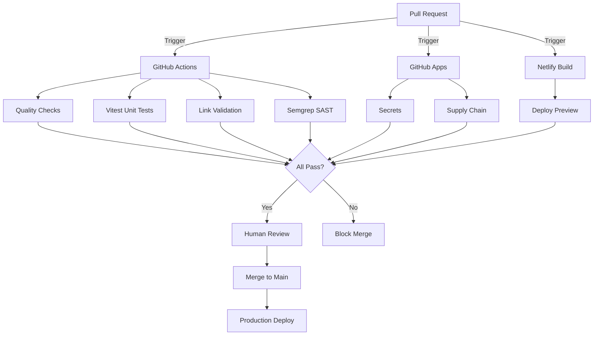

# Architecture Overview

Single source of truth for _what the project is, how it works, and where it is
headed_. This document is referenced by both human documentation and AI working
instructions.

---

## Project Overview

Marketing website for Team 4 Pro Coaching — three IFBB Pro coaches (Helle
Trevino, Gina Cavaliero, Irene Andersen) offering online fitness coaching. Built
with Astro 6, Tailwind CSS v4, TypeScript, deployed on Netlify. Solo developer
(solo maintainer). Static site with planned hybrid rendering for Stripe
(ADR-0022).

---

## Design Philosophy

The goal is code that looks boring on first reading — not because the problems
are trivial, but because every abstraction earns its place, every indirection
has a reason, and nothing is clever when simple would do.

When in doubt between "more structured" and "more direct", choose direct until
proven otherwise. Structure exists to solve a problem — when the problem
disappears, the structure should follow. This philosophy applies equally to
adding and removing abstractions.

Technical debt is not a backlog — it is friction that compounds. When an issue
is identified and the fix is straightforward, the default is to fix it now, not
to track it for later.

### Operational Principles

| Principle               | Implementation                                                                      |
| :---------------------- | :---------------------------------------------------------------------------------- |
| Cost-Conscious          | Public repository, free-tier services (Netlify, Semgrep, GitGuardian), no paid SaaS |
| Security-First          | Defense in depth, signed commits, shift-left scanning in PRs                        |
| Continuity (Bus Factor) | ADRs document decisions, conventional commits, no tribal knowledge                  |
| Fail Fast               | Pre-commit hooks, TypeScript strict mode, Renovate for outdated deps                |
| Developer Experience    | Fast tooling (Biome, Astro), automated formatting, hot reload                       |
| Automation Over Manual  | Git hooks for formatting, Renovate for deps, Netlify for deployment                 |

---

## Project Structure

This is the canonical project tree. All other documents reference this section
rather than maintaining their own copy.

```
/
├── .github/             # CI/CD workflows (no issue/PR templates yet)
├── .husky/              # Git hooks (pre-commit, commit-msg)
├── .semgrep/            # Custom Semgrep rules
├── .vscode/             # Editor settings and recommended extensions
├── docs/                # Project documentation
│   ├── adr/             #   Architecture Decision Records
│   └── reference/       #   Reference docs (animation, color, biome, commitlint, renovate)
├── public/              # Static assets (favicons, robots.txt)
├── scripts/             # Build and CI tooling
│   └── conventions/     #   Convention check functions + unit tests
├── src/
│   ├── components/      # Astro components (.astro)
│   │   ├── layout/      #   Layout helper fragments (BaseHead, SEO)
│   │   ├── navigation/  #   Header, Footer, NavLink, menus
│   │   ├── sections/    #   Page sections by domain
│   │   │   ├── coaches/
│   │   │   ├── contact/
│   │   │   ├── howItWorks/
│   │   │   ├── quiz/
│   │   │   ├── services/
│   │   │   ├── successStories/
│   │   │   └── usps/
│   │   └── ui/          #   Reusable primitives (Button, Modal, FormSelect, etc.)
│   ├── data/            # Typed data modules — business data and config
│   ├── layouts/         # BaseLayout (single page wrapper)
│   ├── pages/           # File-based routing
│   ├── scripts/         # Client-side controller modules (extracted from components)
│   ├── styles/          # Global CSS + shared Tailwind class constants
│   ├── test-utils/      # Shared test helpers (assertNotNull, assertDefined)
│   ├── types/           # Shared TypeScript types (ImageSource, CtaAction, etc.)
│   └── utils/           # Utility functions (slugify, quizContext, counter, etc.)
├── astro.config.mjs     # Astro config (integrations, image domains, CSP hook)
├── biome.json           # Biome formatter + linter config
├── commitlint.config.mjs # Conventional Commits rules
├── netlify.toml         # Build, headers, CSP, redirects
├── package.json         # Scripts and dependencies
├── renovate.json        # Automated dependency updates
├── tsconfig.json        # TypeScript compiler config
└── vitest.config.ts     # Vitest runner config
```

---

## Technical Stack

### Core Technologies

| Technology                 | Purpose                              | Decision                                                             |
| :------------------------- | :----------------------------------- | :------------------------------------------------------------------- |
| **Astro 6**                | Static Site Generator                | [ADR-0001](adr/0001-use-astro-js.md)                                 |
| **Tailwind CSS v4**        | Utility-First CSS                    | `@theme` in `global.css` for custom tokens                           |
| **pnpm**                   | Package Manager                      | [ADR-0002](adr/0002-use-pnpm-package-manager.md)                     |
| **TypeScript**             | Type Safety                          | Strict mode enabled                                                  |
| **Netlify**                | Hosting and Deployment               | [ADR-0018](adr/0018-commit-to-netlify-as-production-platform.md)     |
| **@tailwindplus/elements** | Interactive UI (Modals, Disclosures) | [ADR-0019](adr/0019-use-tailwindplus-elements-for-interactive-ui.md) |

### Code Quality

| Tool                            | Purpose                      | Configuration                                            |
| :------------------------------ | :--------------------------- | :------------------------------------------------------- |
| **Biome**                       | JS/TS Linting and Formatting | `biome.json`                                             |
| **Prettier**                    | Astro/Markdown Formatting    | Built-in                                                 |
| **prettier-plugin-tailwindcss** | Tailwind Class Sorting       | Automatic                                                |
| **Vitest**                      | Unit Testing                 | `vitest.config.ts`                                       |
| **Husky**                       | Git Hooks                    | `.husky/`                                                |
| **lint-staged**                 | Staged File Processing       | `package.json`                                           |
| **commitlint**                  | Commit Message Validation    | `commitlint.config.mjs` ([ref](reference/commitlint.md)) |

### Security and Automation

| Tool             | Purpose                | Scope                   |
| :--------------- | :--------------------- | :---------------------- |
| **Semgrep**      | SAST (Static Analysis) | CI Pipeline             |
| **GitGuardian**  | Secret Detection       | CI Pipeline             |
| **Socket.dev**   | Supply Chain Security  | CI Pipeline             |
| **Gitleaks**     | Secret Detection       | Local (Pre-commit)      |
| **Renovate Bot** | Dependency Updates     | Automated Pull Requests |

---

## Component Organization

Components are organized into domain-based subfolders
([ADR-0007](adr/0007-component-folder-structure.md), amended by
[ADR-0008](adr/0008-clarify-layouts-vs-components-layout.md)).

**Rule**: If a component has `<slot/>` and wraps an entire page →
`src/layouts/`. Everything else → `src/components/`.

| Folder        | Purpose                                       | Examples                                                               |
| :------------ | :-------------------------------------------- | :--------------------------------------------------------------------- |
| `layouts/`    | Page wrappers with `<html>`, `<body>`         | BaseLayout                                                             |
| `layout/`     | Layout helper fragments (no `<slot/>`)        | BaseHead, SEO, ScrollAnimations                                        |
| `navigation/` | Site navigation and routing                   | Header, Footer, DesktopMenu, MobileMenu                                |
| `sections/`   | Page sections and their domain-specific parts | Hero, Services, CoachDetailModal, QuizModal                            |
| `ui/`         | Generic reusable primitives                   | Button, Modal, TextLink, FormSelect, FilterBar, SegmentedControl, Logo |

Domain-specific components live in subfolders under `sections/` (e.g.,
`sections/coaches/CoachDetailModal.astro`, `sections/quiz/QuizModal.astro`).
Generic shells like `Modal.astro` stay in `ui/` — domain modals build on them.

Section components delegate their layout to `Content.astro` and inject
domain-specific content via slots. This keeps layout logic (padding, max-width,
section backgrounds) in one place. For details on composition patterns, dark
background handling, and client-side script conventions, see
[CONVENTIONS.md](CONVENTIONS.md).

---

## Page and Component Map

| Page               | Key Components                                                                              | Data Sources                                                     |
| :----------------- | :------------------------------------------------------------------------------------------ | :--------------------------------------------------------------- |
| `/` (Homepage)     | HeroSplit, Services, Stats, Usps, Coaches, SuccessStories, CTA, CoachDetailModal, QuizModal | coaches, cta, ids, routes, services, stats, successStories, usps |
| `/services`        | HeroFullscreen, ServicesCatalog (FilterBar, SegmentedControl, ServiceCard), CTA, QuizModal  | ids, routes, services                                            |
| `/coaches`         | HeroSplit, Coaches (expanded), Testimonial, Content, PullQuote, CTA, CoachDetailModal       | coaches, routes                                                  |
| `/how-it-works`    | HeroFullscreen, ProcessSteps, FaqAccordion, CTA                                             | howItWorks, routes                                               |
| `/success-stories` | HeroFullscreen, SuccessStoryGridCard, TestimonialGrid, SectionHeader, CTA                   | routes, successStories, testimonials                             |
| `/contact`         | Contact, ContactForm (FormSelect)                                                           | contact                                                          |
| `/contact/thanks`  | Button                                                                                      | thanks                                                           |
| `/privacy`         | BaseLayout only — placeholder content pending real legal copy                               | routes                                                           |
| `/terms`           | BaseLayout only — placeholder content pending real legal copy                               | routes                                                           |

---

## CTA Map

All CTAs are defined in `src/data/routes.ts`. See also `src/data/cta.ts` for
shared CTA configurations.

| Page                   | Primary CTA           | Target              | Secondary CTA            | Target                |
| :--------------------- | :-------------------- | :------------------ | :----------------------- | :-------------------- |
| Homepage Hero          | Start with Team 4 Pro | `/contact`          | Learn about our Services | `#services` (on-page) |
| Homepage Quiz          | Take the Quiz         | QuizModal           | —                        | —                     |
| Homepage Bottom        | Start Your Journey    | `/contact`          | Explore Services         | `/services`           |
| Services Hero          | Take the Quiz         | QuizModal           | Explore Categories       | `#categories`         |
| Services Bottom        | Take the Quiz         | QuizModal           | Contact Us               | `/contact`            |
| Coaches Hero           | Meet the Coaches      | `#meet-the-coaches` | View Our Services        | `/services`           |
| Coaches Bottom         | Contact Us            | `/contact`          | View Services            | `/services`           |
| How It Works Hero      | Book Consultation     | `/contact`          | See How It Works         | `#how-it-works`       |
| How It Works Bottom    | Book Consultation     | `/contact`          | Explore Services         | `/services`           |
| Success Stories Hero   | Start Transformation  | `/contact`          | Explore Stories          | `#stories`            |
| Success Stories Bottom | Start Transformation  | `/contact`          | Explore Services         | `/services`           |

---

## Key Data Flows

### Quiz to Contact (ADR-0021)

```
QuizModal (4 steps) → saveQuizAnswers(sessionStorage) → Result screen
  ├─ "Get in Touch" → /contact?goal=...&service=...&experience=...&timeline=...
  │   → ContactForm reads sessionStorage (priority) or URL params (fallback)
  │   → Summary card + service dropdown preselect + hidden fields for Netlify
  └─ "View This Service" → /services?category=...&service=...
      → servicesFilterController narrows catalog to that category + highlights card
      → User clicks "Get Started" → /contact?service=...
      → ContactForm reads sessionStorage (quiz context survives)
```

### Quiz to Services Deep-Link

```
Quiz result href → /services?category=bodybuilding&service=competition-prep
  → servicesFilterController resolves ?service= to its category (priority over ?category=)
  → narrows catalog to that category + scrolls to card + .quiz-highlight pulse (3s via HIGHLIGHT_DURATION_MS)
```

---

## Known Coupling Points

Places where changes in one file require manual sync in another:

- **`styles/quizClasses.ts`** and `QuizStepPanel.astro` +
  `quizModalController.ts` — radio-card label classes shared between
  server-rendered and client-rendered options
- **`quiz.ts` `SerializedQuizData`** and `quizModalController.ts` — the type
  describes the JSON shape passed via `<template data-json>`
- **`quiz.ts` results** and `quizContext.ts` `answerLabels` — labels are derived
  from quiz.ts at module load, not duplicated manually

---

## Design System

### Color System

Custom color palette with semantic token names, defined in
`src/styles/global.css` under `@theme` and consumed via Tailwind CSS v4 utility
classes.

| Ramp               | Base Color | Role                                       |
| :----------------- | :--------- | :----------------------------------------- |
| `foreground`       | `#38070f`  | Text and UI elements (warm dark brown)     |
| `accent`           | `#bf7960`  | Primary CTAs and actions (terracotta)      |
| `teal`             | `#4a9199`  | Secondary accents and highlights           |
| `background`       | `#f7eee5`  | Standard page background (warm cream)      |
| `background-muted` | `#e8ddd6`  | Alternating section background (warm sand) |

The light mode uses six section background variants to create visual rhythm,
managed via `SectionBackground` type and utility maps in
`src/styles/sectionStyles.ts`.

Full specification: [Color System Reference](reference/color-system.md).
Decision: [ADR-0014](adr/0014-light-mode-section-background-system.md) (silver
revised by [ADR-0032](adr/0032-revise-silver-surface-for-aa.md)).

### Typography

| Token          | Font Family                      | Usage         |
| :------------- | :------------------------------- | :------------ |
| `--font-sans`  | Manrope, sans-serif              | Body text, UI |
| `--font-serif` | Playfair Display, Georgia, serif | Headlines     |

### Dark Mode

Dark mode is supported via Tailwind's `dark:` variant. All components include
both light and dark mode classes. Section background variants (teal, silver,
sage, charcoal) are light-mode only — in dark mode, all variants fall back to
`background-dark` or `background-dark-muted`.

### Animation and Motion

Scroll-triggered reveal animations and hover micro-interactions. Implemented
with zero external dependencies — vanilla CSS transitions + a global
IntersectionObserver.

Key rules: every section animates on scroll, hover effects only on fully
interactive elements, `prefers-reduced-motion: reduce` disables all movement,
scroll-animate and hover classes must never share the same DOM element.

Full specification: [Animation System Reference](reference/animation-system.md).
Decision: [ADR-0015](adr/0015-animation-and-motion-system.md).

---

## Architecture Decisions

All major decisions are documented as Architecture Decision Records (ADRs) in
`docs/adr/`.

### When to Write an ADR

Write an ADR when a decision meets any of these criteria:

- It affects multiple files or components (not just a local refactor)
- It chooses between two or more viable alternatives
- Reversing it later would be expensive
- A future developer (or AI tool) would ask "why was it done this way?"

Not every decision needs an ADR. Adding a new component or fixing a bug does not
qualify. Introducing sessionStorage as a cross-page persistence layer, or
switching the rendering model — those do.

### ADR Process

Copy `docs/adr/0000-template.md`. Include the ADR in the same PR as the
implementation. Add a summary to the quick reference table below.

ADRs are immutable once accepted. Exceptions: status change to "Superseded",
status notes as blockquotes, and migration tracking tables. If a decision was
wrong, write a new ADR that supersedes it.

### ADR Quick Reference

| #    | Decision                        | Status     | Key Insight                                                                                     |
| :--- | :------------------------------ | :--------- | :---------------------------------------------------------------------------------------------- |
| 0001 | Use Astro                       | Accepted   | SSG framework, zero-JS default                                                                  |
| 0002 | Use pnpm                        | Accepted   | Strict deps, workspace-ready                                                                    |
| 0003 | Biome for linting               | Superseded | Replaced by ADR-0004 (added Prettier for .astro/.md)                                            |
| 0004 | Biome + Prettier                | Accepted   | Biome for JS/TS, Prettier for .astro/.md                                                        |
| 0005 | Renovate + Socket.dev           | Accepted   | Auto-update deps with supply chain scanning                                                     |
| 0006 | Strict pinning                  | Accepted   | `.nvmrc`, `engines`, exact versions                                                             |
| 0007 | Component folders               | Accepted   | `sections/` by domain, `ui/` for primitives                                                     |
| 0008 | Layouts vs layout/              | Accepted   | `layouts/` = page wrappers, `layout/` = fragments                                               |
| 0009 | `type` for Props                | Accepted   | Not `interface` — consistency with Astro ecosystem                                              |
| 0010 | SmartImage + ImageSource        | Accepted   | Discriminated union for local/remote images                                                     |
| 0011 | Content format framework        | Accepted   | All data currently in TS modules. Collections may return                                        |
| 0012 | Script strategy (original)      | Superseded | Replaced by ADR-0020                                                                            |
| 0013 | Named exports                   | Accepted   | No default exports in data/utils                                                                |
| 0014 | Section backgrounds             | Accepted   | Token-based: default, muted, teal, silver, sage, charcoal (silver partially superseded by 0032) |
| 0015 | Animation system                | Accepted   | `data-animate` + IntersectionObserver + CSS                                                     |
| 0016 | Vitest                          | Accepted   | Unit tests for data integrity, jsdom for DOM tests                                              |
| 0017 | Data integrity pattern          | Accepted   | `as const satisfies Record<>` for compile-time safety                                           |
| 0018 | Netlify platform                | Accepted   | Forms, Deploy Previews, credit-aware strategy                                                   |
| 0019 | @tailwindplus/elements          | Accepted   | `<el-dialog>` for modals, `<el-disclosure>` for FAQ                                             |
| 0020 | Script strategy (revised)       | Accepted   | Module scripts default, `is:inline` for Critical Early Exec                                     |
| 0021 | sessionStorage persistence      | Accepted   | Quiz answers persist across pages, URL params as fallback                                       |
| 0022 | Hybrid rendering                | Accepted   | SSG default, SSR only for Stripe endpoints                                                      |
| 0023 | Filter vs. Selection primitives | Accepted   | Two distinct UI primitives for selection and filter patterns                                    |
| 0024 | Category filter semantics       | Accepted   | `toolbar` + `aria-pressed` instead of `tablist` for Services filter                             |
| 0025 | Filterable catalog pages        | Accepted   | Server renders full list, client filters — SEO + static gen friendly                            |
| 0026 | Dual-dispatch controller init   | Accepted   | `bootstrapOnLoad` helper dispatches on both DOMContentLoaded + astro:page-load                  |
| 0027 | Invokers API modal triggers     | Accepted   | `command`/`commandfor` against `<dialog>` as the single modal-trigger mechanism                 |
| 0028 | FilterBar labelling XOR         | Accepted   | `ariaLabel` and `ariaLabelledBy` are equal alternatives; exactly one required                   |
| 0029 | Services toolbar-filter         | Accepted   | `FilterBar` primitive + services-specific controller + inline template contract                 |
| 0030 | CSP hash strategy               | Accepted   | Post-build script generates SHA-256 hashes for inline scripts/styles                            |
| 0031 | Native view transitions         | Deferred   | Remove ClientRouter; would supersede ADR-0026 and simplify ADR-0030 if accepted                 |
| 0032 | Silver surface AA revision      | Accepted   | Silver hex #acacac → #6e6e6e; cards no longer required on silver                                |
| 0033 | Inline-first page composition   | Accepted   | New UI inline in the page unless ≥2 consumers, non-trivial logic, or shared primitive/shell     |

### Active ADRs — Day-to-Day Impact

**ADR-0020 (Script Strategy)**: Module `<script>` is the default. `is:inline`
only for Critical Early Execution. See Pending Work below for current migration
status.

**ADR-0021 (Quiz Persistence)**: Quiz answers persist in `sessionStorage` across
navigations, URL parameters as fallback. Shared utility:
`src/utils/quizContext.ts`.

**ADR-0022 (Hybrid Rendering)**: Currently full SSG. Planned: `output: 'server'`
with `prerender: true` default. All marketing pages stay static. Server
endpoints only for Stripe API routes. Config change comes with Stripe PR.

**ADR-0023 (Filter vs. Selection)**: `FilterBar` (JS + toolbar) for filter
semantics with URL state. `SegmentedControl` (CSS-only) for local selection.
Both live in `components/ui/`, both share pill styling, but their interaction
models are disjoint. Cross-referenced in both JSDoc headers.

**ADR-0024 (Category Filter Semantics)**: Services category navigation uses
`role="toolbar"` + `aria-pressed`, not `tablist`. This supports an "All" default
view and matches the user's mental model of filtering (not selecting). Future
filterable lists on the site follow the same pattern.

**ADR-0025 (Filterable Catalog Pages)**: Services page server-renders all
services regardless of URL parameters. The client-side filter controller is
bootstrapped via `bootstrapOnLoad` (see ADR-0026) and hides non-matching groups
via `.hidden`. An inline head-script prevents content flash on deep-link
landings. Applies to any future filterable catalog (Success Stories by tag,
Coaches by specialty).

**ADR-0026 (Dual-Dispatch Controller Init)**: Controllers requiring cold-load
interactivity bootstrap via `bootstrapOnLoad(init)` from `~/utils/bootstrap`,
which dispatches on both `DOMContentLoaded` (`{ once: true }`) and
`astro:page-load`. The init callback must be idempotent via a guard set
synchronously at function entry (see ADR-0026 Decision section for the
async-boundary detail). Components divide into three categories: (1) using the
helper — `ServicesCatalog`, `QuizModal`; (2) conforming to the pattern
invariants with helper migration pending — `SuccessStories`; (3) not yet
conforming (`astro:page-load`-only) — `ScrollAnimations`, `CoachDetailModal`,
`ContactForm`.

**ADR-0027 (Invokers API Modal Triggers)**: All modal triggers use the native
`command="show-modal"` + `commandfor` attributes against `<dialog>` elements —
no JavaScript event binding. Modal IDs are registered centrally in
`src/data/ids.ts` as `MODAL_IDS` with a derived `ModalId` type. The type rejects
unknown ids at compile time when the consuming prop is typed as `ModalId` (for
example `ModalCta.modalId`); a hardcoded string that happens to match a
registered value is still accepted — the type enforces _registration_, not
_reference via the registry constant_. Best practice on both trigger and target
sides is to reference `MODAL_IDS.*`.

**ADR-0030 (CSP Hash Strategy)**: The production Content-Security-Policy in
`netlify.toml` allow-lists inline `<script>` and `<style>` blocks via per-block
SHA-256 hashes. A post-build script (`scripts/generate-csp-hashes.mjs`) scans
`dist/**/*.html`, deduplicates, and rewrites the `script-src` and `style-src`
directives. Runs as an `astro:build:done` hook registered in `astro.config.mjs`;
the `csp-drift.yml` CI workflow fails if the committed `netlify.toml` is out of
sync with the build output.

---

## CI/CD Pipeline


```mermaid
graph TD
    PR[Pull Request] -->|Trigger| CI_GHA[GitHub Actions]
    PR -->|Trigger| CI_Apps[GitHub Apps]
    PR -->|Trigger| Netlify[Netlify Build]

    CI_GHA --> Quality[Quality Checks]
    CI_GHA --> Tests[Vitest Unit Tests]
    CI_GHA --> Links[Link Validation]
    CI_GHA --> Semgrep[Semgrep SAST]

    CI_Apps --> GitGuardian[Secrets]
    CI_Apps --> Socket[Supply Chain]

    Quality --> Gate{All Pass?}
    Tests --> Gate
    Links --> Gate
    Semgrep --> Gate
    GitGuardian --> Gate
    Socket --> Gate

    Netlify --> Preview[Deploy Preview]
    Preview --> Gate

    Gate -->|Yes| Review[Human Review]
    Gate -->|No| Fail[Block Merge]

    Review --> Merge[Merge to Main]
    Merge --> Production[Production Deploy]
```

### Update Strategy

| Type             | Schedule         | Rationale                        |
| :--------------- | :--------------- | :------------------------------- |
| **Runtime**      | Monthly (1st)    | Stability for Node/pnpm          |
| **Dependencies** | Weekly (Mondays) | Keep technical debt low          |
| **Security**     | Immediate        | Critical patches ignore schedule |

---

## Deployment

Hosted on Netlify with immutable deployments. Every deployment is atomic — the
site never exists in a half-deployed state. Rollback is instant via Dashboard.

Netlify uses a credit-based model (300 credits/month free). Each production
deploy costs 15 credits. Deploy Previews are free and unlimited. Auto-deploy is
disabled during launch phase; the `ignore` script in `netlify.toml` skips builds
when no relevant files changed.

| Setting           | Value                |
| :---------------- | :------------------- |
| **Build Command** | `pnpm build`         |
| **Output**        | `dist/`              |
| **Node Version**  | Managed via `.nvmrc` |

---

## Pending Work

### Technical Debt

- **CoachDetailModal**: Last `is:inline` script — migrate to a module `<script>`
  the next time its script behavior is touched, per CLAUDE.md Critical Rule 2
  and [ADR-0020](adr/0020-client-side-script-strategy-revised.md)
- **Logo**: Still using placeholder — real logo outstanding from coaches
- **Legal pages**: `/privacy` and `/terms` — placeholder content, real legal
  copy outstanding
- **`src/data/testimonials.ts` ADR-0017 lift**: Testimonials still use
  `id: string`, with no `testimonialIds` const, no derived `TestimonialId` type,
  and no `testimonialsById` record. Once migrated, the optional
  `Service.testimonialIds` field can be tightened from `readonly string[]` to
  `readonly TestimonialId[]`

### Content Blockers (for Launch)

- Coach content delivery from Helle, Irene, Gina still pending
- Gina's prices not yet finalized

### Upcoming Features (from Coaches)

| Feature                 | Scope                                    | Status / Complexity                            |
| :---------------------- | :--------------------------------------- | :--------------------------------------------- |
| Stripe integration      | New API endpoints, checkout flow         | ADR-0022 decision made, implementation pending |
| Success Stories detail  | `/success-stories/[slug]` pages          | See DECISION_GUIDES.md (Modal vs. Page)        |
| Service additional info | Expandable details per service card      | Medium                                         |
| Curtain reveal effect   | Opening animation when visiting the site | Medium — CSS animation + scroll trigger        |
| How It Works expansion  | More content/sections                    | Low to Medium                                  |
| Color changes           | At one specific location (TBD)           | Low — Tailwind theme tokens                    |

### Infrastructure Enhancements

| Enhancement            | Goal                              | Status                            |
| :--------------------- | :-------------------------------- | :-------------------------------- |
| CI Quality Workflow    | TypeCheck + Lint + Format in CI   | Implemented (quality.yml)         |
| Testing Infrastructure | Unit tests (Vitest) in CI         | Implemented (tests.yml, ADR-0016) |
| E2E Testing            | Playwright for visual regression  | Planned                           |
| Content Management     | Git-based or headless CMS         | Raw TypeScript modules            |
| Performance Monitoring | Lighthouse CI in GitHub Actions   | Manual checks                     |
| Analytics              | GDPR-compliant (Plausible/Fathom) | None                              |

---

## Documentation Map

### For Developers

| Document                   | Purpose                                                      | When to Read                         |
| :------------------------- | :----------------------------------------------------------- | :----------------------------------- |
| README.md                  | Quick start and essential commands                           | First contact with the project       |
| **ARCHITECTURE.md** (this) | Project context, architecture, design system                 | Understanding the big picture        |
| CONVENTIONS.md             | Coding patterns, naming, export style                        | Writing or reviewing code            |
| DEVELOPMENT.md             | Setup, tooling, daily workflow, troubleshooting              | Setting up or debugging              |
| CONTRIBUTING.md            | Workflow, commits, PR process                                | Contributing changes                 |
| MAINTENANCE.md             | CI/CD operations, security, dependency updates               | Touching infrastructure              |
| DECISION_GUIDES.md         | Modal vs. Page, When to Use MDX                              | Introducing new views or formats     |
| FEATURE_TEMPLATE.md        | Template for scoping new features                            | Scoping a new feature                |
| docs/adr/\*.md             | Individual architecture decisions                            | When a specific decision is relevant |
| docs/reference/            | Tool configs (biome, commitlint, renovate, color, animation) | When adjusting tool behavior         |

### For AI Tools

| Document                   | Purpose                                        | When to Use               |
| :------------------------- | :--------------------------------------------- | :------------------------ |
| **ARCHITECTURE.md** (this) | Project context (shared with developers)       | Always — read for context |
| CLAUDE.md                  | Working instructions for implementation        | Implementation phase      |
| docs/REQUIREMENTS_GUIDE.md | Working instructions for requirements analysis | Requirements phase        |
