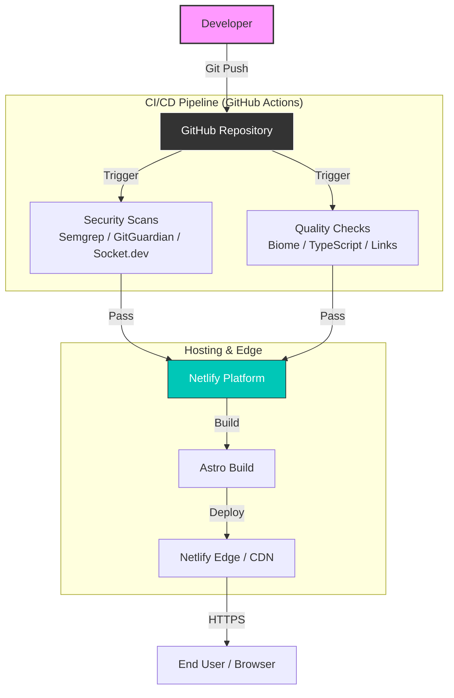
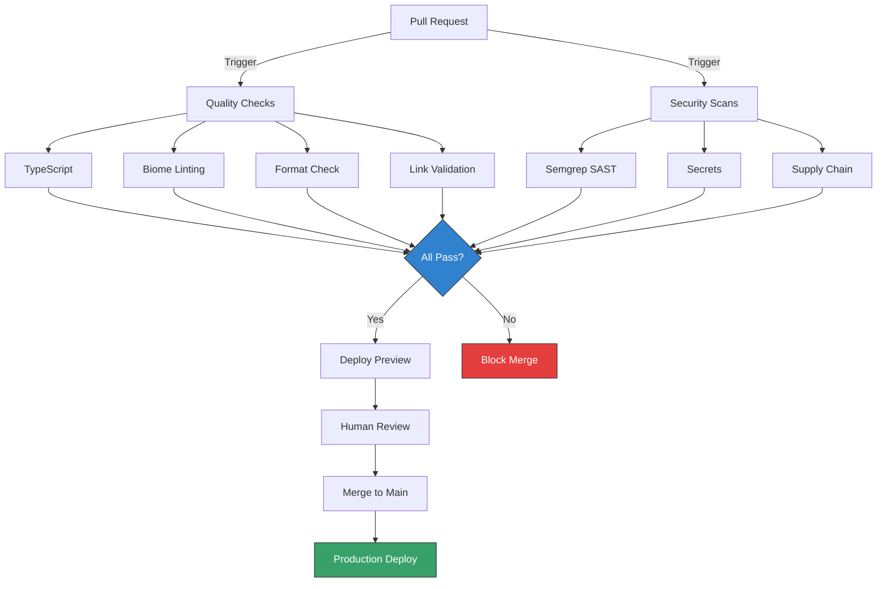

# Architecture Overview

This document provides a high-level overview of the **Team 4 Pro Coaching**
website's technical architecture, key decisions, and the rationale behind tool
choices.

It is designed to give new developers a complete understanding of how the system
works, is secured, and deployed.

## 📋 Table of Contents

- [Project Goals](#-project-goals)
- [System Context Diagram](#-system-context-diagram)
- [Project Structure](#-project-structure)
- [Technical Stack](#️-technical-stack)
- [Architecture Decisions](#️-architecture-decisions)
- [CI/CD Pipeline](#-cicd-pipeline)
- [Deployment Architecture](#-deployment-architecture)
- [Design Principles](#-design-principles)
- [Future Roadmap](#-future-roadmap)
- [Related Documentation](#-related-documentation)

---

## 🎯 Project Goals

### Primary Objectives

| Objective           | Description                                                |
| :------------------ | :--------------------------------------------------------- |
| **Continuity**      | Maintainable by others if primary developer is unavailable |
| **Stability**       | Strict pinning ensures builds work identically over time   |
| **Security**        | High standards (Shift-Left) without enterprise costs       |
| **Performance**     | Static HTML delivery for maximum speed and SEO             |
| **Cost Efficiency** | Minimized fixed costs via free-tier services               |

### Target Audience

- **End Users**: Fitness coaching clients
- **Content Editors**: Coaches (non-technical content management)
- **Maintainers**: Developers ensuring the system stays online and secure

---

## 🧩 System Context Diagram


```mermaid
graph TD
    User[Developer] -->|Git Push| GitHub[GitHub Repository]

    subgraph "CI/CD Pipeline (GitHub Actions)"
        GitHub -->|Trigger| Security[Security Scans<br/>Semgrep / GitGuardian / Socket.dev]
        GitHub -->|Trigger| Quality[Quality Checks<br/>Biome / TypeScript / Links]
    end

    Security -->|Pass| Netlify
    Quality -->|Pass| Netlify

    subgraph "Hosting & Edge"
        Netlify[Netlify Platform] -->|Build| Build[Astro Build]
        Build -->|Deploy| CDN[Netlify Edge / CDN]
    end

    CDN -->|HTTPS| Client[End User / Browser]

    style User fill:#f9f,stroke:#333,stroke-width:2px
    style GitHub fill:#333,stroke:#fff,color:#fff
    style Netlify fill:#00c7b7,stroke:#333,color:#fff
```

---

## 📂 Project Structure

```text
/
├── .github/             # CI/CD pipelines & templates
├── .husky/              # Git hooks (pre-commit automation)
├── docs/                # Project documentation
├── public/              # Static assets (favicons, robots.txt)
├── src/
│   ├── components/      # UI Components (.astro)
│   │   ├── layout/      #   Layout helper fragments (BaseHead, SEO)
│   │   ├── navigation/  #   Navigation (Header, menus, NavLink)
│   │   ├── sections/    #   Page sections (Hero, Features, etc.)
│   │   └── ui/          #   Reusable primitives (Button, Logo, etc.)
│   ├── content/         # Content Collections — rich body text with detail pages (ADR-0011)
│   ├── data/            # Typed data modules — structured business data and config (ADR-0011)
│   ├── layouts/         # Page wrappers (BaseLayout - Astro convention)
│   ├── pages/           # Route definitions
│   ├── types/           # Shared TypeScript types
│   ├── utils/           # Utility functions
│   └── styles/          # Global CSS (Tailwind directives)
├── .npmrc               # Strict package manager configuration
├── .nvmrc               # Node.js version definition
├── astro.config.mjs     # Astro framework configuration
├── biome.json           # Linter/Formatter rules
├── netlify.toml         # Netlify deployment settings
├── package.json         # Dependencies & scripts
└── renovate.json        # Automated dependency updates
```

### Component Organization

Components are organized into domain-based subfolders
([ADR-0007](adr/0007-component-folder-structure.md), amended by
[ADR-0008](adr/0008-clarify-layouts-vs-components-layout.md)):

**Page Wrappers** (`src/layouts/`):

| Component    | Purpose                                         |
| :----------- | :---------------------------------------------- |
| `BaseLayout` | Page wrapper with `<html>`, `<body>`, `<slot/>` |

**Components** (`src/components/`):

| Folder        | Purpose                                   | Examples                        |
| :------------ | :---------------------------------------- | :------------------------------ |
| `layout/`     | Layout helper fragments (no `<slot/>`)    | BaseHead, SEO                   |
| `navigation/` | Site navigation, menus, routing           | Header, DesktopMenu, MobileMenu |
| `sections/`   | Self-contained page sections with layout  | Hero, Features, Testimonials    |
| `ui/`         | Small, reusable primitives without layout | Button, TextLink, Logo          |

> **Rule**: If a component has `<slot/>` and wraps an entire page →
> `src/layouts/`. Everything else → `src/components/`.

### Shared Types

Reusable TypeScript types are centralized in `src/types/`:

| File            | Purpose                                       |
| :-------------- | :-------------------------------------------- |
| `components.ts` | Shared types for components (ImageProp, etc.) |

### Utility Functions

Reusable utility functions are centralized in `src/utils/`:

| File         | Purpose                                          |
| :----------- | :----------------------------------------------- |
| `slugify.ts` | Generate URL-safe slugs for IDs and anchor links |

**Usage:**

```typescript
import type { ImageProp } from '~/types/components';
import { slugify } from '~/utils/slugify';
```

This ensures consistency across components that share common patterns (e.g.,
image handling with Astro's `<Image />` component — see
[ADR-0010](adr/0010-use-astro-image-component-consistently.md)).

---

## 🏗️ Technical Stack

### Core Technologies

| Technology       | Purpose               | Why Chosen                                                              |
| :--------------- | :-------------------- | :---------------------------------------------------------------------- |
| **Astro.js**     | Static Site Generator | Fast, modern, excellent DX ([ADR-0001](adr/0001-use-astro-js.md))       |
| **Tailwind CSS** | Utility-First CSS     | Rapid styling, consistent design system                                 |
| **pnpm**         | Package Manager       | Fast, disk-efficient ([ADR-0002](adr/0002-use-pnpm-package-manager.md)) |
| **TypeScript**   | Type Safety           | Catch errors early, better IDE support                                  |
| **Netlify**      | Hosting & Deployment  | Free tier, excellent DX, automatic deployments                          |

### Code Quality Stack

| Tool                            | Purpose                    | Configuration  |
| :------------------------------ | :------------------------- | :------------- |
| **Biome**                       | JS/TS Linting & Formatting | `biome.json`   |
| **Prettier**                    | Astro/Markdown Formatting  | Built-in       |
| **prettier-plugin-tailwindcss** | Tailwind Class Sorting     | Automatic      |
| **Husky**                       | Git Hooks                  | `.husky/`      |
| **lint-staged**                 | Staged File Processing     | `package.json` |
| **commitlint**                  | Commit Message Validation  | Conventional   |

### Security & Automation Stack

| Tool             | Purpose                | Scope                   |
| :--------------- | :--------------------- | :---------------------- |
| **Semgrep**      | SAST (Static Analysis) | CI Pipeline             |
| **GitGuardian**  | Secret Detection       | CI Pipeline             |
| **Socket.dev**   | Supply Chain Security  | CI Pipeline             |
| **Gitleaks**     | Secret Detection       | Local (Pre-commit)      |
| **Renovate Bot** | Dependency Updates     | Automated Pull Requests |

---

## 🏛️ Architecture Decisions

All major decisions are documented as Architecture Decision Records (ADRs) in
[`docs/adr/`](adr/).

### ADR-0001: Use Astro and MDX

**Decision**: Use Astro as the primary web framework with MDX and Content
Collections.

**Rationale**:

- **Cost Efficiency**: Zero-cost hosting on Netlify and git-based storage
- **Performance**: Static Site Generation ensures excellent Core Web Vitals
- **Data Integrity**: Content Collections (Zod) prevent build errors via schema
  validation
- **Flexibility**: MDX allows embedding interactive components within content

**Alternatives**: Gatsby (declining ecosystem), WordPress (high maintenance).

### ADR-0002: Use pnpm

**Decision**: Use pnpm as the exclusive package manager.

**Rationale**:

- **Performance**: Faster installation via global content-addressable store
- **Efficiency**: Reduced disk space usage (hard links)
- **Reliability**: Strict dependency resolution prevents phantom dependencies

**Alternatives**: npm (flat node_modules issues).

### ADR-0004: Hybrid Formatting (Biome + Prettier)

**Decision**: Domain-split strategy using Biome for code and Prettier for
content.

**Rationale**:

- **Biome**: JS/TS/JSON/CSS — extreme speed, simplified config
- **Prettier**: `.astro`/`.mdx` — safe template handling
- **Risk Mitigation**: Avoids experimental Astro support in Biome

**Alternatives**: Pure Biome (immature for Astro), ESLint + Prettier.

### ADR-0005: Renovate Bot & Socket.dev

**Decision**: Renovate for dependency updates + Socket.dev for security.

**Rationale**:

- **Automation**: Reduces manual toil
- **Security**: Socket.dev detects supply chain attacks
- **Grouping**: Related packages updated together to reduce PR noise

**Alternatives**: Dependabot (less flexible grouping).

### ADR-0006: Strict Environment and Dependency Pinning

**Decision**: Enforce exact version matching for Node.js, pnpm, and all
dependencies.

**Rationale**:

- **Determinism**: Builds work identically across all environments
- **Stability**: No surprise updates that could break production
- **Traceability**: Every version change is explicit in Git history

**Alternatives**: Flexible ranges (risk of unexpected breakage).

### ADR-0007: Component Folder Structure

**Decision**: Organize components into domain-based subfolders.

**Rationale**:

- **Predictability**: Clear location for new components based on purpose
- **Scalability**: Structure accommodates growth without clutter
- **Separation of Concerns**: Folder name communicates architectural role

**Alternatives**: Flat structure with naming conventions.

### ADR-0008: Clarify Layouts vs Components/Layout

**Decision**: Distinguish `src/layouts/` (page wrappers) from
`components/layout/` (helper fragments).

**Rationale**:

- **Astro Alignment**: Follows Astro's official project structure convention
- **Clear Mental Model**: "layouts/ = page wrappers, components/layout/ = helper
  fragments"

**Amends**: ADR-0007.

### ADR-0009: Use `type` for Component Props

**Decision**: Use `type` exclusively (not `interface`) for all `Props`
definitions in Astro components and data structures.

**Rationale**:

- **Consistency**: Single uniform pattern across the entire codebase
- **Flexibility**: `type` natively supports unions, intersections, and mapped
  types — patterns commonly needed for component props
- **Clarity**: Eliminates the need to decide between `type` and `interface` on a
  case-by-case basis

**Alternatives**: `interface` (provides declaration merging, but that is
undesirable for component props).

### ADR-0010: Use `ImageSource` Discriminated Union and `SmartImage` Wrapper

**Decision**: All image sources use the `ImageSource` discriminated union type
(`kind: 'local' | 'remote'`) instead of `string | ImageMetadata`. A `SmartImage`
wrapper component handles Astro's `<Image />` type overloads in one place.

**Rationale**:

- **Domain-driven types**: `kind` discriminator is self-documenting and
  extensible
- **Single narrowing point**: SmartImage eliminates duplicated type checks
  across all components
- **Pragmatic exceptions**: Small decorative images (≤ 64px) may use ``

**Exceptions**: `Logo.astro` (decorative SVGs), `CoachDetailModal.astro`
(runtime-dynamic src), small avatars (≤ 64px) in TestimonialCard and
SuccessStoryGridCard.

### ADR-0011: Content Format Decision Framework

**Decision**: Use a three-question flowchart to determine whether data belongs
in a Content Collection (MDX/YAML) or a TypeScript data module
([ADR-0011](adr/0011-content-format-decision-framework.md)).

**Rationale**:

- **Q1 — Rich body text?** → MDX Content Collection (e.g., success stories)
- **Q2 — Tightly coupled to code logic?** → TypeScript module (e.g., services,
  coaches, quiz)
- **Q3 — Large/growing dataset or non-developer editors?** → Content Collection;
  otherwise TypeScript (e.g., testimonials, FAQ, stats stay as TypeScript)

**Current assignments**: Success stories → MDX Collection. All other data
(services, coaches, testimonials, navigation, etc.) → TypeScript modules.

### ADR-0012: Client-Side Script Strategy

**Decision**: Use module `<script>` by default. Use `<script is:inline>` only
when the component reads build-time data from `<template>` elements, needs
critical early execution, or requires re-execution after View Transitions
([ADR-0012](adr/0012-client-side-script-strategy.md)).

**Rationale**:

- **Module `<script>`** — bundled, tree-shaken, TypeScript, deduped (default)
- **`is:inline`** — unbundled, global scope, re-executes on navigation
  (CoachDetailModal, QuizModal, ServiceCategoryTabs, HeroFullscreen)

**Conventions**: `is:inline` scripts use IIFEs, `var`, DOM API (no innerHTML),
and `data-*-initialized` guards.

### ADR-0013: Use Named Exports for Data Modules

**Decision**: All `src/data/*.ts` modules use named exports exclusively. No
default exports ([ADR-0013](adr/0013-use-named-exports-for-data-modules.md)).

**Rationale**: Default exports allow arbitrary rename at import site, making
global search unreliable. Named exports fix the symbol name, improve IDE
auto-imports, and align with Astro convention.

---

## 🔄 CI/CD Pipeline


```mermaid
graph TD
    PR[Pull Request] -->|Trigger| CI_Quality[Quality Checks]
    PR -->|Trigger| CI_Security[Security Scans]

    CI_Quality --> TypeCheck[TypeScript]
    CI_Quality --> Lint[Biome Linting]
    CI_Quality --> Format[Format Check]
    CI_Quality --> Links[Link Validation]

    CI_Security --> Semgrep[Semgrep SAST]
    CI_Security --> GitGuardian[Secrets]
    CI_Security --> Socket[Supply Chain]

    TypeCheck --> Gate{All Pass?}
    Lint --> Gate
    Format --> Gate
    Links --> Gate
    Semgrep --> Gate
    GitGuardian --> Gate
    Socket --> Gate

    Gate -->|Yes| Preview[Deploy Preview]
    Gate -->|No| Fail[Block Merge]

    Preview --> Review[Human Review]
    Review --> Merge[Merge to Main]
    Merge --> Production[Production Deploy]

    style Gate fill:#3182ce,stroke:#333,color:#fff
    style Production fill:#38a169,stroke:#333,color:#fff
    style Fail fill:#e53e3e,stroke:#333,color:#fff
```

### Update Strategy

| Type             | Schedule         | Rationale                        |
| :--------------- | :--------------- | :------------------------------- |
| **Runtime**      | Monthly (1st)    | Stability for Node/pnpm          |
| **Dependencies** | Weekly (Mondays) | Keep technical debt low          |
| **Security**     | Immediate        | Critical patches ignore schedule |

---

## 🚀 Deployment Architecture

### Hosting: Netlify

We utilize Netlify's **Immutable Deployments**:

- **Atomic**: Every deployment is unique. The site never exists in a
  "half-deployed" state.
- **Rollback**: If `v2` breaks, instantly switch back to `v1` via Dashboard.

### Configuration

| Setting           | Value                |
| :---------------- | :------------------- |
| **Build Command** | `pnpm build`         |
| **Output**        | `dist/`              |
| **Node Version**  | Managed via `.nvmrc` |

### Deploy Previews

Every Pull Request automatically triggers an isolated preview:

- **Unique URL**: Each PR gets a permanent, shareable URL
- **Production Parity**: Same build process as live site
- **Stakeholder Review**: Non-technical team can review before merge
- **No "Works on my Machine"**: Runs in Netlify cloud environment

---

## 📐 Design Principles

### 1. Cost-Conscious Architecture

**Principle**: Maximize quality while minimizing costs.

- **Public Repository**: Unlocks free GitHub tiers
- **Free-Tier First**: Netlify, Semgrep, GitGuardian in free tiers
- **Open Source**: No paid SaaS where OSS alternatives exist

### 2. Security-First

**Principle**: Security is non-negotiable, even on a budget.

- **Defense in Depth**: Multiple scanning layers (Code, Secrets, Dependencies)
- **Signed Commits**: Required for verification
- **Shift-Left**: Catch vulnerabilities in PR, not production

### 3. Continuity ("Bus Factor")

**Principle**: Anyone should be able to take over without prior knowledge.

- **ADRs**: We document _decisions_, not just code
- **Conventional Commits**: History is readable
- **No Tribal Knowledge**: If it's not documented, it doesn't exist

### 4. Fail Fast

**Principle**: Catch problems as early as possible.

- **Pre-commit Hooks**: Prevent bad code from entering Git
- **TypeScript**: Catches logic errors at compile time
- **Renovate**: Identifies outdated/insecure dependencies automatically

### 5. Developer Experience (DX)

**Principle**: Make development pleasant and productive.

- **Fast Tooling**: Biome & Astro (Rust/Go based) for speed
- **Automated Formatting**: No discussions about code style
- **Hot Reload**: Instant feedback during development

### 6. Automation Over Manual Work

**Principle**: If you have to do it twice, automate it.

- **Formatting**: Automated via Git hooks
- **Dependency Management**: Automated via Renovate
- **Deployment**: Automated via Netlify (Git Push)

---

## 🔮 Future Roadmap

### Potential Enhancements

| Enhancement                | Goal                                      | Status          |
| :------------------------- | :---------------------------------------- | :-------------- |
| **Testing Infrastructure** | Vitest + Playwright for regression        | Not implemented |
| **Content Management**     | Git-based CMS (Keystatic) or Headless CMS | Raw Markdown    |
| **Performance Monitoring** | Lighthouse CI in GitHub Actions           | Manual checks   |
| **Analytics**              | GDPR-compliant (Plausible/Fathom)         | None            |

### Scalability Assessment

**Current architecture scales well for**:

- ✅ Content Growth (thousands of pages, no performance penalty)
- ✅ Traffic Spikes (handled by CDN)
- ✅ Team Scaling (docs + strict tooling enable quick onboarding)

**Not optimized for**:

- ❌ Dynamic User Content (comments, forums)
- ❌ Real-Time Data (no WebSockets)
- ❌ Complex State (no Redux/Zustand)

---

## 📚 Related Documentation

| Document                                  | Purpose                                   |
| :---------------------------------------- | :---------------------------------------- |
| **[DEVELOPMENT.md](DEVELOPMENT.md)**      | Setup, tooling, daily workflow            |
| **[MAINTENANCE.md](MAINTENANCE.md)**      | Dependency updates, security, emergencies |
| **[CONTRIBUTING.md](../CONTRIBUTING.md)** | Contribution guidelines, PR process       |
| **[ADRs](adr/)**                          | Complete log of architectural decisions   |

### For New Developers

1. Read this **Architecture Overview**
2. Review key ADRs: [0001](adr/0001-use-astro-js.md),
   [0002](adr/0002-use-pnpm-package-manager.md),
   [0004](adr/0004-use-hybrid-formatting-biome-and-prettier.md),
   [0006](adr/0006-enforce-strict-environment-and-dependency-pinning.md),
   [0007](adr/0007-component-folder-structure.md),
   [0008](adr/0008-clarify-layouts-vs-components-layout.md),
   [0009](adr/0009-use-types-for-component-props.md)
3. Follow **[DEVELOPMENT.md](DEVELOPMENT.md)** to set up your machine
4. Explore the codebase (start with `src/pages` and `astro.config.mjs`)

### For Maintainers

1. Understand **[Renovate Configuration](reference/renovate.md)**
2. Monitor security scans (Semgrep & GitGuardian in GitHub Actions)
3. Review **[MAINTENANCE.md](MAINTENANCE.md)** for operational procedures
4. Keep documentation updated when architecture changes

---

**Philosophy**: This project prioritizes _sustainability_ over complexity. Every
tool and process serves a clear purpose aligned with project goals.
