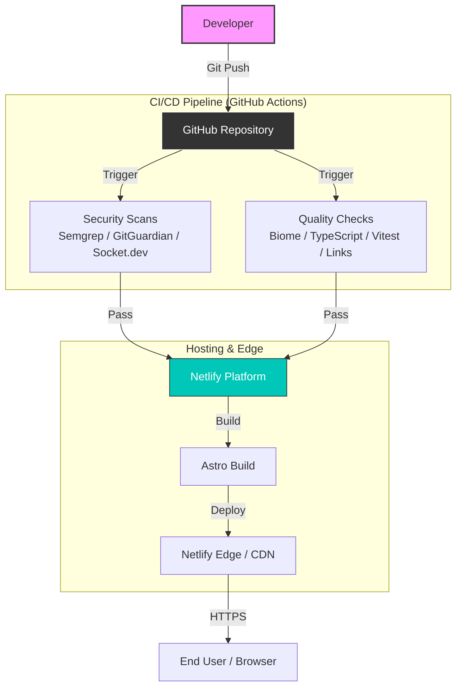
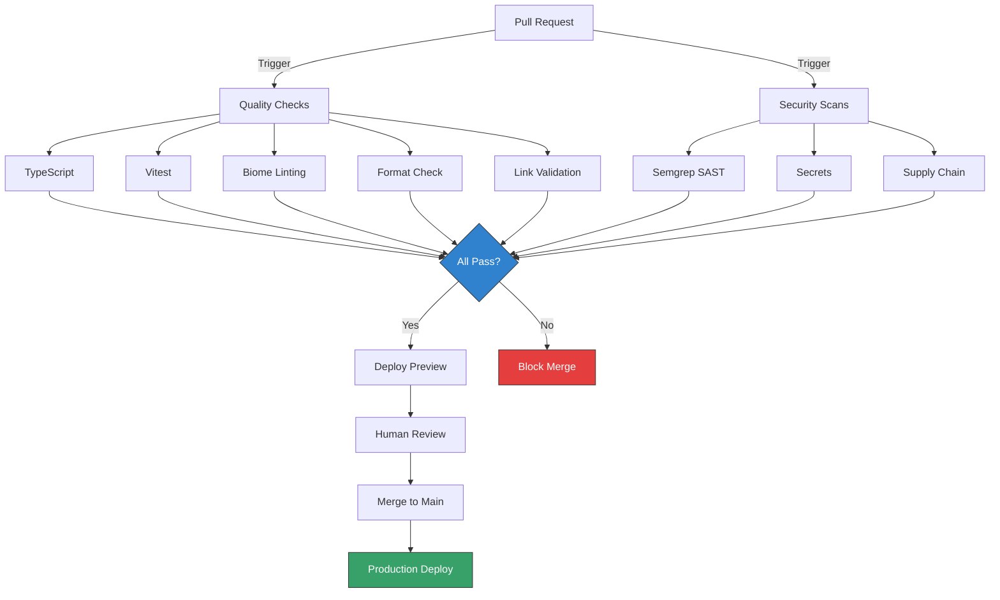

# Architecture Overview

This document provides a high-level overview of the **Team 4 Pro Coaching**
website's technical architecture, key decisions, and the rationale behind tool
choices.

It is designed to give new developers a complete understanding of how the system
works, is secured, and deployed.

## 📋 Table of Contents

- [Project Goals](#-project-goals)
- [System Context Diagram](#-system-context-diagram)
- [Project Structure](#-project-structure)
- [Technical Stack](#️-technical-stack)
- [Architecture Decisions](#️-architecture-decisions)
- [CI/CD Pipeline](#-cicd-pipeline)
- [Deployment Architecture](#-deployment-architecture)
- [Design Principles](#-design-principles)
- [Design System](#-design-system)
- [Future Roadmap](#-future-roadmap)
- [Related Documentation](#-related-documentation)

---

## 🎯 Project Goals

### Primary Objectives

| Objective           | Description                                                |
| :------------------ | :--------------------------------------------------------- |
| **Continuity**      | Maintainable by others if primary developer is unavailable |
| **Stability**       | Strict pinning ensures builds work identically over time   |
| **Security**        | High standards (Shift-Left) without enterprise costs       |
| **Performance**     | Static HTML delivery for maximum speed and SEO             |
| **Cost Efficiency** | Minimized fixed costs via free-tier services               |

### Target Audience

- **End Users**: Fitness coaching clients
- **Content Editors**: Coaches (non-technical content management)
- **Maintainers**: Developers ensuring the system stays online and secure

---

## 🧩 System Context Diagram


```mermaid
graph TD
    User[Developer] -->|Git Push| GitHub[GitHub Repository]

    subgraph "CI/CD Pipeline (GitHub Actions)"
        GitHub -->|Trigger| Security[Security Scans<br/>Semgrep / GitGuardian / Socket.dev]
        GitHub -->|Trigger| Quality[Quality Checks<br/>Biome / TypeScript / Vitest / Links]
    end

    Security -->|Pass| Netlify
    Quality -->|Pass| Netlify

    subgraph "Hosting & Edge"
        Netlify[Netlify Platform] -->|Build| Build[Astro Build]
        Build -->|Deploy| CDN[Netlify Edge / CDN]
    end

    CDN -->|HTTPS| Client[End User / Browser]

    style User fill:#f9f,stroke:#333,stroke-width:2px
    style GitHub fill:#333,stroke:#fff,color:#fff
    style Netlify fill:#00c7b7,stroke:#333,color:#fff
```

---

## 📂 Project Structure

```text
/
├── .github/             # CI/CD pipelines & templates
├── .husky/              # Git hooks (pre-commit automation)
├── .semgrep/            # Custom Semgrep rules (project-specific)
├── docs/                # Project documentation
├── public/              # Static assets (favicons, robots.txt)
├── src/
│   ├── components/      # UI Components (.astro)
│   │   ├── layout/      #   Layout helper fragments (BaseHead, SEO)
│   │   ├── navigation/  #   Navigation (Header, menus, NavLink)
│   │   ├── sections/    #   Page sections (Hero, Features, etc.)
│   │   └── ui/          #   Reusable primitives (Button, Logo, etc.)
│   ├── data/            # Typed data modules — structured business data and config (ADR-0011)
│   ├── layouts/         # Page wrappers (BaseLayout - Astro convention)
│   ├── pages/           # Route definitions
│   ├── scripts/         # Client-side controller modules (ADR-0020)
│   ├── types/           # Shared TypeScript types
│   ├── utils/           # Utility functions
│   └── styles/          # Global CSS and shared Tailwind class constants
├── .npmrc               # Strict package manager configuration
├── .nvmrc               # Node.js version definition
├── astro.config.mjs     # Astro framework configuration
├── biome.json           # Linter/Formatter rules
├── netlify.toml         # Netlify deployment settings
├── package.json         # Dependencies & scripts
└── renovate.json        # Automated dependency updates
```

### Component Organization

Components are organized into domain-based subfolders
([ADR-0007](adr/0007-component-folder-structure.md), amended by
[ADR-0008](adr/0008-clarify-layouts-vs-components-layout.md)):

**Page Wrappers** (`src/layouts/`):

| Component    | Purpose                                         |
| :----------- | :---------------------------------------------- |
| `BaseLayout` | Page wrapper with `<html>`, `<body>`, `<slot/>` |

**Components** (`src/components/`):

| Folder        | Purpose                                   | Examples                        |
| :------------ | :---------------------------------------- | :------------------------------ |
| `layout/`     | Layout helper fragments (no `<slot/>`)    | BaseHead, SEO                   |
| `navigation/` | Site navigation, menus, routing           | Header, DesktopMenu, MobileMenu |
| `sections/`   | Self-contained page sections with layout  | Hero, Features, Testimonials    |
| `ui/`         | Small, reusable primitives without layout | Button, TextLink, Logo          |

> **Rule**: If a component has `<slot/>` and wraps an entire page →
> `src/layouts/`. Everything else → `src/components/`.

### Shared Types

Reusable TypeScript types are centralized in `src/types/`:

| File            | Purpose                                       |
| :-------------- | :-------------------------------------------- |
| `components.ts` | Shared types for components (ImageProp, etc.) |

### Utility Functions

Reusable utility functions are centralized in `src/utils/`:

| File         | Purpose                                          |
| :----------- | :----------------------------------------------- |
| `slugify.ts` | Generate URL-safe slugs for IDs and anchor links |

**Usage:**

```typescript
import type { ImageProp } from '~/types/components';
import { slugify } from '~/utils/slugify';
```

This ensures consistency across components that share common patterns (e.g.,
image handling with Astro's `<Image />` component — see
[ADR-0010](adr/0010-use-astro-image-component-consistently.md)).

---

## 🏗️ Technical Stack

### Core Technologies

| Technology                 | Purpose                              | Why Chosen                                                                                                                               |
| :------------------------- | :----------------------------------- | :--------------------------------------------------------------------------------------------------------------------------------------- |
| **Astro.js**               | Static Site Generator                | Fast, modern, excellent DX ([ADR-0001](adr/0001-use-astro-js.md))                                                                        |
| **Tailwind CSS**           | Utility-First CSS                    | Rapid styling, consistent design system                                                                                                  |
| **pnpm**                   | Package Manager                      | Fast, disk-efficient ([ADR-0002](adr/0002-use-pnpm-package-manager.md))                                                                  |
| **TypeScript**             | Type Safety                          | Catch errors early, better IDE support                                                                                                   |
| **Netlify**                | Hosting & Deployment                 | Free tier, Deploy Previews, integrated forms ([ADR-0018](adr/0018-commit-to-netlify-as-production-platform.md))                          |
| **@tailwindplus/elements** | Interactive UI (Modals, Disclosures) | Headless Custom Elements from Tailwind Plus, declarative HTML API ([ADR-0019](adr/0019-use-tailwindplus-elements-for-interactive-ui.md)) |

### Code Quality Stack

| Tool                            | Purpose                    | Configuration      |
| :------------------------------ | :------------------------- | :----------------- |
| **Biome**                       | JS/TS Linting & Formatting | `biome.json`       |
| **Prettier**                    | Astro/Markdown Formatting  | Built-in           |
| **prettier-plugin-tailwindcss** | Tailwind Class Sorting     | Automatic          |
| **Vitest**                      | Unit Testing               | `vitest.config.ts` |
| **Husky**                       | Git Hooks                  | `.husky/`          |
| **lint-staged**                 | Staged File Processing     | `package.json`     |
| **commitlint**                  | Commit Message Validation  | Conventional       |

### Security & Automation Stack

| Tool             | Purpose                | Scope                   |
| :--------------- | :--------------------- | :---------------------- |
| **Semgrep**      | SAST (Static Analysis) | CI Pipeline             |
| **GitGuardian**  | Secret Detection       | CI Pipeline             |
| **Socket.dev**   | Supply Chain Security  | CI Pipeline             |
| **Gitleaks**     | Secret Detection       | Local (Pre-commit)      |
| **Renovate Bot** | Dependency Updates     | Automated Pull Requests |

---

## 🏛️ Architecture Decisions

All major decisions are documented as Architecture Decision Records (ADRs) in
[`docs/adr/`](adr/).

### ADR-0001: Use Astro

**Decision**: Use Astro as the primary web framework
([ADR-0001](adr/0001-use-astro-js.md)).

**Rationale**:

- **Cost Efficiency**: Zero-cost hosting on Netlify and git-based storage
- **Performance**: Static Site Generation ensures excellent Core Web Vitals
- **Data Integrity**: TypeScript data modules with `as const satisfies` pattern
  prevent build errors via compile-time validation

**Alternatives**: Gatsby (declining ecosystem), WordPress (high maintenance).

> **Note**: ADR-0001 originally included MDX and Content Collections. These were
> removed when success stories moved to a TypeScript data module (no detail
> pages in the current version). MDX may be reintroduced when detail pages
> return.

### ADR-0002: Use pnpm

**Decision**: Use pnpm as the exclusive package manager.

**Rationale**:

- **Performance**: Faster installation via global content-addressable store
- **Efficiency**: Reduced disk space usage (hard links)
- **Reliability**: Strict dependency resolution prevents phantom dependencies

**Alternatives**: npm (flat node_modules issues).

### ADR-0004: Hybrid Formatting (Biome + Prettier)

**Decision**: Domain-split strategy using Biome for code and Prettier for
content.

**Rationale**:

- **Biome**: JS/TS/JSON/CSS — extreme speed, simplified config
- **Prettier**: `.astro`/`.mdx` — safe template handling
- **Risk Mitigation**: Avoids experimental Astro support in Biome

**Alternatives**: Pure Biome (immature for Astro), ESLint + Prettier.

### ADR-0005: Renovate Bot & Socket.dev

**Decision**: Renovate for dependency updates + Socket.dev for security.

**Rationale**:

- **Automation**: Reduces manual toil
- **Security**: Socket.dev detects supply chain attacks
- **Grouping**: Related packages updated together to reduce PR noise

**Alternatives**: Dependabot (less flexible grouping).

### ADR-0006: Strict Environment and Dependency Pinning

**Decision**: Enforce exact version matching for Node.js, pnpm, and all
dependencies.

**Rationale**:

- **Determinism**: Builds work identically across all environments
- **Stability**: No surprise updates that could break production
- **Traceability**: Every version change is explicit in Git history

**Alternatives**: Flexible ranges (risk of unexpected breakage).

### ADR-0007: Component Folder Structure

**Decision**: Organize components into domain-based subfolders.

**Rationale**:

- **Predictability**: Clear location for new components based on purpose
- **Scalability**: Structure accommodates growth without clutter
- **Separation of Concerns**: Folder name communicates architectural role

**Alternatives**: Flat structure with naming conventions.

### ADR-0008: Clarify Layouts vs Components/Layout

**Decision**: Distinguish `src/layouts/` (page wrappers) from
`components/layout/` (helper fragments).

**Rationale**:

- **Astro Alignment**: Follows Astro's official project structure convention
- **Clear Mental Model**: "layouts/ = page wrappers, components/layout/ = helper
  fragments"

**Amends**: ADR-0007.

### ADR-0009: Use `type` for Component Props

**Decision**: Use `type` exclusively (not `interface`) for all `Props`
definitions in Astro components and data structures.

**Rationale**:

- **Consistency**: Single uniform pattern across the entire codebase
- **Flexibility**: `type` natively supports unions, intersections, and mapped
  types — patterns commonly needed for component props
- **Clarity**: Eliminates the need to decide between `type` and `interface` on a
  case-by-case basis

**Alternatives**: `interface` (provides declaration merging, but that is
undesirable for component props).

### ADR-0010: Use `ImageSource` Discriminated Union and `SmartImage` Wrapper

**Decision**: All image sources use the `ImageSource` discriminated union type
(`kind: 'local' | 'remote'`) instead of `string | ImageMetadata`. A `SmartImage`
wrapper component handles Astro's `<Image />` type overloads in one place.

**Rationale**:

- **Domain-driven types**: `kind` discriminator is self-documenting and
  extensible
- **Single narrowing point**: SmartImage eliminates duplicated type checks
  across all components
- **Pragmatic exceptions**: Small decorative images (≤ 64px) may use ``

**Exceptions**: `Logo.astro` (decorative SVGs), `CoachDetailModal.astro`
(runtime-dynamic src), small avatars (≤ 64px) in TestimonialCard and
SuccessStoryGridCard.

### ADR-0011: Content Format Decision Framework

**Decision**: Use a decision framework to determine whether data belongs in a
TypeScript data module or a Content Collection
([ADR-0011](adr/0011-content-format-decision-framework.md)).

**Current state**: All data lives in TypeScript modules (`src/data/`). Content
Collections and MDX are not currently in use — success stories were migrated
from MDX to a TypeScript data module when detail pages were removed. MDX may be
reintroduced when detail pages or CMS integration return.

### ADR-0012: Client-Side Script Strategy _(superseded)_

**Superseded by [ADR-0020](#adr-0020-client-side-script-strategy-revised).**
Original decision established three criteria for `is:inline` usage
([ADR-0012](adr/0012-client-side-script-strategy.md)). Two of the three criteria
were found to be based on incorrect technical assumptions.

### ADR-0013: Use Named Exports for Data Modules

**Decision**: All `src/data/*.ts` modules use named exports exclusively. No
default exports ([ADR-0013](adr/0013-use-named-exports-for-data-modules.md)).

**Rationale**: Default exports allow arbitrary rename at import site, making
global search unreliable. Named exports fix the symbol name, improve IDE
auto-imports, and align with Astro convention.

### ADR-0014: Section Background System

**Decision**: Light mode uses 6 section background variants (`default`, `muted`,
`teal`, `silver`, `sage`, `charcoal`) for visual rhythm
([ADR-0014](adr/0014-light-mode-section-background-system.md)).

**Rationale**: The original two-tone alternation (cream/sand) limited visual
hierarchy. Darker section backgrounds create depth and direct attention to key
content blocks.

### ADR-0015: Animation & Motion System

**Decision**: Data-attribute-driven scroll-reveal animations + CSS hover
effects, implemented with a single IntersectionObserver and zero external
dependencies ([ADR-0015](adr/0015-animation-and-motion-system.md)).

**Rationale**: The visual mockup required scroll-triggered entrance animations
on every section. A vanilla CSS + JS approach avoids library dependencies while
providing GPU-composited animations with full `prefers-reduced-motion` support.

> **Full specification**:
> [Animation System Reference](reference/animation-system.md)

### ADR-0016: Use Vitest for Unit Testing

**Decision**: Use Vitest as the unit test runner for utility functions, with
co-located test files and CI integration
([ADR-0016](adr/0016-use-vitest-for-unit-testing.md)).

**Rationale**: Astro uses Vite as its build tool. Vitest shares the same
transform pipeline — TypeScript, path aliases, and ESM work without extra
configuration. Alternatives (Jest, Node.js test runner, Bun) require
significantly more setup or conflict with the existing toolchain.

### ADR-0017: Domain Data Integrity Pattern

**Decision**: All domain datasets with ID-based cross-references use the
**const-array + Record + satisfies** pattern for compile-time completeness
([ADR-0017](adr/0017-domain-data-integrity-pattern.md)).

**Rationale**: ID values were manually duplicated across data modules and
components — a new coach or service category required changes in 4+ locations
with no compile-time safety net. The pattern ensures that a single const array
is the source of truth, with TypeScript enforcing completeness.

> **Implementation guide**: [CONVENTIONS.md](CONVENTIONS.md) — Data Integrity
> section with copy-pasteable template

### ADR-0018: Commit to Netlify as Production Platform

**Decision**: Confirm Netlify as the production hosting platform, accepting the
platform bindings for Forms, Astro adapter, and `netlify.toml` configuration
([ADR-0018](adr/0018-commit-to-netlify-as-production-platform.md)).

**Rationale**: Netlify provides integrated form handling (with honeypot spam
protection), free unlimited Deploy Previews for coach self-service content
workflows, and a single platform for hosting, forms, and server-side API routes.
The Stripe integration uses portable Astro API Routes — only the adapter
(`@astrojs/netlify`) is platform-specific. The Cloudflare/Astro acquisition
(January 2026) was evaluated but does not justify migration at this point.

### ADR-0019: Use `@tailwindplus/elements` for Interactive UI

**Decision**: Use `@tailwindplus/elements` (`el-dialog`, `el-disclosure`) for
modal dialogs and accordion/disclosure behavior
([ADR-0019](adr/0019-use-tailwindplus-elements-for-interactive-ui.md)).

**Rationale**: The site's UI was designed using Tailwind Plus UI Blocks
(commercially licensed). These blocks use `@tailwindplus/elements` — headless
Custom Elements that wrap native platform features (`<dialog>`, Invoker Commands
via `commandfor`/`command`) with polyfills for missing browser support. Using
the library that powers the adopted UI Blocks avoids reimplementing scroll
locking, focus trapping, exit transitions, and ARIA management as custom code.
Alternatives (native `<dialog>` without wrapper, self-built Web Components,
Alpine.js) were rejected.

### ADR-0020: Client-Side Script Strategy (Revised)

**Decision**: Module `<script>` is the default for all client-side JavaScript.
`<script is:inline>` is reserved exclusively for **Critical Early Execution** —
code that must run before HTML parsing completes
([ADR-0020](adr/0020-client-side-script-strategy-revised.md)). Supersedes
[ADR-0012](adr/0012-client-side-script-strategy.md).

**Rationale**: ADR-0012 established three criteria for `is:inline`, but two were
based on incorrect technical assumptions. Module scripts are `deferred` (DOM is
complete when they execute), and `astro:page-load` listeners work in module
scripts for View Transition re-initialization. Only one criterion remains valid:
Critical Early Execution (currently: `HeroFullscreen.astro` for reduced-motion
video pause).

**Migration**: `CoachDetailModal` will be migrated from `is:inline` to a module
script opportunistically when next modified. `QuizModal` and
`ServiceCategoryTabs` have been migrated. `QuizModal`'s controller logic is
extracted to `src/scripts/quizModalController.ts` — the Astro component's
`<script>` only imports and calls `initQuizModal`.

### ADR-0021: sessionStorage for Quiz Context Persistence

**Decision**: Use `sessionStorage` as the primary persistence mechanism for quiz
answers across page navigations, with URL parameters as graceful fallback
([ADR-0021](adr/0021-session-storage-quiz-persistence.md)).

**Rationale**: The quiz flow spans multiple page navigations (Quiz → Services →
Contact). `sessionStorage` survives these navigations without manual expiration
logic (unlike `localStorage`). A shared utility (`src/utils/quizContext.ts`)
encapsulates all storage interaction, with display labels derived from `quiz.ts`
data to avoid duplication.

### ADR-0022: Hybrid Rendering Model

**Decision**: Use Astro's hybrid rendering (`output: 'server'` with
`prerender: true` as default) and the `@astrojs/netlify` adapter. All pages
remain statically generated; only server-side API endpoints (Stripe) opt in via
`export const prerender = false`
([ADR-0022](adr/0022-hybrid-rendering-model.md)).

**Rationale**: The Stripe integration requires server-side endpoints for
checkout session creation and webhook handling. Full SSR is unnecessary — the
site has no per-request dynamic content. The hybrid model adds server
capabilities with zero impact on existing static pages.

---

## 🔄 CI/CD Pipeline


```mermaid
graph TD
    PR[Pull Request] -->|Trigger| CI_Quality[Quality Checks]
    PR -->|Trigger| CI_Security[Security Scans]

    CI_Quality --> TypeCheck[TypeScript]
    CI_Quality --> Tests[Vitest]
    CI_Quality --> Lint[Biome Linting]
    CI_Quality --> Format[Format Check]
    CI_Quality --> Links[Link Validation]

    CI_Security --> Semgrep[Semgrep SAST]
    CI_Security --> GitGuardian[Secrets]
    CI_Security --> Socket[Supply Chain]

    TypeCheck --> Gate{All Pass?}
    Tests --> Gate
    Lint --> Gate
    Format --> Gate
    Links --> Gate
    Semgrep --> Gate
    GitGuardian --> Gate
    Socket --> Gate

    Gate -->|Yes| Preview[Deploy Preview]
    Gate -->|No| Fail[Block Merge]

    Preview --> Review[Human Review]
    Review --> Merge[Merge to Main]
    Merge --> Production[Production Deploy]

    style Gate fill:#3182ce,stroke:#333,color:#fff
    style Production fill:#38a169,stroke:#333,color:#fff
    style Fail fill:#e53e3e,stroke:#333,color:#fff
```

### Update Strategy

| Type             | Schedule         | Rationale                        |
| :--------------- | :--------------- | :------------------------------- |
| **Runtime**      | Monthly (1st)    | Stability for Node/pnpm          |
| **Dependencies** | Weekly (Mondays) | Keep technical debt low          |
| **Security**     | Immediate        | Critical patches ignore schedule |

---

## 🚀 Deployment Architecture

### Hosting: Netlify

> For the full rationale on platform choice, credit model, and migration risk
> assessment, see
> [ADR-0018](adr/0018-commit-to-netlify-as-production-platform.md).

We utilize Netlify's **Immutable Deployments**:

- **Atomic**: Every deployment is unique. The site never exists in a
  "half-deployed" state.
- **Rollback**: If `v2` breaks, instantly switch back to `v1` via Dashboard.

Netlify uses a **credit-based pricing model** (300 credits/month on the free
plan). Each production deploy costs 15 credits. Deploy Previews are free and
unlimited. To control credit usage, auto-deploy is disabled during the launch
phase and the `ignore` script in `netlify.toml` skips builds when no relevant
files have changed.

### Configuration

| Setting           | Value                |
| :---------------- | :------------------- |
| **Build Command** | `pnpm build`         |
| **Output**        | `dist/`              |
| **Node Version**  | Managed via `.nvmrc` |

### Deploy Previews

Every Pull Request automatically triggers an isolated preview:

- **Unique URL**: Each PR gets a permanent, shareable URL
- **Production Parity**: Same build process as live site
- **Stakeholder Review**: Non-technical team can review before merge
- **No "Works on my Machine"**: Runs in Netlify cloud environment

---

## 📐 Design Principles

### 1. Cost-Conscious Architecture

**Principle**: Maximize quality while minimizing costs.

- **Public Repository**: Unlocks free GitHub tiers
- **Free-Tier First**: Netlify, Semgrep, GitGuardian in free tiers
- **Open Source**: No paid SaaS where OSS alternatives exist

### 2. Security-First

**Principle**: Security is non-negotiable, even on a budget.

- **Defense in Depth**: Multiple scanning layers (Code, Secrets, Dependencies)
- **Signed Commits**: Required for verification
- **Shift-Left**: Catch vulnerabilities in PR, not production

### 3. Continuity ("Bus Factor")

**Principle**: Anyone should be able to take over without prior knowledge.

- **ADRs**: We document _decisions_, not just code
- **Conventional Commits**: History is readable
- **No Tribal Knowledge**: If it's not documented, it doesn't exist

### 4. Fail Fast

**Principle**: Catch problems as early as possible.

- **Pre-commit Hooks**: Prevent bad code from entering Git
- **TypeScript**: Catches logic errors at compile time
- **Renovate**: Identifies outdated/insecure dependencies automatically

### 5. Developer Experience (DX)

**Principle**: Make development pleasant and productive.

- **Fast Tooling**: Biome & Astro (Rust/Go based) for speed
- **Automated Formatting**: No discussions about code style
- **Hot Reload**: Instant feedback during development

### 6. Automation Over Manual Work

**Principle**: If you have to do it twice, automate it.

- **Formatting**: Automated via Git hooks
- **Dependency Management**: Automated via Renovate
- **Deployment**: Automated via Netlify (Git Push)

---

## 🎨 Design System

### Color System

The site uses a custom color palette with semantic token names, defined in
`src/styles/global.css` under `@theme` and consumed via Tailwind CSS v4 utility
classes.

**Core Palette** (3 ramps + 2 background tones):

| Ramp               | Base Color | Role                                       |
| :----------------- | :--------- | :----------------------------------------- |
| `foreground`       | `#38070f`  | Text and UI elements (warm dark brown)     |
| `accent`           | `#bf7960`  | Primary CTAs and actions (terracotta)      |
| `teal`             | `#4a9199`  | Secondary accents and highlights           |
| `background`       | `#f7eee5`  | Standard page background (warm cream)      |
| `background-muted` | `#e8ddd6`  | Alternating section background (warm sand) |

Each ramp includes stops from 50 (lightest) to 950 (darkest).

**Section Background System**: The light mode uses **6 section background
variants** to create visual rhythm across pages — alternating between light and
dark sections. This is managed via the `SectionBackground` type and utility maps
in `src/utils/styles.ts`.

> **Full specification**: [Color System Reference](reference/color-system.md) ·
> **Decision**: [ADR-0014](adr/0014-light-mode-section-background-system.md)

### Typography

Typography tokens are defined in the same `@theme` block:

| Token          | Font Family                      | Usage         |
| :------------- | :------------------------------- | :------------ |
| `--font-sans`  | Manrope, sans-serif              | Body text, UI |
| `--font-serif` | Playfair Display, Georgia, serif | Headlines     |

The headline hierarchy is documented in `global.css` as a CSS comment block with
size specifications per level (Page Title → Section Title → Subsection → Card
Title) and responsive breakpoints.

### Dark Mode

Dark mode is supported via Tailwind's `dark:` variant. All components include
both light and dark mode classes. The dark mode palette uses:

- `background-dark` (`#1a1412`) for standard backgrounds
- `background-dark-muted` (`#241c19`) for alternating sections
- White text and `gray-300`/`gray-400` for secondary text

> **Note**: The section background variants (`teal`, `silver`, `sage`,
> `charcoal`) are light-mode only. In dark mode, all variants fall back to
> `background-dark` or `background-dark-muted`.

### Animation & Motion

The site uses scroll-triggered reveal animations and hover micro-interactions to
create a polished, Apple-inspired browsing experience. The system is implemented
with zero external dependencies — vanilla CSS transitions + a global
IntersectionObserver.

**Key principles**:

- Every section animates on scroll into viewport (fade-up is the standard)
- Hover effects only on fully interactive elements (stretched-link cards,
  buttons, standalone links)
- `prefers-reduced-motion: reduce` disables all movement
- Scroll-animate and hover classes must **never** share the same DOM element
  (CSS transition shorthand conflict)

**Files**: Animation CSS in `global.css`, observer in
`components/layout/ScrollAnimations.astro`.

> **Full specification**:
> [Animation System Reference](reference/animation-system.md) · **Decision**:
> [ADR-0015](adr/0015-animation-and-motion-system.md)

---

## 🔮 Future Roadmap

### Potential Enhancements

| Enhancement                | Goal                                      | Status                            |
| :------------------------- | :---------------------------------------- | :-------------------------------- |
| **Testing Infrastructure** | Vitest + Playwright for regression        | Unit tests implemented (ADR-0016) |
| **Content Management**     | Git-based CMS (Keystatic) or Headless CMS | Raw Markdown                      |
| **Performance Monitoring** | Lighthouse CI in GitHub Actions           | Manual checks                     |
| **Analytics**              | GDPR-compliant (Plausible/Fathom)         | None                              |

### Scalability Assessment

**Current architecture scales well for**:

- ✅ Content Growth (thousands of pages, no performance penalty)
- ✅ Traffic Spikes (handled by CDN)
- ✅ Team Scaling (docs + strict tooling enable quick onboarding)

**Not optimized for**:

- ❌ Dynamic User Content (comments, forums)
- ❌ Real-Time Data (no WebSockets)
- ❌ Complex State (no Redux/Zustand)

---

## 📚 Related Documentation

| Document                                              | Purpose                                   |
| :---------------------------------------------------- | :---------------------------------------- |
| **[CONVENTIONS.md](CONVENTIONS.md)**                  | Coding patterns, naming, export style     |
| **[DEVELOPMENT.md](DEVELOPMENT.md)**                  | Setup, tooling, daily workflow            |
| **[MAINTENANCE.md](MAINTENANCE.md)**                  | Dependency updates, security, emergencies |
| **[CONTRIBUTING.md](../CONTRIBUTING.md)**             | Contribution guidelines, PR process       |
| **[Color System](reference/color-system.md)**         | Light-mode color specification            |
| **[Animation System](reference/animation-system.md)** | Scroll reveals, hover effects, motion     |
| **[ADRs](adr/)**                                      | Complete log of architectural decisions   |

### For New Developers

1. Read this **Architecture Overview**
2. Review key ADRs: [0001](adr/0001-use-astro-js.md),
   [0002](adr/0002-use-pnpm-package-manager.md),
   [0004](adr/0004-use-hybrid-formatting-biome-and-prettier.md),
   [0006](adr/0006-enforce-strict-environment-and-dependency-pinning.md),
   [0007](adr/0007-component-folder-structure.md),
   [0008](adr/0008-clarify-layouts-vs-components-layout.md),
   [0009](adr/0009-use-types-for-component-props.md),
   [0014](adr/0014-light-mode-section-background-system.md),
   [0015](adr/0015-animation-and-motion-system.md),
   [0019](adr/0019-use-tailwindplus-elements-for-interactive-ui.md)
3. Read **[CONVENTIONS.md](CONVENTIONS.md)** for coding patterns and naming
4. Follow **[DEVELOPMENT.md](DEVELOPMENT.md)** to set up your machine
5. Explore the codebase (start with `src/pages` and `astro.config.mjs`)

### For Maintainers

1. Understand **[Renovate Configuration](reference/renovate.md)**
2. Monitor security scans (Semgrep & GitGuardian in GitHub Actions)
3. Review **[MAINTENANCE.md](MAINTENANCE.md)** for operational procedures
4. Keep documentation updated when architecture changes

---

**Philosophy**: This project prioritizes _sustainability_ over complexity. Every
tool and process serves a clear purpose aligned with project goals.
