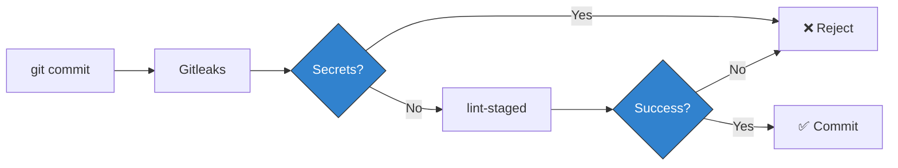

# Development Guide

Comprehensive guide for developing the **Team 4 Pro Coaching** website. This
document covers environment setup, tooling, daily workflows, and
troubleshooting.

## 📋 Table of Contents

- [Objectives](#-objectives)
- [Prerequisites](#-prerequisites)
- [Initial Setup](#-initial-setup)
- [Development Environment](#-development-environment)
- [Daily Workflow](#-daily-workflow)
- [Available Scripts](#-available-scripts)
- [Code Quality Tools](#️-code-quality-tools)
- [Git Hooks](#-git-hooks)
- [Troubleshooting](#-troubleshooting)
- [Reference](#-reference)

---

## 🎯 Objectives

The development workflow is designed around these principles from the
[Architecture Overview](ARCHITECTURE.md):

1. **Deterministic Builds**: Identical environments across local, CI/CD, and
   production
2. **Fast Feedback**: Automated quality checks catch issues before code review
3. **Developer Experience**: Minimal configuration, maximum automation
4. **Type Safety**: TypeScript-first approach with strict validation

---

## 🔧 Prerequisites

> ⚠️ **Important**: This project uses **strict version pinning**
> ([ADR-0006](adr/0006-enforce-strict-environment-and-dependency-pinning.md)).
> Installation will fail if versions don't match exactly.

### Required Software

| Tool        | Version           | Purpose            | Installation                                            |
| :---------- | :---------------- | :----------------- | :------------------------------------------------------ |
| **Node.js** | `24.12.0` (exact) | JavaScript runtime | [nvm](https://github.com/nvm-sh/nvm) recommended        |
| **pnpm**    | `≥10.0.0`         | Package manager    | Managed via Corepack                                    |
| **Git**     | Latest            | Version control    | [git-scm.com](https://git-scm.com/)                     |
| **VS Code** | Latest            | Code editor        | [code.visualstudio.com](https://code.visualstudio.com/) |

### Node.js Setup

**Using nvm (recommended):**

```bash
# Install nvm (if not already installed)
curl -o- https://raw.githubusercontent.com/nvm-sh/nvm/v0.40.0/install.sh | bash

# Install and use the correct Node.js version (reads .nvmrc)
nvm install
nvm use

# Verify version (must output: v24.12.0)
node --version
```

**Without nvm:** Download Node.js `24.12.0` from
[nodejs.org](https://nodejs.org/).

### pnpm Setup

pnpm is managed via **Corepack** (built into Node.js 16+):

```bash
# Enable Corepack
corepack enable

# Verify pnpm is available (should output: 10.26.1)
pnpm --version
```

**Manual installation (if Corepack fails):**

```bash
npm install -g pnpm@10.26.1
```

### Git Signing (Required)

Configure commit signing for verification:

```bash
# Option 1: GPG signing
git config --global commit.gpgsign true
git config --global user.signingkey <YOUR_GPG_KEY_ID>

# Option 2: SSH signing (Git 2.34+, recommended)
git config --global gpg.format ssh
git config --global user.signingkey ~/.ssh/id_ed25519.pub
```

---

## 🚀 Initial Setup

### 1. Clone Repository

```bash
git clone https://github.com/team4procoaching/website.git
cd website
```

### 2. Environment Verification

```bash
# Verify Node.js version (must be exactly 24.12.0)
node --version

# Verify pnpm is available
pnpm --version

# Verify Git signing
git config --get commit.gpgsign
```

### 3. Install Dependencies

```bash
pnpm install
```

> ℹ️ **What happens**:
>
> - pnpm validates Node.js version against `engines` field
> - Dependencies are installed with **exact versions** (no `^` or `~` ranges)
> - Dependencies are hard-linked from global store (saves disk space)

**If installation fails with "The engine 'node' is incompatible":** Use
`nvm use` to switch to the correct version (24.12.0).

### 4. Setup Git Hooks

```bash
pnpm prepare
```

This installs two Git hooks:

- **pre-commit**: Gitleaks (secret scanning) + lint-staged (formatting)
- **commit-msg**: Validates Conventional Commits format

### 5. Verify Installation

```bash
pnpm check
```

This runs `astro check`, then `biome lint`, then format checks (Biome +
Prettier). If all commands complete without errors, your environment is
correctly configured.

---

## 💻 Development Environment

### VS Code Extensions

The following extensions are auto-suggested when opening the project:

| Extension        | ID                          | Purpose                           |
| :--------------- | :-------------------------- | :-------------------------------- |
| **Astro**        | `astro-build.astro-vscode`  | Syntax highlighting, IntelliSense |
| **Biome**        | `biomejs.biome`             | Real-time linting and formatting  |
| **Prettier**     | `esbenp.prettier-vscode`    | Formatting for Astro/Markdown     |
| **Tailwind CSS** | `bradlc.vscode-tailwindcss` | IntelliSense for Tailwind classes |

### Editor Configuration

The project includes VS Code settings (`.vscode/settings.json`) that enforce:

- **Format on Save**: Automatic formatting when you save
- **Default Formatter**: Biome for code, Prettier for content
- **Auto-fix**: Linting issues fixed on save
- **Visual Ruler**: Line at 100 characters

**Hybrid Strategy** (per
[ADR-0004](adr/0004-use-hybrid-formatting-biome-and-prettier.md)):

| File Type                       | Formatter |
| :------------------------------ | :-------- |
| `.js`, `.ts`, `.json`, `.css`   | Biome     |
| `.astro`, `.md`, `.mdx`, `.yml` | Prettier  |

### Tailwind CSS v4

Tailwind v4 uses custom at-rules (`@theme`, `@plugin`, `@source`). The project
configures both VS Code and Biome to ignore false warnings for these.

---

## 🔄 Daily Workflow

### Typical Flow


### Step-by-Step

#### 1. Sync with Main

```bash
git checkout main
git pull origin main
```

#### 2. Create Feature Branch

```bash
git checkout -b feat/add-testimonials-section
git checkout -b fix/mobile-navigation-overflow
git checkout -b docs/update-readme
```

#### 3. Start Development Server

```bash
pnpm dev
```

**Access**: `http://localhost:4321`

**Features**:

- ⚡ Instant hot reload for `.astro`, `.ts`, `.md` changes
- 🎨 CSS changes apply without page refresh
- 🐛 TypeScript errors show in browser overlay

#### 4. Make Changes

Edit files in `src/`:

```
src/
├── components/      # UI Components (.astro)
│   ├── layout/      #   Layout helper fragments (BaseHead, SEO)
│   ├── navigation/  #   Navigation (Header, menus, NavLink)
│   ├── sections/    #   Page sections (Hero, Features, etc.)
│   └── ui/          #   Reusable primitives (Button, Logo, etc.)
├── data/            # Static configuration (navigation, site config)
├── layouts/         # Page wrappers (BaseLayout - contains <html>, <body>, <slot/>)
├── pages/           # File-based routing
├── types/           # Shared TypeScript types (ImageSource, ImageProp, etc.)
├── utils/           # Utility functions (slugify, etc.)        ← NEU
└── styles/          # Global CSS
```

**Best Practices**:

- Keep components small and focused
- Place components in appropriate subfolder
  ([ADR-0007](adr/0007-component-folder-structure.md))
- Use TypeScript for type safety
- Use PascalCase for component names
- Use shared types from `~/types/` for consistency (e.g., `ImageSource`,
  `ImageProp`) and `SmartImage` for all content images
  ([ADR-0010](adr/0010-use-astro-image-component-consistently.md))
- Use utility functions from `~/utils/` (e.g., `slugify`)

#### Adding Images

Images use the `ImageSource` type. How you create one depends on the source:

```typescript
// Local asset (imported) — dimensions are automatic
import photo from '~/assets/images/photo.jpg';
const image: ImageSource = { kind: 'local', src: photo };

// Remote URL — dimensions must be explicit
import { remoteImage } from '~/types/components';
const image = remoteImage('https://cdn.example.com/photo.jpg', 800, 600);
```

Use `SmartImage` in templates — it handles Astro's type overloads internally:

```astro
<SmartImage src={image} alt="Description" widths={[400, 800]} />
```

For small decorative images (≤ 64px, e.g. avatars), plain `` is acceptable.

**Remote image optimization:** To enable Astro's build-time optimization
(WebP/AVIF conversion, srcset generation) for remote images, their domain must
be added to `image.domains` in `astro.config.mjs`:

```javascript
// astro.config.mjs
export default defineConfig({
  image: {
    domains: ['cdn.team4pro.com'],
  },
});
```

Without this, remote images still render correctly but are served in their
original format without optimization. This is fine for development placeholders
but should be configured when production image domains are known.

#### 5. Run Quality Checks

```bash
pnpm check
```

This runs: `astro check` → `biome lint` → `biome format --check` →
`prettier --check`.

#### 6. Fix Issues (if needed)

```bash
pnpm fix
```

Auto-fixes linting issues and formats all files.

#### 7. Commit Changes

```bash
git add .
git commit -m "feat(testimonials): add customer testimonials section"
```

Git hooks automatically validate secrets and commit message format.

#### 8. Push and Create PR

```bash
git push origin feat/add-testimonials-section
gh pr create --title "feat(testimonials): add customer testimonials section"
```

---

## 📦 Available Scripts

### Development

| Script      | Command        | Description                          |
| :---------- | :------------- | :----------------------------------- |
| **dev**     | `pnpm dev`     | Start dev server at `localhost:4321` |
| **build**   | `pnpm build`   | Build static site to `dist/`         |
| **preview** | `pnpm preview` | Preview production build locally     |

### Quality Assurance

| Script        | Command          | Description                            |
| :------------ | :--------------- | :------------------------------------- |
| **check**     | `pnpm check`     | Run all quality checks (CI simulation) |
| **fix**       | `pnpm fix`       | Auto-fix linting and formatting        |
| **typecheck** | `pnpm typecheck` | Run TypeScript type checking only      |
| **lint**      | `pnpm lint`      | Run Biome linter (check only)          |
| **lint:fix**  | `pnpm lint:fix`  | Auto-fix Biome linting issues          |

### Testing

| Script       | Command         | Description                              |
| :----------- | :-------------- | :--------------------------------------- |
| **test**     | `pnpm test`     | Run tests in watch mode (development)    |
| **test:run** | `pnpm test:run` | Run tests once (CI / local verification) |

Test files are co-located with their source (e.g., `slugify.ts` →
`slugify.test.ts`). See [ADR-0016](adr/0016-use-vitest-for-unit-testing.md).

### Formatting

| Script               | Command                 | Description                         |
| :------------------- | :---------------------- | :---------------------------------- |
| **format**           | `pnpm format`           | Format all files (Biome + Prettier) |
| **format:check**     | `pnpm format:check`     | Check formatting without changes    |
| **format:biome**     | `pnpm format:biome`     | Format JS/TS/JSON/CSS only          |
| **format:prettier**  | `pnpm format:prettier`  | Format Astro/Markdown only          |
| **organize-imports** | `pnpm organize-imports` | Sort and organize imports           |

### Maintenance

| Script                | Command                  | Description              |
| :-------------------- | :----------------------- | :----------------------- |
| **prepare**           | `pnpm prepare`           | Setup Husky Git hooks    |
| **validate:renovate** | `pnpm validate:renovate` | Validate Renovate config |

### Script Details

#### `pnpm check`

```bash
pnpm typecheck && pnpm lint && pnpm format:check
```

**Use before every commit.** Simulates CI/CD validation locally.

#### `pnpm fix`

```bash
pnpm lint:fix && pnpm format
```

Two-phase process:

1. **Lint phase**: Auto-fixes code issues (unused imports, missing semicolons)
2. **Format phase**: Applies consistent code style

#### `pnpm format`

Hybrid formatting strategy:

```bash
# Phase 1: Biome formats code files
biome format --write .

# Phase 2: Prettier formats content files
prettier --write "**/*.{astro,md,mdx,yml,yaml}"
```

---

## 🛠️ Code Quality Tools

### Tool Matrix

| Tool            | Purpose              | File Types                      | Config             |
| :-------------- | :------------------- | :------------------------------ | :----------------- |
| **Biome**       | Linting + Formatting | `.js`, `.ts`, `.json`, `.css`   | `biome.json`       |
| **Prettier**    | Formatting           | `.astro`, `.md`, `.mdx`, `.yml` | Built-in defaults  |
| **Vitest**      | Unit Testing         | `.test.ts`                      | `vitest.config.ts` |
| **TypeScript**  | Type Checking        | `.ts`, `.astro`                 | `tsconfig.json`    |
| **Gitleaks**    | Secret Scanning      | All files                       | `.gitleaks.toml`   |
| **commitlint**  | Commit Messages      | Git commits                     | Conventional       |
| **lint-staged** | Pre-commit Hook      | Staged files                    | `package.json`     |

### Biome Configuration

**File**: `biome.json`

**Key Settings**:

```json
{
  "formatter": {
    "indentStyle": "space",
    "indentWidth": 2,
    "lineWidth": 100,
    "includes": ["**", "!**/*.astro"]
  },
  "javascript": {
    "formatter": {
      "quoteStyle": "single",
      "semicolons": "always",
      "trailingCommas": "all"
    }
  }
}
```

**Astro Exclusion**: `.astro` files are excluded from Biome because it only
analyzes frontmatter, causing false "unused import" warnings.

**Enabled Rules**:

- **Recommended**: Standard best practices
- **Style**: Code consistency
- **Accessibility**: Enforced (except SVG title)
- **Suspicious**: Warnings for potential bugs

### lint-staged Configuration

Formats only **staged files** during pre-commit:

```json
{
  "lint-staged": {
    "*.{js,jsx,ts,tsx,cjs,mjs}": ["biome check --write ..."],
    "*.{json,css}": ["biome format --write ..."],
    "*.{astro,md,mdx,yml,yaml}": ["prettier --write --cache"]
  }
}
```

**Performance**: Typically completes in <1 second.

---

## 🪝 Git Hooks

### Pre-commit Hook



**Phase 1: Secret Scanning** (Gitleaks)

Detects: API keys, private keys, passwords, cloud credentials.

**Phase 2: Code Formatting** (lint-staged)

Formats staged files by type.

### Commit-msg Hook

Validates commit message format:

- Must follow Conventional Commits
- **Scope is mandatory**
- Type must be from approved list
- Description must be present and lowercase

### Bypassing Hooks (Emergency Only)

```bash
git commit --no-verify -m "emergency: hotfix production issue"
```

> ⚠️ CI/CD will still run checks. Use only for urgent fixes.

---

## 🐛 Troubleshooting

### Environment Issues

#### Node version mismatch

```
error: The engine "node" is incompatible with this module.
```

**Solution**:

```bash
nvm use
node --version  # Must be v24.12.0
```

#### pnpm not found

```bash
corepack enable
corepack prepare pnpm@10.26.1 --activate
```

#### Git hooks not working

```bash
pnpm prepare
```

### Build Issues

#### Build works locally but fails on Netlify

1. Check Netlify build logs for specific error
2. Verify versions match:
   ```bash
   node --version  # v24.12.0
   pnpm --version  # 10.26.1
   ```
3. Test production build locally:
   ```bash
   pnpm build
   pnpm preview
   ```

#### Slow build times

```bash
# Clean install
rm -rf node_modules pnpm-lock.yaml
pnpm install --frozen-lockfile

# Clear cache
rm -rf node_modules/.astro
pnpm build
```

### Commit Issues

#### Commit rejected by commitlint

Ensure your commit follows Conventional Commits with scope:

```bash
# ✅ Good
feat(hero): add background image

# ❌ Bad
added new feature
```

#### Commit rejected by Gitleaks

A potential secret was detected. Either:

- Remove the secret and use environment variables
- If false positive: add to `.gitleaks.toml` allowlist with justification

### Development Server Issues

#### Changes not reflecting in browser

1. Hard refresh: `Ctrl + Shift + R` (Windows/Linux) or `Cmd + Shift + R` (macOS)
2. Clear service workers: DevTools → Application → Service Workers → Unregister
3. Restart dev server: Stop with `Ctrl+C`, then `pnpm dev`

### Biome Issues

#### False "unused import" warnings in Astro files

Verify `biome.json` excludes Astro files:

```json
{
  "formatter": { "includes": ["**", "!**/*.astro"] },
  "linter": { "includes": ["**", "!**/*.astro"] }
}
```

Restart IDE if warnings persist.

---

## 📚 Reference

### Project Documentation

| Document                              | Purpose                                  |
| :------------------------------------ | :--------------------------------------- |
| [README.md](../README.md)             | Project overview and quick start         |
| [ARCHITECTURE.md](ARCHITECTURE.md)    | Technical decisions and design rationale |
| [MAINTENANCE.md](MAINTENANCE.md)      | Operational procedures, security, deps   |
| [CONTRIBUTING.md](../CONTRIBUTING.md) | Contribution guidelines and PR process   |
| [ADR Log](adr/)                       | Architecture Decision Records            |

### Key ADRs

| ADR                                                                   | Topic                    |
| :-------------------------------------------------------------------- | :----------------------- |
| [0001](adr/0001-use-astro-js.md)                                      | Astro Framework          |
| [0002](adr/0002-use-pnpm-package-manager.md)                          | pnpm Package Mgr         |
| [0004](adr/0004-use-hybrid-formatting-biome-and-prettier.md)          | Hybrid Formatting        |
| [0006](adr/0006-enforce-strict-environment-and-dependency-pinning.md) | Strict Versioning        |
| [0007](adr/0007-component-folder-structure.md)                        | Component Structure      |
| [0008](adr/0008-clarify-layouts-vs-components-layout.md)              | Layouts vs Components    |
| [0009](adr/0009-use-types-for-component-props.md)                     | `type` for Props         |
| [0010](adr/0010-use-astro-image-component-consistently.md)            | ImageSource & SmartImage |
| [0016](adr/0016-use-vitest-for-unit-testing.md)                       | Vitest Unit Testing      |

### Configuration Files

| File               | Purpose                      | Documentation                                                                         |
| :----------------- | :--------------------------- | :------------------------------------------------------------------------------------ |
| `biome.json`       | Linter/Formatter rules       | [biome.md](reference/biome.md) • [Biome Docs](https://biomejs.dev/)                   |
| `astro.config.mjs` | Astro framework config       | [Astro Config](https://docs.astro.build/en/reference/configuration-reference/)        |
| `package.json`     | Dependencies & scripts       | [npm Docs](https://docs.npmjs.com/cli/v10/configuring-npm/package-json)               |
| `vitest.config.ts` | Unit test runner config      | [Vitest Docs](https://vitest.dev/)                                                    |
| `.npmrc`           | pnpm configuration           | [pnpm .npmrc](https://pnpm.io/npmrc)                                                  |
| `.nvmrc`           | Node.js version pinning      | [nvm Docs](https://github.com/nvm-sh/nvm#nvmrc)                                       |
| `renovate.json`    | Dependency update automation | [Renovate Docs](https://docs.renovatebot.com/)                                        |
| `netlify.toml`     | Netlify build and deployment | [Netlify Config](https://docs.netlify.com/configure-builds/file-based-configuration/) |

### External Resources

**Astro**: [docs.astro.build](https://docs.astro.build/) •
[Discord](https://astro.build/chat)

**Tooling**: [Biome](https://biomejs.dev/) • [pnpm](https://pnpm.io/) •
[Prettier](https://prettier.io/) • [Tailwind CSS](https://tailwindcss.com/)

**Security**: [Gitleaks](https://gitleaks.io/) • [Semgrep](https://semgrep.dev/)
• [GitGuardian](https://www.gitguardian.com/)

**Deployment**: [Netlify Docs](https://docs.netlify.com/) •
[Netlify Status](https://www.netlifystatus.com/)

### Getting Help

1. Check this guide and related documentation
2. Search existing GitHub Issues
3. Create new Issue with `question` label

**For emergencies**: See
[MAINTENANCE.md → Emergency Procedures](MAINTENANCE.md#-emergency-procedures)
