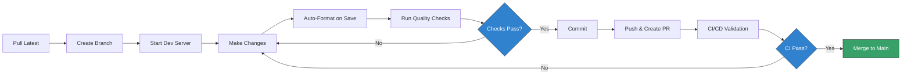

# Development Guide

Comprehensive guide for developing the **Team 4 Pro Coaching** website. This
document covers daily development workflows, tooling, environment setup, and
best practices.

## 📋 Table of Contents

- [Objectives](#-objectives)
- [Prerequisites](#-prerequisites)
- [Initial Setup](#-initial-setup)
- [Development Environment](#-development-environment)
- [Daily Workflow](#-daily-workflow)
- [Available Scripts](#-available-scripts)
- [Code Quality Tools](#️-code-quality-tools)
- [Git Workflow](#-git-workflow)
- [Troubleshooting](#-troubleshooting)
- [Reference & Help](#-reference--help)

---

## 🎯 Objectives

1. **Deterministic Builds**: Identical environments across local development,
   CI/CD, and production (Netlify).
2. **Fast Feedback**: Automated quality checks catch issues before they reach
   code review.
3. **Developer Experience**: Minimal configuration, maximum automation via
   tooling.
4. **Type Safety**: TypeScript-first approach with strict validation.

### Development Roles

| Role             | Responsibility                                   | Primary Tools                     |
| :--------------- | :----------------------------------------------- | :-------------------------------- |
| **Developer**    | Implement features, fix bugs, write tests        | VS Code, Astro Dev Server, Git    |
| **Quality Gate** | Automated via Git hooks (pre-commit, commit-msg) | Gitleaks, lint-staged, commitlint |
| **CI/CD**        | Final validation before merge                    | GitHub Actions, Semgrep, Lychee   |

---

## 🔧 Prerequisites

Before starting development, ensure you have the following installed:

> ⚠️ **Important**: This project uses **strict version pinning** (see
> [ADR-0006](adr/0006-enforce-strict-environment-and-dependency-pinning.md)).
> The exact Node.js version and dependency versions are enforced to ensure
> deterministic builds across all environments. Installation will fail if
> versions don't match exactly.

### Required Software

| Tool        | Version              | Purpose            | Installation                                            |
| :---------- | :------------------- | :----------------- | :------------------------------------------------------ |
| **Node.js** | `24.12.0` (exact)    | JavaScript runtime | [nvm](https://github.com/nvm-sh/nvm) recommended        |
| **pnpm**    | `≥10.0.0`            | Package manager    | Managed via Corepack (see below)                        |
| **Git**     | Latest               | Version control    | [git-scm.com](https://git-scm.com/)                     |
| **VS Code** | Latest (recommended) | Code editor        | [code.visualstudio.com](https://code.visualstudio.com/) |

### Node.js Setup

This project enforces strict Node.js version matching via `.nvmrc` and
`package.json` engines field (see
[ADR-0006](adr/0006-enforce-strict-environment-and-dependency-pinning.md)).

**Using nvm (recommended):**

```bash
# Install nvm (if not already installed)
curl -o- https://raw.githubusercontent.com/nvm-sh/nvm/v0.40.0/install.sh | bash

# Install and use the correct Node.js version
nvm install
nvm use

# Verify version (should output: v24.12.0)
node --version
```

**Without nvm:**

Download and install Node.js `24.12.0` from [nodejs.org](https://nodejs.org/).

> ⚠️ **Important**: Installation will fail if you use a different Node.js
> version due to `engine-strict=true` in `.npmrc`.

### pnpm Setup

This project uses **pnpm** as the exclusive package manager (see
[ADR-0002](adr/0002-use-pnpm-package-manager.md)). The exact version is defined
in `package.json` via the `packageManager` field.

**Enable Corepack (Node.js 16+):**

```bash
# Enable Corepack (built into Node.js)
corepack enable

# Verify pnpm is available (should output: 10.26.1)
pnpm --version
```

**Manual Installation (if Corepack fails):**

```bash
npm install -g pnpm@10.26.1
```

### Git Configuration

Configure Git signing for commit verification:

```bash
# Check if signing is enabled
git config --get commit.gpgsign

# Enable GPG signing (recommended)
git config --global commit.gpgsign true
git config --global user.signingkey <YOUR_GPG_KEY_ID>
```

---

## 🚀 Initial Setup

### 1. Clone Repository

```bash
git clone https://github.com/team4procoaching/website.git
cd website
```

### 2. Environment Verification

```bash
# Verify Node.js version (must be exactly 24.12.0)
node --version

# Verify pnpm is available
pnpm --version

# Verify Git signing configuration
git config --get commit.gpgsign
```

> ⚠️ **Critical**: This project enforces **strict version matching** (see
> [ADR-0006](adr/0006-enforce-strict-environment-and-dependency-pinning.md)).
> Installation will fail if Node.js version doesn't match `.nvmrc` exactly.

### 3. Install Dependencies

```bash
# Install all dependencies (respects pnpm-lock.yaml)
pnpm install
```

> ℹ️ **What happens during installation:**
>
> - pnpm validates Node.js version against `engines` field
>   (`engine-strict=true`)
> - Dependencies are installed with **exact versions** (no `^` or `~` ranges)
> - Dependencies are hard-linked from global store (saves disk space)
> - Peer dependencies are auto-installed (`auto-install-peers=true`)

**If installation fails with "The engine 'node' is incompatible":**

This means your Node.js version doesn't match the required version. Use
`nvm use` to switch to the correct version (24.12.0).

### 4. Setup Git Hooks

```bash
# Initialize Husky (Git hooks)
pnpm prepare
```

This installs two Git hooks:

- **pre-commit**: Runs Gitleaks (secret scanning) + lint-staged (formatting)
- **commit-msg**: Validates commit message format (Conventional Commits)

### 5. Verify Installation

```bash
# Run full quality check suite
pnpm check
```

Expected output:

```
✔ TypeScript check passed
✔ Biome lint passed
✔ Biome format check passed
✔ Prettier format check passed
```

If all checks pass, your environment is correctly configured.

---

## 💻 Development Environment

### VS Code Extensions

The following extensions are automatically suggested when opening the project
(see `.vscode/extensions.json`):

| Extension    | ID                         | Purpose                                              |
| :----------- | :------------------------- | :--------------------------------------------------- |
| **Astro**    | `astro-build.astro-vscode` | Syntax highlighting, IntelliSense for `.astro` files |
| **Biome**    | `biomejs.biome`            | Real-time linting and formatting for JS/TS/JSON/CSS  |
| **Prettier** | `esbenp.prettier-vscode`   | Formatting for Astro/Markdown files                  |

**Installation:** VS Code will prompt you to install these on first open. Accept
the prompt.

**Debug Configuration:** The project includes a debug configuration
(`.vscode/launch.json`) for running the development server with debugging
support.

### Editor Configuration

The project includes a comprehensive VS Code configuration
(`.vscode/settings.json`) that enforces the hybrid formatting strategy and
provides optimal developer experience.

**Key Settings:**

```json
{
  "editor.formatOnSave": true,
  "editor.defaultFormatter": "biomejs.biome",
  "editor.rulers": [100],
  "editor.codeActionsOnSave": {
    "source.fixAll.biome": "explicit",
    "source.organizeImports.biome": "explicit"
  }
}
```

**What this does:**

- **Format on Save**: Automatically formats files when you save (Ctrl+S / Cmd+S)
- **Default Formatter**: Biome handles most files (JS, TS, JSON, CSS)
- **Visual Ruler**: Shows a line at 100 characters (matches Biome's line width)
- **Auto-fix**: Automatically fixes linting issues and organizes imports on save

**Hybrid Strategy Overrides:**

```json
{
  "[astro]": { "editor.defaultFormatter": "esbenp.prettier-vscode" },
  "[markdown]": { "editor.defaultFormatter": "esbenp.prettier-vscode" },
  "[mdx]": { "editor.defaultFormatter": "esbenp.prettier-vscode" },
  "[yaml]": { "editor.defaultFormatter": "esbenp.prettier-vscode" }
}
```

This ensures Prettier handles content files while Biome handles code files (see
[ADR-0004](adr/0004-use-hybrid-formatting-biome-and-prettier.md)).

**Explicit Biome Enforcement:**

```json
{
  "[javascript]": { "editor.defaultFormatter": "biomejs.biome" },
  "[typescript]": { "editor.defaultFormatter": "biomejs.biome" },
  "[json]": { "editor.defaultFormatter": "biomejs.biome" },
  "[jsonc]": { "editor.defaultFormatter": "biomejs.biome" }
}
```

This prevents conflicts if multiple formatters are installed.

> ℹ️ **Note**: These settings are already configured in the repository. You
> don't need to modify them unless you have specific preferences.

---

## 🔄 Daily Workflow

### Typical Feature Development Flow



### Step-by-Step Workflow

#### 1. Sync with Main Branch

```bash
# Switch to main and pull latest changes
git checkout main
git pull origin main
```

#### 2. Create Feature Branch

Use descriptive branch names following the pattern: `type/description`

```bash
# Examples:
git checkout -b feat/add-testimonials-section
git checkout -b fix/mobile-navigation-overflow
git checkout -b docs/update-readme
```

#### 3. Start Development Server

```bash
# Start Astro dev server with hot reload
pnpm dev
```

**Access at:** `http://localhost:4321`

**Features:**

- ⚡ Instant hot reload for `.astro`, `.ts`, `.md` changes
- 🎨 CSS changes apply without page refresh
- 🐛 TypeScript errors show in browser overlay

#### 4. Make Changes

Edit files in `src/`:

```
src/
├── components/     # Reusable Astro components
├── layouts/        # Page layouts
├── pages/          # File-based routing
└── styles/         # Global CSS
```

**Best Practices:**

- Keep components small and focused
- Use TypeScript for type safety
- Follow naming conventions (PascalCase for components)

#### 5. Run Quality Checks

Before committing, ensure code quality:

```bash
# Run all checks (same as CI/CD)
pnpm check
```

This runs:

1. **TypeScript validation** (`astro check`)
2. **Biome linting** (checks for code issues)
3. **Biome formatting** (checks code style)
4. **Prettier formatting** (checks Astro/Markdown files)

#### 6. Fix Issues (if needed)

```bash
# Auto-fix linting issues
pnpm fix

# This runs:
# 1. biome lint --write (fixes auto-fixable issues)
# 2. biome format --write (formats JS/TS/JSON/CSS)
# 3. prettier --write (formats Astro/Markdown)
```

#### 7. Commit Changes

```bash
# Stage files
git add .

# Commit with Conventional Commits format
git commit -m "feat(testimonials): add customer testimonials section"
```

**Git Hooks Execute Automatically:**

1. **Pre-commit hook:**
   - Runs Gitleaks (scans for secrets)
   - Runs lint-staged (formats staged files)

2. **Commit-msg hook:**
   - Validates commit message format

> ⚠️ **Commit will be rejected if:**
>
> - Secrets are detected (API keys, passwords)
> - Commit message doesn't follow Conventional Commits
> - Formatting fails

#### 8. Push and Create Pull Request

```bash
# Push branch to GitHub
git push origin feat/add-testimonials-section

# Create PR via GitHub UI or CLI
gh pr create --title "feat(testimonials): add customer testimonials section"
```

**Automated CI Checks Run:**

- Semgrep security scan (SAST)
- Link validation (fast mode, internal links only)
- GitHub Apps (GitGuardian, Socket.dev)

#### 9. Address CI Feedback

If CI fails:

1. **Check GitHub Actions logs** for specific errors
2. **Fix locally** and push additional commits
3. **Re-run checks** if it was a transient failure

#### 10. Merge to Main

Once approved and CI passes:

```bash
# Squash and merge via GitHub UI
# Or use GitHub CLI
gh pr merge --squash
```

**Automatic Deployment:**

- Netlify automatically builds and deploys to production
- Build uses exact same environment as local (Node 24.12.0, pnpm 10.26.1)
- Strict security headers are applied (CSP, HSTS, X-Frame-Options)
  - See
    [MAINTENANCE.md - Deployment Security](MAINTENANCE.md#%EF%B8%8F-deployment-security-netlify)
    for details on security headers

---

## 📦 Available Scripts

### Development Scripts

| Script      | Command        | Description                          | Use Case              |
| :---------- | :------------- | :----------------------------------- | :-------------------- |
| **dev**     | `pnpm dev`     | Start dev server at `localhost:4321` | Daily development     |
| **build**   | `pnpm build`   | Build static site to `dist/`         | Test production build |
| **preview** | `pnpm preview` | Preview production build locally     | Verify build output   |

> ℹ️ **Note**: All scripts use exact dependency versions defined in
> `pnpm-lock.yaml`. This ensures deterministic builds across all environments
> (see
> [ADR-0006](adr/0006-enforce-strict-environment-and-dependency-pinning.md)).

### Quality Assurance Scripts

| Script        | Command          | Description                            | When to Use           |
| :------------ | :--------------- | :------------------------------------- | :-------------------- |
| **check**     | `pnpm check`     | Run all quality checks (CI simulation) | Before committing     |
| **fix**       | `pnpm fix`       | Auto-fix linting and formatting issues | After making changes  |
| **typecheck** | `pnpm typecheck` | Run TypeScript type checking only      | Debug type errors     |
| **lint**      | `pnpm lint`      | Run Biome linter (check only)          | Review linting issues |
| **lint:fix**  | `pnpm lint:fix`  | Auto-fix Biome linting issues          | Quick fixes           |

### Formatting Scripts

| Script               | Command                 | Description                         | Use Case                |
| :------------------- | :---------------------- | :---------------------------------- | :---------------------- |
| **format**           | `pnpm format`           | Format all files (Biome + Prettier) | After major refactoring |
| **format:check**     | `pnpm format:check`     | Check formatting without changes    | CI validation           |
| **format:biome**     | `pnpm format:biome`     | Format JS/TS/JSON/CSS only          | Selective formatting    |
| **format:prettier**  | `pnpm format:prettier`  | Format Astro/Markdown only          | Content formatting      |
| **organize-imports** | `pnpm organize-imports` | Sort and organize imports           | Clean up imports        |

### Maintenance Scripts

| Script                | Command                  | Description              | Frequency                |
| :-------------------- | :----------------------- | :----------------------- | :----------------------- |
| **prepare**           | `pnpm prepare`           | Setup Husky Git hooks    | Automatic (post-install) |
| **validate:renovate** | `pnpm validate:renovate` | Validate Renovate config | After config changes     |

### Script Deep Dive

#### `pnpm check`

**What it does:**

```bash
pnpm typecheck && pnpm lint && pnpm format:check
```

**Use this before every commit.** It simulates CI/CD validation locally.

**Expected Runtime:** ~5-10 seconds

---

#### `pnpm fix`

**What it does:**

```bash
pnpm lint:fix && pnpm format
```

**Two-phase process:**

1. **Lint phase:** Auto-fixes code issues (unused imports, missing semicolons)
2. **Format phase:** Applies consistent code style

**Safe to run:** All changes are deterministic and reversible via Git.

---

#### `pnpm format`

**Hybrid formatting strategy** (see
[ADR-0004](adr/0004-use-hybrid-formatting-biome-and-prettier.md)):

```bash
# Phase 1: Biome formats code files
biome format --write .

# Phase 2: Prettier formats content files
prettier --write "**/*.{astro,md,mdx,yml,yaml}"
```

**Why both tools?**

- **Biome**: Fast, modern formatter for `.js`, `.ts`, `.json`, `.css`
- **Prettier**: Industry-standard for `.astro`, `.md`, `.mdx` (official plugin)

**File Separation:**

```
Biome:     *.{js,ts,json,css}
Prettier:  *.{astro,md,mdx,yml,yaml}
```

No overlap = no conflicts.

---

## 🛠️ Code Quality Tools

This project uses a **multi-layered quality strategy** with specialized tools
for different purposes.

### Tool Matrix

| Tool            | Purpose              | File Types                      | Configuration                     |
| :-------------- | :------------------- | :------------------------------ | :-------------------------------- |
| **Biome**       | Linting + Formatting | `.js`, `.ts`, `.json`, `.css`   | `biome.json`                      |
| **Prettier**    | Formatting           | `.astro`, `.md`, `.mdx`, `.yml` | Built-in defaults                 |
| **TypeScript**  | Type Checking        | `.ts`, `.astro`                 | `tsconfig.json` (via Astro)       |
| **Gitleaks**    | Secret Scanning      | All files                       | `.gitleaks.toml` (default)        |
| **commitlint**  | Commit Messages      | Git commits                     | `@commitlint/config-conventional` |
| **lint-staged** | Pre-commit Hook      | Staged files                    | `package.json`                    |

### Biome Configuration

**File:** `biome.json`

**Key Settings:**

```json
{
  "formatter": {
    "indentStyle": "space",
    "indentWidth": 2,
    "lineWidth": 100
  },
  "javascript": {
    "formatter": {
      "quoteStyle": "single",
      "semicolons": "always",
      "trailingCommas": "all"
    }
  }
}
```

**Enabled Linter Rules:**

- **Recommended**: Standard best practices
- **Style**: Code consistency (prefer const, self-closing JSX)
- **Accessibility**: Enforced (except SVG title requirement)
- **Suspicious**: Warnings for potential bugs

**Performance:** ~50x faster than ESLint for large codebases.

**Detailed Configuration:** For a complete explanation of all Biome rules and
settings, see [biome.md](reference/biome.md).

### Prettier Configuration

**Plugin:** `prettier-plugin-astro`

**Why Prettier for Astro?** Astro's official formatter plugin provides the most
reliable template parsing (see
[ADR-0004](adr/0004-use-hybrid-formatting-biome-and-prettier.md)).

**Caching:** Prettier uses `.prettier-cache` to skip unchanged files (70% faster
on subsequent runs).

### lint-staged Configuration

The project uses `lint-staged` to format only staged files during pre-commit,
which is much faster than formatting the entire codebase.

**Configuration** (in `package.json`):

```json
{
  "lint-staged": {
    "*.{js,jsx,ts,tsx,cjs,mjs}": [
      "biome check --write --no-errors-on-unmatched --files-ignore-unknown=true"
    ],
    "*.{json,css}": [
      "biome format --write --no-errors-on-unmatched --files-ignore-unknown=true"
    ],
    "*.{astro,md,mdx,yml,yaml}": ["prettier --write --cache"]
  }
}
```

**What this does:**

- Runs Biome on staged JavaScript/TypeScript files
- Runs Biome formatter on staged JSON/CSS files
- Runs Prettier on staged Astro/Markdown/YAML files
- Only processes files you've actually changed (not the entire codebase)

**Performance:** Typically completes in <1 second for small commits.

### TypeScript Validation

**Command:** `pnpm typecheck`

**What it checks:**

- Type errors in `.ts` files
- Type errors in `.astro` component scripts
- Invalid prop types
- Missing imports

**When it runs:**

- Pre-commit (via `pnpm check`)
- CI/CD pipeline
- On-demand during development

### Secret Scanning (Gitleaks)

**Pre-commit Hook:**

```bash
pnpm exec gitleaks protect --staged --verbose
```

**What it detects:**

- API keys (AWS, GitHub, Stripe)
- Private keys and certificates
- Passwords in configuration files
- Cloud provider credentials

**Action on detection:** Commit is rejected with detailed report.

**False Positive?** Add to `.gitleaks.toml` allowlist (with justification).

### Commit Message Validation (commitlint)

**Format:** [Conventional Commits](https://www.conventionalcommits.org/) with
**mandatory scope**

**Valid Examples:**

```bash
✅ feat(landing): add hero section with CTA button
✅ fix(navigation): resolve mobile menu overflow on iOS
✅ docs(readme): update installation instructions
✅ chore(deps): update astro to v5.16.6
✅ refactor(utils): extract date formatting to helper function
```

**Invalid Examples:**

```bash
❌ feat: add hero section           # Missing scope
❌ added new feature                # Wrong format
❌ Fix bug                          # Wrong case (should be lowercase)
❌ feat(landing) add hero           # Missing colon
```

**Type Options:**

- `feat`: New feature
- `fix`: Bug fix
- `docs`: Documentation changes
- `style`: Code style (formatting, not CSS)
- `refactor`: Code restructuring
- `test`: Add or update tests
- `chore`: Maintenance (deps, build config)
- `ci`: CI/CD changes
- `perf`: Performance improvements

**Scope Guidelines:**

- Use component or feature name
- Keep it short and descriptive
- Examples: `landing`, `navigation`, `testimonials`, `contact-form`, `deps`

**Learn More:**
[Conventional Commits Specification](https://www.conventionalcommits.org/)

---

## 🔀 Git Workflow

### Branch Naming Convention

```
<type>/<description>

Examples:
feat/add-testimonials-section
fix/mobile-navigation-overflow
docs/update-development-guide
chore/upgrade-astro-v6
```

### Protected Branch: `main`

**Rules:**

- Direct pushes are **disabled**
- All changes must go through Pull Requests
- Required status checks must pass:
  - ✅ Semgrep security scan
  - ✅ Link validation
  - ✅ GitGuardian secret detection
  - ✅ Socket.dev supply chain check

### Pull Request Checklist

Before creating a PR, ensure:

- [ ] `pnpm check` passes locally
- [ ] All new features have corresponding documentation
- [ ] Commit messages follow Conventional Commits format
- [ ] No secrets or sensitive data in code
- [ ] Screenshots included (for UI changes)

### Merge Strategy

**Use:** Squash and merge (recommended)

**Rationale:**

- Keeps `main` history clean
- Preserves full development history in PR
- Final commit message matches PR title

---

## 🐛 Troubleshooting

### Environment Issues

#### Error: `The engine "node" is incompatible`

**Cause:** Wrong Node.js version installed.

**Solution:**

```bash
# Use nvm to switch to correct version
nvm use

# Or install the required version
nvm install 24.12.0
nvm use 24.12.0
```

---

#### Error: `command not found: pnpm`

**Cause:** Corepack not enabled.

**Solution:**

```bash
# Enable Corepack (built into Node.js 16+)
corepack enable

# Verify pnpm is available
pnpm --version
```

**Alternative (manual installation):**

```bash
npm install -g pnpm@10.26.1
```

---

#### Error: Port `4321` already in use

**Cause:** Another process is using the default Astro port.

**Solution:**

```bash
# Use a different port
pnpm dev -- --port 3000

# Or kill the process using port 4321
lsof -ti:4321 | xargs kill
```

---

### Git Hook Issues

#### Pre-commit hook not running

**Cause:** Husky not initialized.

**Solution:**

```bash
# Reinstall Husky hooks
pnpm prepare

# Verify hooks exist
ls -la .husky/
```

---

#### Commit rejected: Secret detected

**Cause:** Gitleaks found a potential secret in staged files.

**Solution:**

1. **Review the Gitleaks output** (shows file and line number)
2. **Remove the secret** from the file
3. **Use environment variables** instead:

   ```typescript
   // ❌ Bad
   const API_KEY = 'hardcoded-secret-value';

   // ✅ Good
   const API_KEY = import.meta.env.PUBLIC_API_KEY;
   ```

4. **Stage and commit again**

**Never use `--no-verify` to bypass security checks.**

---

#### Commit rejected: Invalid commit message

**Cause:** Commit message doesn't follow Conventional Commits format.

**Solution:**

```bash
# ❌ Bad
git commit -m "fix bug"

# ✅ Good (with scope)
git commit -m "fix(navigation): resolve mobile menu overflow"
```

**Format:** `type(scope): description`

---

### Build Issues

#### TypeScript errors after dependency update

**Cause:** Cached type definitions or incompatible types.

**Solution:**

```bash
# Clear Astro cache
rm -rf node_modules/.astro

# Reinstall dependencies
pnpm install

# Rebuild
pnpm build
```

---

#### Formatting conflicts between Biome and Prettier

**Cause:** File overlap (shouldn't happen with current config).

**Solution:**

```bash
# Re-format with both tools
pnpm format

# Verify configuration
cat biome.json | grep -A5 "ignore"
cat .prettierignore
```

**Expected:** Biome and Prettier should never format the same file types.

---

#### Slow build times

**Potential causes and solutions:**

1. **Large `node_modules`:**

   ```bash
   # Clean install
   rm -rf node_modules pnpm-lock.yaml
   pnpm install --frozen-lockfile
   ```

2. **Corrupted cache:**

   ```bash
   rm -rf node_modules/.astro
   pnpm build
   ```

3. **Outdated Node.js:**

   ```bash
   # Check version (must be 24.12.0)
   node --version

   # Switch to correct version
   nvm use
   ```

---

### Development Server Issues

#### Changes not reflecting in browser

**Possible causes:**

1. **Hard refresh needed:**
   - Press `Ctrl + Shift + R` (Windows/Linux)
   - Press `Cmd + Shift + R` (macOS)

2. **Service worker caching:**

   ```bash
   # Clear service workers in browser DevTools
   Application → Service Workers → Unregister
   ```

3. **Restart dev server:**
   ```bash
   # Stop server (Ctrl+C)
   # Start again
   pnpm dev
   ```

---

#### Browser shows error overlay

**Cause:** TypeScript or runtime error in code.

**Solution:**

1. **Read the error message** in the overlay (shows file and line)
2. **Fix the error** in your code
3. **Save the file** (hot reload will clear the overlay)

**Common errors:**

- Missing imports
- Type mismatches
- Undefined variables

---

### Dependency Issues

#### `pnpm install` fails with peer dependency warnings

**Cause:** Incompatible peer dependencies (rare with `auto-install-peers=true`).

**Solution:**

```bash
# Check which dependency is causing the issue
pnpm why <package-name>

# Update the conflicting package
pnpm update <package-name>
```

---

#### Version mismatch after `git pull`

**Cause:** `pnpm-lock.yaml` was updated by another developer.

**Solution:**

```bash
# Always run install after pulling
git pull
pnpm install
```

---

### Production Build Issues

#### Build works locally but fails on Netlify

**Cause:** Environment difference (should be rare with strict versioning).

**Solution:**

1. **Check Netlify build logs** for specific error
2. **Verify versions match:**

   ```bash
   # Local
   node --version  # Should be v24.12.0
   pnpm --version  # Should be 10.26.1

   # Netlify (in build logs)
   # Look for: "Node version: v24.12.0"
   ```

3. **Test production build locally:**
   ```bash
   pnpm build
   pnpm preview
   ```

---

## 📚 Reference & Help

### Project Documentation

| Document                             | Purpose                                       |
| :----------------------------------- | :-------------------------------------------- |
| **[README.md](../README.md)**        | Project overview and quick start              |
| **[MAINTENANCE.md](MAINTENANCE.md)** | Operational procedures and dependency updates |
| **[ADR Log](adr/)**                  | Architecture Decision Records                 |

### Architecture Decision Records (ADRs)

| ADR                                                                   | Title             | Key Decisions                       |
| :-------------------------------------------------------------------- | :---------------- | :---------------------------------- |
| [0001](adr/0001-use-astro-js.md)                                      | Use Astro JS      | Framework choice, SSG approach      |
| [0002](adr/0002-use-pnpm-package-manager.md)                          | Use pnpm          | Package manager selection           |
| [0003](adr/0003-use-biome-for-linting-and-formatting.md)              | Use Biome         | Linting and formatting (superseded) |
| [0004](adr/0004-use-hybrid-formatting-biome-and-prettier.md)          | Hybrid Formatting | Biome + Prettier strategy           |
| [0006](adr/0006-enforce-strict-environment-and-dependency-pinning.md) | Strict Versioning | Environment and dependency pinning  |

### Configuration Files Reference

| File                | Purpose                       | Documentation                                                                         |
| :------------------ | :---------------------------- | :------------------------------------------------------------------------------------ |
| `biome.json`        | Biome linter/formatter rules  | [biome.md](reference/biome.md) • [Biome Docs](https://biomejs.dev/)                   |
| `astro.config.mjs`  | Astro framework configuration | [Astro Config](https://docs.astro.build/en/reference/configuration-reference/)        |
| `package.json`      | Dependencies and scripts      | [npm Docs](https://docs.npmjs.com/cli/v10/configuring-npm/package-json)               |
| `.npmrc`            | pnpm configuration            | [pnpm .npmrc](https://pnpm.io/npmrc)                                                  |
| `.nvmrc`            | Node.js version pinning       | [nvm Docs](https://github.com/nvm-sh/nvm#nvmrc)                                       |
| `renovate.json`     | Dependency update automation  | [Renovate Docs](https://docs.renovatebot.com/)                                        |
| `netlify.toml`      | Netlify build and deployment  | [Netlify Config](https://docs.netlify.com/configure-builds/file-based-configuration/) |
| `.husky/pre-commit` | Git pre-commit hook           | [Husky Docs](https://typicode.github.io/husky/)                                       |
| `.husky/commit-msg` | Commit message validation     | [commitlint Docs](https://commitlint.js.org/)                                         |

### External Resources

#### Astro Framework

- **Official Documentation**: [docs.astro.build](https://docs.astro.build/)
- **Discord Community**: [astro.build/chat](https://astro.build/chat)
- **GitHub Repository**: [withastro/astro](https://github.com/withastro/astro)

#### Tooling

- **Biome**: [biomejs.dev](https://biomejs.dev/)
- **pnpm**: [pnpm.io](https://pnpm.io/)
- **Prettier**: [prettier.io](https://prettier.io/)
- **Renovate**: [docs.renovatebot.com](https://docs.renovatebot.com/)

#### Security

- **Gitleaks**: [gitleaks.io](https://gitleaks.io/)
- **Semgrep**: [semgrep.dev](https://semgrep.dev/)
- **GitGuardian**: [gitguardian.com](https://www.gitguardian.com/)

#### Deployment

- **Netlify**: [docs.netlify.com](https://docs.netlify.com/)
- **Netlify Status**: [netlifystatus.com](https://www.netlifystatus.com/)

### Getting Help

**For project-specific questions:**

1. Check this guide and related documentation
2. Search existing GitHub Issues
3. Create a new GitHub Issue with `question` label

**For tool-specific issues:**

1. Consult the tool's official documentation (links above)
2. Search the tool's GitHub Issues
3. Ask in the tool's community (Discord, Discussions)

**For dependency-related issues:**

- **Never** manually edit version numbers in `package.json`
- All dependency updates are managed by Renovate Bot
- See [MAINTENANCE.md](MAINTENANCE.md#-dependency-management) for update
  procedures

**For emergency issues (production down):**

1. Follow [Emergency Procedures](MAINTENANCE.md#-emergency-procedures)
2. Contact the maintainer directly

---

**Remember:** The development workflow is designed to catch issues early. Trust
the automation, and don't bypass quality checks. Every tool serves a specific
purpose in ensuring code quality and security.
