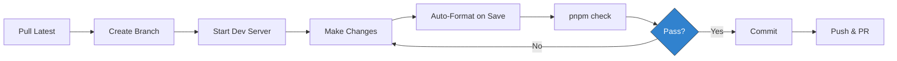
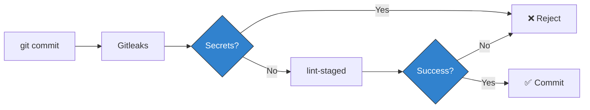

# Development Guide

Comprehensive guide for developing the **Team 4 Pro Coaching** website. This
document covers environment setup, tooling, daily workflows, and
troubleshooting.

## Table of Contents

- [Objectives](#objectives)
- [Prerequisites](#prerequisites)
- [Initial Setup](#initial-setup)
- [Development Environment](#development-environment)
- [AI-Assisted Development](#ai-assisted-development)
- [Daily Workflow](#daily-workflow)
- [Available Scripts](#available-scripts)
- [Code Quality Tools](#code-quality-tools)
- [SonarLint Connected Mode](#sonarlint-connected-mode)
- [Git Hooks](#git-hooks)
- [Troubleshooting](#troubleshooting)
- [Reference](#reference)

---

## Objectives

The development workflow is designed around these principles from the
[Architecture Overview](ARCHITECTURE.md):

1. **Deterministic Builds**: Identical environments across local, CI/CD, and
   production
2. **Fast Feedback**: Automated quality checks catch issues before code review
3. **Developer Experience**: Minimal configuration, maximum automation
4. **Type Safety**: TypeScript-first approach with strict validation

---

## Prerequisites

> ⚠️ **Important**: This project uses **strict version pinning**
> ([ADR-0006](adr/_archive/0006-enforce-strict-environment-and-dependency-pinning.md)).
> Installation will fail if versions don't match exactly.

### Required Software

| Tool        | Version                              | Purpose                         | Installation                                                                                                       |
| :---------- | :----------------------------------- | :------------------------------ | :----------------------------------------------------------------------------------------------------------------- |
| **Node.js** | `v24.12.0` (exact, matches `.nvmrc`) | JavaScript runtime              | [nvm](https://github.com/nvm-sh/nvm) recommended                                                                   |
| **pnpm**    | `≥10.0.0`                            | Package manager                 | Managed via Corepack                                                                                               |
| **gh**      | Latest                               | GitHub CLI for PR/issue queries | `winget install --id GitHub.cli` (Windows) or [cli.github.com](https://cli.github.com/). Run `gh auth login` once. |
| **Git**     | Latest                               | Version control                 | [git-scm.com](https://git-scm.com/)                                                                                |
| **VS Code** | Latest                               | Code editor                     | [code.visualstudio.com](https://code.visualstudio.com/)                                                            |

> **How version pinning works**: `.nvmrc` pins the exact Node.js version for
> local development (`nvm use` reads it). The `engines` field in `package.json`
> sets a minimum (`>=24.12.0`) as a compatibility guard — pnpm rejects installs
> on older versions when `engine-strict=true` is set in `.npmrc`.

### Node.js Setup

**Using nvm (recommended):**

```bash
# Install nvm (if not already installed)
curl -o- https://raw.githubusercontent.com/nvm-sh/nvm/v0.40.0/install.sh | bash

# Install and use the correct Node.js version (reads .nvmrc)
nvm install
nvm use

# Verify version (must output: v24.12.0)
node --version
```

**Without nvm:** Download Node.js `v24.12.0` from
[nodejs.org](https://nodejs.org/).

### pnpm Setup

pnpm is managed via **Corepack** (built into Node.js 16+):

```bash
# Enable Corepack
corepack enable

# Verify pnpm is available (should output: 10.26.1)
pnpm --version
```

**Manual installation (if Corepack fails):**

```bash
npm install -g pnpm@10.26.1
```

### GitHub CLI Setup

The GitHub CLI is required for read-only PR and issue queries from automation
tooling. Install via package manager, then authenticate once:

```bash
# Install (Windows; for other platforms see cli.github.com)
winget install --id GitHub.cli

# Authenticate (browser flow or PAT)
gh auth login

# Verify
gh auth status
```

### Git Signing (Required)

Configure commit signing for verification:

```bash
# Option 1: GPG signing
git config --global commit.gpgsign true
git config --global user.signingkey <YOUR_GPG_KEY_ID>

# Option 2: SSH signing (Git 2.34+, recommended)
git config --global gpg.format ssh
git config --global user.signingkey ~/.ssh/id_ed25519.pub
```

---

## Initial Setup

### 1. Clone Repository

```bash
git clone https://github.com/team4procoaching/website.git
cd website
```

### 2. Environment Verification

```bash
# Verify Node.js version (must be exactly 24.12.0)
node --version

# Verify pnpm is available
pnpm --version

# Verify Git signing
git config --get commit.gpgsign
```

### 3. Install Dependencies

```bash
pnpm install
```

> ℹ️ **What happens**:
>
> - pnpm validates Node.js version against `engines` field
> - Dependencies are installed with **exact versions** (no `^` or `~` ranges)
> - Dependencies are hard-linked from global store (saves disk space)

**If installation fails with "The engine 'node' is incompatible":** Use
`nvm use` to switch to the correct version (24.12.0).

### 4. Setup Git Hooks

```bash
pnpm prepare
```

This installs two Git hooks:

- **pre-commit**: Gitleaks (secret scanning) + lint-staged (formatting)
- **commit-msg**: Validates Conventional Commits format

### 5. Verify Installation

```bash
pnpm check
```

This runs `typecheck` → `lint` → `format:check` → `check:conventions`. If all
commands complete without errors, your environment is correctly configured.

---

## Development Environment

### VS Code Extensions

The following extensions are auto-suggested when opening the project:

| Extension        | ID                          | Purpose                           |
| :--------------- | :-------------------------- | :-------------------------------- |
| **Astro**        | `astro-build.astro-vscode`  | Syntax highlighting, IntelliSense |
| **Biome**        | `biomejs.biome`             | Real-time linting and formatting  |
| **Prettier**     | `esbenp.prettier-vscode`    | Formatting for Astro/Markdown     |
| **Tailwind CSS** | `bradlc.vscode-tailwindcss` | IntelliSense for Tailwind classes |

### Editor Configuration

The project includes VS Code settings (`.vscode/settings.json`) that enforce:

- **Format on Save**: Automatic formatting when you save
- **Default Formatter**: Biome for code, Prettier for content
- **Auto-fix**: Linting issues fixed on save
- **Visual Ruler**: Line at 100 characters

**Hybrid Strategy** (per
[ADR-0004](adr/0004-use-hybrid-formatting-biome-and-prettier.md)):

| File Type                                | Formatter |
| :--------------------------------------- | :-------- |
| `.js`, `.ts`, `.json`, `.css`            | Biome     |
| `.astro`, `.md`, `.mdx`, `.yml`, `.yaml` | Prettier  |

### Tailwind CSS v4

Tailwind v4 uses custom at-rules (`@theme`, `@plugin`, `@source`). The project
configures both VS Code and Biome to ignore false warnings for these.

---

## AI-Assisted Development

This project uses Claude Code with a structured subagent architecture for
requirements analysis, design, implementation, and review. Before starting
AI-assisted work, read **[AGENTS.md](AGENTS.md)** — it documents the
orchestrator model, the seven specialized subagents, and how a task flows
through the phases.

Key points for daily work:

- You talk to one session (the Orchestrator). It delegates to subagents defined
  in `.claude/agents/`.
- Commits are still owner-signed. The implementer stages files and prepares
  `.git/COMMIT_EDITMSG`; you run `git commit -S -F .git/COMMIT_EDITMSG`.
- Bash permissions are limited by `.claude/settings.json`. State-changing git
  commands, shell wrappers, and foreign runtimes are denied at the tool level.
  Expect `ask` prompts for operations like `git add`, `pnpm exec`, `npx`, and
  `node`.
- Agent outputs (requirements, concept, review documents) live under
  `.claude/work/<task-id>/` inside the feature worktree. They are gitignored and
  never land on main. When the PR merges, the Orchestrator removes the worktree
  and the task docs vanish with it; persistent outputs (ADRs, debt register
  entries, code) live on main.

For the big picture, see AGENTS.md. For the working rules the implementer
follows during coding, see CLAUDE.md.

---

## Daily Workflow

### Typical Flow



### Step-by-Step

#### 1. Sync with Main

```bash
git checkout main
git pull origin main
```

#### 2. Create Feature Branch

```bash
git checkout -b feat/add-testimonials-section
git checkout -b fix/mobile-navigation-overflow
git checkout -b docs/update-readme
```

#### 3. Start Development Server

```bash
pnpm dev
```

**Access**: `http://localhost:4321`

**Features**:

- Instant hot reload for `.astro`, `.ts`, `.md` changes
- CSS changes apply without page refresh
- TypeScript errors show in browser overlay

#### 4. Make Changes

Edit files in `src/` and `scripts/`. For the full project structure, see
[ARCHITECTURE.md → Project Structure](ARCHITECTURE.md#project-structure).

**Best Practices**:

- Keep components small and focused
- Place components in appropriate subfolder
  ([ADR-0007](adr/_archive/0007-component-folder-structure.md))
- Use TypeScript for type safety
- Use PascalCase for component names
- Use shared types from `~/types/` for consistency (e.g., `ImageSource`,
  `ImageProp`) and `SmartImage` for all content images
  ([ADR-0010](adr/0010-use-astro-image-component-consistently.md))
- Use utility functions from `~/utils/` (e.g., `slugify`)

#### Adding Images

Images use the `ImageSource` type. How you create one depends on the source:

```typescript
// Local asset (imported) — dimensions are automatic
import photo from '~/assets/images/photo.jpg';
const image: ImageSource = { kind: 'local', src: photo };

// Remote URL — dimensions must be explicit
import { remoteImage } from '~/types/components';
const image = remoteImage('https://cdn.example.com/photo.jpg', 800, 600);
```

Use `SmartImage` in templates — it handles Astro's type overloads internally:

```astro
<SmartImage src={image} alt="Description" widths={[400, 800]} />
```

For small decorative images (≤ 64px, e.g. avatars), plain `` is acceptable.

**Remote image optimization:** To enable Astro's build-time optimization
(WebP/AVIF conversion, srcset generation) for remote images, their domain must
be added to `image.domains` in `astro.config.mjs`:

```javascript
// astro.config.mjs
export default defineConfig({
  image: {
    domains: ['cdn.team4pro.com'],
  },
});
```

Without this, remote images still render correctly but are served in their
original format without optimization. This is fine for development placeholders
but should be configured when production image domains are known.

#### 5. Run Quality Checks

```bash
pnpm check
```

This runs `typecheck` → `lint` → `format:check` → `check:conventions`. See
[Script Details](#script-details) for the full breakdown. These same checks also
run in CI via the [Quality workflow](../.github/workflows/quality.yml) on every
PR.

#### 6. Fix Issues (if needed)

```bash
pnpm fix
```

Auto-fixes linting issues and formats all files.

#### 7. Commit Changes

```bash
git add .
git commit -m "feat(testimonials): add customer testimonials section"
```

Git hooks automatically validate secrets and commit message format.

#### 8. Push and Create PR

```bash
git push origin feat/add-testimonials-section
gh pr create --title "feat(testimonials): add customer testimonials section"
```

---

## Available Scripts

### Development

| Script      | Command        | Description                          |
| :---------- | :------------- | :----------------------------------- |
| **dev**     | `pnpm dev`     | Start dev server at `localhost:4321` |
| **build**   | `pnpm build`   | Build static site to `dist/`         |
| **preview** | `pnpm preview` | Preview production build locally     |

### Quality Assurance

| Script                | Command                  | Description                               |
| :-------------------- | :----------------------- | :---------------------------------------- |
| **check**             | `pnpm check`             | Run all quality checks (matches CI scope) |
| **check:conventions** | `pnpm check:conventions` | Check project-specific conventions        |
| **fix**               | `pnpm fix`               | Auto-fix linting and formatting           |
| **typecheck**         | `pnpm typecheck`         | Run TypeScript type checking only         |
| **lint**              | `pnpm lint`              | Run Biome linter (check only)             |
| **lint:fix**          | `pnpm lint:fix`          | Auto-fix Biome linting issues             |

### Testing

| Script       | Command         | Description                              |
| :----------- | :-------------- | :--------------------------------------- |
| **test**     | `pnpm test`     | Run tests in watch mode (development)    |
| **test:run** | `pnpm test:run` | Run tests once (CI / local verification) |

Test files are co-located with their source (e.g., `slugify.ts` →
`slugify.test.ts`). See
[ADR-0016](adr/_archive/0016-use-vitest-for-unit-testing.md).

### Formatting

| Script               | Command                 | Description                                            |
| :------------------- | :---------------------- | :----------------------------------------------------- |
| **format**           | `pnpm format`           | Organize imports + format all files (Biome + Prettier) |
| **format:check**     | `pnpm format:check`     | Check formatting without changes                       |
| **format:biome**     | `pnpm format:biome`     | Format JS/TS/JSON/CSS only                             |
| **format:prettier**  | `pnpm format:prettier`  | Format Astro/Markdown only                             |
| **organize-imports** | `pnpm organize-imports` | Sort and organize imports (all files incl. `.astro`)   |

### Maintenance

| Script                | Command                  | Description              |
| :-------------------- | :----------------------- | :----------------------- |
| **prepare**           | `pnpm prepare`           | Setup Husky Git hooks    |
| **validate:renovate** | `pnpm validate:renovate` | Validate Renovate config |

### Script Details

#### `pnpm check`

```bash
pnpm typecheck && pnpm lint && pnpm format:check && pnpm check:conventions
```

**Use before every commit.** Runs the same checks as the CI quality workflow
(`quality.yml`). Locally the `&&` chain is fail-fast — the first error stops the
pipeline. In CI, all four checks run independently so you see all failures at
once. The convention checker (`scripts/check-conventions.mjs`) covers rules
Biome cannot express — see
[CONVENTIONS.md → Style Guide Baseline](CONVENTIONS.md#style-guide-baseline).

#### `pnpm fix`

```bash
pnpm lint:fix && pnpm format
```

Two-phase process:

1. **Lint phase**: Auto-fixes code issues (unused imports, missing semicolons)
2. **Format phase**: Applies consistent code style

#### `pnpm format`

Three-phase formatting pipeline:

```bash
# Phase 1: Biome organizes imports (all files including .astro frontmatter)
biome check --write --formatter-enabled=false --linter-enabled=false .

# Phase 2: Biome formats code files (.js, .ts, .json, .css)
biome format --write .

# Phase 3: Prettier formats content files (.astro, .md, .mdx, .yml)
prettier --write "**/*.{astro,md,mdx,yml,yaml}"
```

Import sorting runs first because both Biome and Prettier may reformat the
result. VS Code achieves the same via `codeActionsOnSave` (Biome organizes
imports) followed by the language-specific formatter (Biome or Prettier).

---

## Code Quality Tools

### Tool Matrix

| Tool            | Purpose                               | File Types                                                  | Config             |
| :-------------- | :------------------------------------ | :---------------------------------------------------------- | :----------------- |
| **Biome**       | Linting + Formatting + Import Sorting | `.js`, `.ts`, `.json`, `.css` (imports: all incl. `.astro`) | `biome.json`       |
| **Prettier**    | Formatting                            | `.astro`, `.md`, `.mdx`, `.yml`, `.yaml`                    | Built-in defaults  |
| **Vitest**      | Unit Testing                          | `.test.ts`                                                  | `vitest.config.ts` |
| **TypeScript**  | Type Checking                         | `.ts`, `.astro`                                             | `tsconfig.json`    |
| **Gitleaks**    | Secret Scanning                       | All files                                                   | `.gitleaks.toml`   |
| **commitlint**  | Commit Messages                       | Git commits                                                 | Conventional       |
| **lint-staged** | Pre-commit Hook                       | Staged files                                                | `package.json`     |

### Biome Configuration

**File**: `biome.json`

**Key Settings**:

```json
{
  "formatter": {
    "indentStyle": "space",
    "indentWidth": 2,
    "lineWidth": 100,
    "includes": ["**", "!**/*.astro"]
  },
  "javascript": {
    "formatter": {
      "quoteStyle": "single",
      "semicolons": "always",
      "trailingCommas": "all"
    }
  }
}
```

**Astro Exclusion**: `.astro` files are excluded from Biome because it only
analyzes frontmatter, causing false "unused import" warnings.

**Enabled Rules**:

- **Recommended**: Standard best practices
- **Style**: Code consistency
- **Accessibility**: Enforced (except SVG title)
- **Suspicious**: Warnings for potential bugs

### lint-staged Configuration

Formats only **staged files** during pre-commit:

```json
{
  "lint-staged": {
    "*.{js,jsx,ts,tsx,cjs,mjs}": ["biome check --write ..."],
    "*.{json,css}": ["biome format --write ..."],
    "*.{astro,md,mdx,yml,yaml}": ["prettier --write --cache"]
  }
}
```

**Performance**: Typically completes in <1 second.

---

## SonarLint Connected Mode

The
[SonarQube for IDE](https://marketplace.visualstudio.com/items?itemName=SonarSource.sonarlint-vscode)
VS Code extension (formerly "SonarLint") runs in **Connected Mode** against this
project's SonarCloud organisation. When connected, it surfaces the same findings
SonarCloud reports — at edit time, before push — so issues never make it into a
PR. See [ADR-0041](adr/0041-sonarlint-connected-mode-local-prevention.md) for
the architectural rationale.

> Note: SonarSource rebranded the extension to "SonarQube for IDE"; the
> marketplace title and Extensions-view entry now use that name. The install ID
> (`SonarSource.sonarlint-vscode`) and the command-palette entries
> (`SonarLint: Connect to SonarCloud`, etc.) keep the original SonarLint name.

### Prerequisites

| Requirement      | Notes                                                                                        |
| :--------------- | :------------------------------------------------------------------------------------------- |
| **VS Code**      | Workspace open prompts the recommendation via `.vscode/extensions.json`                      |
| **Java Runtime** | Bundled JRE 21 ships with the extension on Windows, macOS, and Linux x64 — no install needed |
| **SonarCloud**   | Project access on the configured organisation (owner-managed)                                |

The bundled JRE covers Windows x64, macOS (Intel and Apple Silicon), and Linux
x64. See SonarSource's
[Requirements](https://docs.sonarsource.com/sonarqube-for-ide/vs-code/getting-started/requirements/)
page for the authoritative platform matrix.

### Token Model

No SonarCloud token ships in this repository. The five authentication paths
involved each store their credentials elsewhere:

- The committed `.sonarlint/connectedMode.json` carries the SonarCloud
  organisation slug and project key. Both are public identifiers visible in
  SonarCloud URLs and are not secrets.
- The personal access token used by VS Code SonarLint lives in VS Code's
  encrypted SecretStorage after the connect step. Never paste it into any file
  under version control.
- The personal access token used by the agent-side findings query
  (`pnpm query:sonar-findings`) lives in `.env.local` at the repository root.
  That file is gitignored; only the `.env.local.example` template is committed.
  See [Agent-Side Findings Query](#agent-side-findings-query) below.
- SonarCloud's Automatic Analysis on pull requests authenticates via the GitHub
  App integration configured on the SonarCloud project. No repo-side token is
  required.
- If a future change introduces a `sonar-scanner` step in CI, that step reads a
  `SONAR_TOKEN` from GitHub Actions secrets — also never committed.

### First-Time Setup

Estimated time: ~2 minutes per developer.

#### 1. Install the Extension

VS Code prompts on workspace open via the recommendation in
`.vscode/extensions.json`. Accept the prompt, or install manually:

- Search the Extensions view for **SonarQube for IDE**, or
- Install by ID: `SonarSource.sonarlint-vscode`.

#### 2. Generate a SonarCloud Token

Open <https://sonarcloud.io/account/security> and generate a personal token. Use
a name that identifies the device, for example
`team4procoaching-website-laptop`. Copy the token — SonarCloud only shows it
once.

> ⚠️ **Never paste the token into any file in this repository.** It must not
> appear in `.vscode/settings.json`, `.sonarlint/`, environment files, or
> anywhere else under version control. The next step stores it in VS Code's
> encrypted SecretStorage, which is the correct location.

#### 3. Connect VS Code to SonarCloud

1. Open the Command Palette (`Ctrl+Shift+P` / `Cmd+Shift+P`).
2. Run `SonarLint: Connect to SonarCloud`.
3. Paste the token when prompted.

The token is now stored in VS Code SecretStorage. The binding to this project is
read from `.sonarlint/connectedMode.json`, which is checked into the repository.

#### 4. Confirm the Binding

After connecting, run `SonarLint: Share Connected Mode Configuration` from the
Command Palette. This regenerates `.sonarlint/connectedMode.json` with the
current `sonarCloudOrganization` and `projectKey` values. If the file content
changes versus the committed version, open a small follow-up PR with the
regenerated file. That PR is the bind-completion signal.

### What SonarLint Does Not Replace

SonarLint Connected Mode is **additive**. It surfaces the SonarCloud rule set at
edit time; it does not replace any existing local check:

- **Biome lint** (`pnpm lint`) — project-specific lint rules, runs in CI.
- **Prettier formatting** (`pnpm format`) — Markdown, Astro, YAML.
- **TypeScript** (`pnpm typecheck`) — type safety.
- **Pre-commit hooks** — Gitleaks (secrets) and lint-staged (formatting).

The local check chain remains the gate. SonarLint is the early-warning layer
that prevents SonarCloud findings from reaching the post-push analysis in the
first place.

### Agent-Side Findings Query

The `pnpm query:sonar-findings` script queries SonarCloud's REST API for
findings on a defined file set and prints them as a human-readable table or as
stable JSON. It complements
[SonarLint Connected Mode](#sonarlint-connected-mode) above: SonarLint covers
humans editing in VS Code, while this script covers automated contributors that
do not run an editor extension. Both layers share the binding from
`.sonarlint/connectedMode.json` so a single source of truth governs which
SonarCloud project is queried. See
[ADR-0042](adr/0042-agent-side-sonarcloud-findings-query.md) for the
architectural rationale.

The script is a **lookup, not a build gate**. It reports what SonarCloud already
knows about a file as of the last analysed branch state on the server. It cannot
predict findings on uncommitted or unpushed code; SonarCloud's Automatic
Analysis on pull requests remains the authoritative gate for new code.

Every endpoint the script queries — issues, hotspots, and duplications — is
scoped to the same branch axis. By default that axis is the current local
branch, so findings on a feature branch differ from findings on `main` (the
feature branch surfaces only what SonarCloud has analysed for it; new commits
that have not yet been pushed and analysed are invisible). Pass
`--branch=<name>` to override the local resolution, or `--pull-request=<n>` to
scope queries to a specific pull-request analysis instead. The override flags
exist for the cases where the local branch name is not a useful query target:
detached-HEAD checkouts, CI ephemeral checkouts, post-rebase verification, and
`git worktree add <sha>` results where no branch ref is attached. `--branch` and
`--pull-request` are mutually exclusive. When SonarCloud has not yet analysed
the requested branch (or the supplied pull-request id is unknown), the script
surfaces a clear warning naming the branch axis and exits 0 — the condition is
informational, not a failure, and clears as soon as the branch is pushed and
analysis completes.

#### First-Time Setup

Estimated time: ~1 minute per developer.

1. **Generate a SonarCloud token.** Open
   <https://sonarcloud.io/account/security> and generate a personal token. If
   you already created one for VS Code SonarLint, you can reuse it or generate a
   separate token for the script — both work.
2. **Copy the example file and fill in the token.**

   ```bash
   cp .env.local.example .env.local
   ```

   Open `.env.local` and paste the token after `SONAR_TOKEN=`. The file is
   gitignored and must never be committed.

3. **Verify.** Run the script against the current branch:

   ```bash
   pnpm query:sonar-findings
   ```

   The script prints a banner naming the analysis basis, then a findings table
   for the files this branch has touched since branching off `main`.

The token is optional for this public project — SonarCloud's issues endpoint
serves data unauthenticated for public repositories. Setting `SONAR_TOKEN`
raises the rate-limit ceiling and is required if the project ever turns private.

#### Common Usage

```bash
# Default — query findings on files changed since main.
pnpm query:sonar-findings

# JSON envelope (stable shape for agent consumers).
pnpm query:sonar-findings --json

# Explicit file list (comma-separated; bypasses git diff resolution).
pnpm query:sonar-findings --files src/foo.ts,src/bar.ts

# Bypass the .sonar-cache TTL cache and force a fresh fetch.
pnpm query:sonar-findings --no-cache

# Query the entire project (mutually exclusive with --files).
pnpm query:sonar-findings --all
```

Run `pnpm query:sonar-findings --help` for the full flag list, including
`--cache-ttl-seconds=N` (override the 5-minute default) and
`--default-branch=<name>` (when the local repository's default branch is not
`main`).

The script writes a small JSON cache under `.sonar-cache/` (gitignored) keyed by
the requested file set and query parameters. The cache absorbs repeat
invocations within a typical agent task without re-hitting SonarCloud's
rate-limit budget.

#### Hotspots Coverage

SonarCloud splits its finding taxonomy across two endpoints. The default script
queries `/api/issues/search` only, which leaves **Security Hotspots** (rules
such as `javascript:S5852` for super-linear regex backtracking, or
`javascript:S4036` for OS-command-search-path sensitivity) outside the agent's
view. The `--include-hotspots` flag closes that gap by additionally fetching
`/api/hotspots/search` for the same project + file scope.

```bash
# Pretty output with both findings and hotspots.
pnpm query:sonar-findings --include-hotspots

# JSON envelope; gains a top-level `hotspots: [...]` array.
pnpm query:sonar-findings --include-hotspots --json
```

Browse the same data on the SonarCloud UI under the
[Security Hotspots tab](https://sonarcloud.io/project/security_hotspots?id=team4procoaching_website).

The lifecycle filter runs client-side (the SonarCloud endpoint accepts neither
`status=` nor `resolution=` URL parameters): `TO_REVIEW` and
`REVIEWED+ACKNOWLEDGED` hotspots reach the output, while `REVIEWED+SAFE` and
`REVIEWED+FIXED` are filtered out as resolved noise.

#### Duplications Coverage

SonarCloud's third finding class — **duplicated blocks** — lives behind a
separate endpoint (`/api/duplications/show`) and is opt-in. The
`--include-duplications` flag fetches duplications for the same project + file
scope as the issues path, surfaces them under a `Duplicated Blocks:` section in
pretty mode, and adds a top-level `duplications: [...]` array in JSON mode.

```bash
# Pretty output with issues, hotspots, and duplications.
pnpm query:sonar-findings --include-hotspots --include-duplications

# JSON envelope with all three finding classes.
pnpm query:sonar-findings --include-hotspots --include-duplications --json
```

The fetch shape differs by mode. On the default path and on `--files <list>`,
the script iterates the resolved file set and issues one
`/api/duplications/show` request per file. On `--all`, the script first issues a
`/api/measures/component_tree` query (paginated, capped at 5000 components) to
find which files have a non-zero `duplicated_lines` measure, then iterates
`/api/duplications/show` only over that subset. Without the measures pre-fetch,
`--all` against the full project would issue one round-trip per source file with
most returning empty payloads — the chained fetch trades one cheap measures call
for skipping the per-file calls that would have nothing to report.

Findings carry the synthetic rule key `sonarcloud:duplicated-block`. The key is
synthetic because SonarCloud's duplications metric does not surface a rule
registry entry comparable to `typescript:S1234`; the underlying metric reports
under `common-js:DuplicatedBlocks` and `common-ts:DuplicatedBlocks` per
language. The `sonarcloud:` prefix signals that the agent surface adds an
identifier the SonarCloud rule registry does not, and lets consumers filter or
group duplicated-block findings the same way they handle ordinary rule keys.

The branch-axis fallback applies here too: if SonarCloud has not yet analysed
the queried branch, the duplications endpoint returns HTTP 404, the script emits
the same branch-not-analysed warning the issues and hotspots paths emit, the
duplications array surfaces empty, and the script exits 0. Push the branch and
wait for the next analysis to populate the data.

#### Limitations

The script reports findings against the **last analysed branch state on
SonarCloud**. New code in commits that have not yet been pushed, and code on
branches that SonarCloud has not yet analysed, are not visible. SonarCloud's
Automatic Analysis on the pull request — triggered after push — remains the gate
for new code. Treat this script as a fast lookup of existing baseline, not as a
predictive analyser.

#### Expected Stderr Noise on First Run

Node 24's `--env-file-if-exists=` flag prints
`.env.local not found. Continuing without it.` to stderr when the file is
absent. That advisory line precedes the script's own banner on a fresh clone
that has not yet copied `.env.local.example`. It is expected output, not an
error; the script proceeds normally without a token against this public project.
Once `.env.local` exists, the line goes away.

#### Troubleshooting

**Findings list is empty even though SonarCloud shows findings on this branch.**
Check that `.sonarlint/connectedMode.json` matches the project key on SonarCloud
— the script reads its binding from that file. Run
`pnpm query:sonar-findings --no-cache` to bypass any stale cache entry.

**Script reports an unauthenticated query in the banner warnings.** `.env.local`
does not exist or `SONAR_TOKEN` is unset. Copy `.env.local.example` to
`.env.local` and fill in the token. The script continues to work without a token
against this public project but is subject to a stricter rate limit.

**Script reports a rate-limit hit and falls back to the cache.** Normal under
heavy use. The cache TTL defaults to five minutes; subsequent invocations within
that window are served from cache automatically. Pass `--cache-ttl-seconds=N` to
widen or narrow the window.

### Troubleshooting

**"Not connected" status in the SonarLint panel.** Re-run
`SonarLint: Connect to SonarCloud` from the Command Palette. If the token is no
longer valid, regenerate it at <https://sonarcloud.io/account/security> and
re-bind.

**JRE-related errors on activation.** The bundled JRE may have failed to
extract. Uninstall and reinstall the extension; the JRE re-extracts on first
activation.

**Token expired or revoked.** Generate a new token at SonarCloud, then run
`SonarLint: Connect to SonarCloud` again to replace the stored value.

---

## Git Hooks

### Pre-commit Hook



**Phase 1: Secret Scanning** (Gitleaks)

Detects: API keys, private keys, passwords, cloud credentials.

**Phase 2: Code Formatting** (lint-staged)

Formats staged files by type.

### Commit-msg Hook

Validates commit message format:

- Must follow Conventional Commits
- **Scope is mandatory**
- Type must be from approved list
- Description must be present and lowercase

### Bypassing Hooks (Emergency Only)

```bash
git commit --no-verify -m "emergency: hotfix production issue"
```

> ⚠️ CI/CD will still run checks. Use only for urgent fixes.

---

## Troubleshooting

### Environment Issues

#### Node version mismatch

```
error: The engine "node" is incompatible with this module.
```

**Solution**:

```bash
nvm use
node --version  # Must be v24.12.0
```

#### pnpm not found

```bash
corepack enable
corepack prepare pnpm@10.26.1 --activate
```

#### Git hooks not working

```bash
pnpm prepare
```

### Build Issues

#### Build works locally but fails on Netlify

1. Check Netlify build logs for specific error
2. Verify versions match:
   ```bash
   node --version  # v24.12.0
   pnpm --version  # 10.26.1
   ```
3. Test production build locally:
   ```bash
   pnpm build
   pnpm preview
   ```

#### Slow build times

```bash
# Clean install (keeps lockfile intact)
rm -rf node_modules
pnpm install --frozen-lockfile

# Clear cache
rm -rf node_modules/.astro
pnpm build
```

### Astro 6 Specific Issues

#### Parse errors (`ts(1005)`, `ts(1002)`) in SVG elements

JSX comments (`{/* ... */}`) inside element attribute lists cause parse errors
in Astro 6's stricter JSX parser. Move the comment _before_ the element:

```astro
{/* ✅ Comment before element */}
<svg class="size-6" set:html={icon} />

{/* ❌ Comment between attributes — parse error */}
<svg class="size-6" {/* comment */} set:html={icon} />
```

#### `readonly` type mismatch (`ts(4104)`)

If a component receives a `readonly` array but the Props type declares a mutable
array, the stricter type checking in Astro 6 will reject it. Use `readonly T[]`
in Props when the source data is immutable:

```typescript
type Props = {
  items: readonly ItemType[]; // ✅ accepts readonly arrays
};
```

### Commit Issues

#### Commit rejected by commitlint

Ensure your commit follows Conventional Commits with scope:

```bash
# ✅ Good
feat(hero): add background image

# ❌ Bad
added new feature
```

#### Commit rejected by Gitleaks

A potential secret was detected. Either:

- Remove the secret and use environment variables
- If false positive: add to `.gitleaks.toml` allowlist with justification

### Development Server Issues

#### Changes not reflecting in browser

1. Hard refresh: `Ctrl + Shift + R` (Windows/Linux) or `Cmd + Shift + R` (macOS)
2. Clear service workers: DevTools → Application → Service Workers → Unregister
3. Restart dev server: Stop with `Ctrl+C`, then `pnpm dev`

### Biome Issues

#### False "unused import" warnings in Astro files

Verify `biome.json` excludes Astro files:

```json
{
  "formatter": { "includes": ["**", "!**/*.astro"] },
  "linter": { "includes": ["**", "!**/*.astro"] }
}
```

Restart IDE if warnings persist.

---

## Reference

### Project Documentation

| Document                              | Purpose                                  |
| :------------------------------------ | :--------------------------------------- |
| [README.md](../README.md)             | Project overview and quick start         |
| [ARCHITECTURE.md](ARCHITECTURE.md)    | Technical decisions and design rationale |
| [CONVENTIONS.md](CONVENTIONS.md)      | Coding patterns, naming, export style    |
| [MAINTENANCE.md](MAINTENANCE.md)      | Operational procedures, security, deps   |
| [CONTRIBUTING.md](../CONTRIBUTING.md) | Contribution guidelines and PR process   |
| [ADR Log](adr/)                       | Architecture Decision Records            |

### Key ADRs

| ADR                                                                            | Topic                    |
| :----------------------------------------------------------------------------- | :----------------------- |
| [0001](adr/_archive/0001-use-astro-js.md)                                      | Astro Framework          |
| [0002](adr/_archive/0002-use-pnpm-package-manager.md)                          | pnpm Package Mgr         |
| [0004](adr/0004-use-hybrid-formatting-biome-and-prettier.md)                   | Hybrid Formatting        |
| [0006](adr/_archive/0006-enforce-strict-environment-and-dependency-pinning.md) | Strict Versioning        |
| [0007](adr/_archive/0007-component-folder-structure.md)                        | Component Structure      |
| [0008](adr/_archive/0008-clarify-layouts-vs-components-layout.md)              | Layouts vs Components    |
| [0010](adr/0010-use-astro-image-component-consistently.md)                     | ImageSource & SmartImage |
| [0016](adr/_archive/0016-use-vitest-for-unit-testing.md)                       | Vitest Unit Testing      |

### Configuration Files

| File               | Purpose                      | Documentation                                                                         |
| :----------------- | :--------------------------- | :------------------------------------------------------------------------------------ |
| `biome.json`       | Linter/Formatter rules       | [biome.md](reference/biome.md) • [Biome Docs](https://biomejs.dev/)                   |
| `astro.config.mjs` | Astro framework config       | [Astro Config](https://docs.astro.build/en/reference/configuration-reference/)        |
| `package.json`     | Dependencies & scripts       | [npm Docs](https://docs.npmjs.com/cli/v10/configuring-npm/package-json)               |
| `vitest.config.ts` | Unit test runner config      | [Vitest Docs](https://vitest.dev/)                                                    |
| `.npmrc`           | pnpm configuration           | [pnpm .npmrc](https://pnpm.io/npmrc)                                                  |
| `.nvmrc`           | Node.js version pinning      | [nvm Docs](https://github.com/nvm-sh/nvm#nvmrc)                                       |
| `renovate.json`    | Dependency update automation | [Renovate Docs](https://docs.renovatebot.com/)                                        |
| `netlify.toml`     | Netlify build and deployment | [Netlify Config](https://docs.netlify.com/configure-builds/file-based-configuration/) |

### External Resources

**Astro**: [docs.astro.build](https://docs.astro.build/) •
[Discord](https://astro.build/chat)

**Tooling**: [Biome](https://biomejs.dev/) • [pnpm](https://pnpm.io/) •
[Prettier](https://prettier.io/) • [Tailwind CSS](https://tailwindcss.com/)

**Security**: [Gitleaks](https://gitleaks.io/) • [Semgrep](https://semgrep.dev/)
• [GitGuardian](https://www.gitguardian.com/)

**Deployment**: [Netlify Docs](https://docs.netlify.com/) •
[Netlify Status](https://www.netlifystatus.com/)

### Getting Help

1. Check this guide and related documentation
2. Search existing GitHub Issues
3. Create new Issue with `question` label

**For emergencies**: See
[MAINTENANCE.md → Emergency Procedures](MAINTENANCE.md#emergency-procedures)
