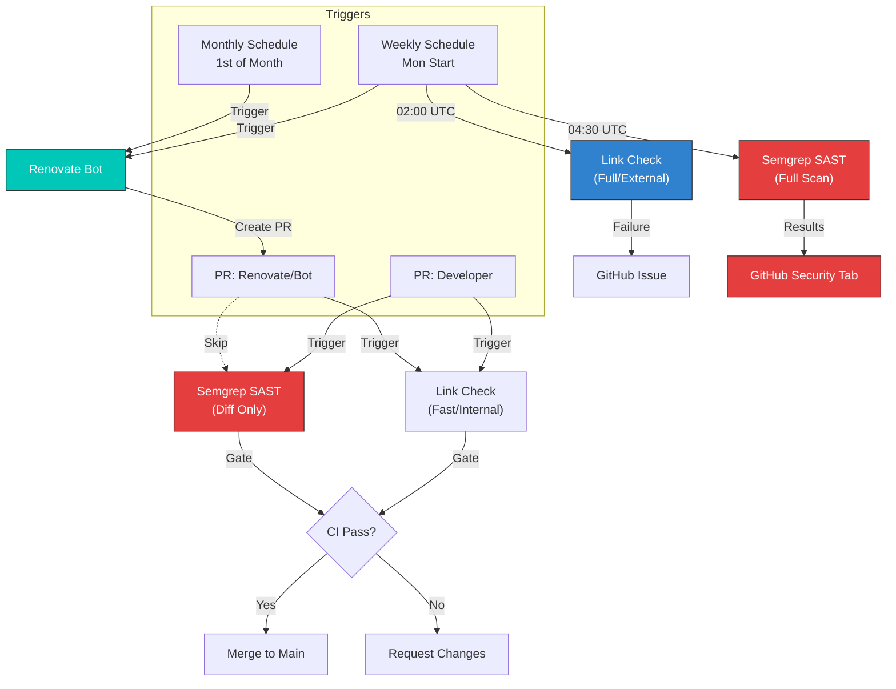

# Maintenance Guide

This document defines the operational procedures required to keep the **Team 4
Pro Coaching** website healthy, secure, and up-to-date.

## 📋 Table of Contents

- [Objectives](#-objectives)
- [Maintenance Lifecycle](#-maintenance-lifecycle)
- [Regular Maintenance Tasks](#-regular-maintenance-tasks)
- [Dependency Management](#-dependency-management)
- [Security Operations](#-security-operations)
- [Link Health Monitoring](#-link-health-monitoring)
- [Emergency Procedures](#-emergency-procedures)
- [Reference & Help](#-reference--help)

---

## 🎯 Objectives

The maintenance strategy follows the design principles defined in the
[Architecture Overview](./ARCHITECTURE.md):

1.  **Automation First**: We rely on Renovate and CI/CD to do the heavy lifting.
    Humans only review and approve.
2.  **Proactive Security**: We fix vulnerabilities in dependencies before they
    can be exploited.
3.  **Stability**: We accept updates only if they pass strict CI gates (Linting,
    Types, Security).
4.  **Zero Downtime**: Maintenance tasks should never impact the live site
    availability.

### Roles & Responsibilities

| Role               | Responsibility                               | Frequency    |
| :----------------- | :------------------------------------------- | :----------- |
| **Maintainer**     | Review Renovate PRs, monitor Security Alerts | Weekly (Mon) |
| **Developer**      | Fix CI failures, implement feature updates   | Ad-hoc       |
| **Content Editor** | Verify content rendering on Preview          | Ad-hoc       |

---

## 🔄 Maintenance Lifecycle

The following diagram visualizes the workflow for both scheduled maintenance and
ad-hoc security events:



---

## 📅 Regular Maintenance Tasks

### Weekly Routine (Mondays)

Renovate is configured to group updates and open PRs every Monday morning
(before 4am).

1.  **Check Dependency Dashboard**
    - Navigate to: GitHub Issues → "🔄 Dependency Updates Dashboard".
    - **Action**: Look for errors or rate limits. Check checkboxes to un-pause
      updates if needed.

2.  **Review Open PRs**
    - **Auto-Merge Candidates**: "Code Quality Tools" (Biome, Prettier, Husky)
      and minor/patch updates are configured to auto-merge if CI passes.
    - **Manual Review Required**:
      - **Astro Framework**: Updates are grouped but require manual approval to
        ensure no breaking rendering changes.
      - **Major Updates**: Always require manual testing.
    - **Security Updates**: These bypass the schedule and appear immediately.

3.  **Housekeeping**
    - Delete stale branches if not auto-deleted.
    - Check for "Pending" status in the dashboard (Renovate limits concurrent
      PRs to 5).

### Quarterly Audit

Every 3 months, perform a deeper health check:

1.  **Unused Dependencies**: Run `pnpm ls --depth=0` and remove unused packages
    from `package.json`.
2.  **Config Validation**:
    - Validate Renovate config: `pnpm validate:renovate`
    - Check for stricter Biome rules: `pnpm check`
3.  **Runtime Sync**: Verify that `engines` in `package.json` matches your
    production environment (currently set to Node >=24.x).

---

## 📦 Dependency Management

We use **Renovate Bot** with a strict configuration defined in
[`renovate.json`](../renovate.json).

### Update Strategy Matrix

| Type                | Example               | Automation Level                | Schedule                  |
| :------------------ | :-------------------- | :------------------------------ | :------------------------ |
| **Patch/Minor**     | `1.0.1` → `1.1.0`     | **High** (Auto-merge)           | Weekly (Mon)              |
| **Code Quality**    | `Biome`, `Husky`      | **High** (Grouped + Auto-merge) | Weekly (Mon)              |
| **Astro Framework** | `astro`, `@astrojs/*` | **Medium** (Grouped + Manual)   | Weekly (Mon)              |
| **Major**           | `1.0.0` → `2.0.0`     | **Low** (Manual Review)         | Weekly (Mon)              |
| **Runtime**         | `Node`, `pnpm`        | **Low** (Manual Review)         | **Monthly (1st day)**     |
| **Security**        | `CVE-2023-XYZ`        | **Immediate** (Priority)        | **Any time (1 day wait)** |

### Handling Major Updates

Major updates often introduce breaking changes. Follow this process:

1.  **Read the Changelog**: Renovate embeds this in the PR body. Look for
    "BREAKING CHANGES".
2.  **Local Test**:

    ```bash
    gh pr checkout <PR-NUMBER>
    pnpm install

    # Run the full quality suite (Types, Lint, Format)
    pnpm check

    # Verify the site visually
    pnpm dev
    ```

3.  **Fixing Issues**:
    - If linter errors occur: Run `pnpm fix` to auto-correct standard issues.
    - If logic breaks: Fix manually, commit, and push to the PR branch.

---

## 🔒 Security Operations

We operate on a **Defense in Depth** model utilizing automated scanning and
strict gates.

### 🛡️ Automated Scanning (Semgrep)

We use **Semgrep** via the [AppSec Platform](https://semgrep.dev) for Static
Application Security Testing (SAST). The configuration is defined in
[`.github/workflows/semgrep.yml`](../.github/workflows/semgrep.yml).

| Scan Type     | Trigger          | Scope              | Behavior                                                                  |
| :------------ | :--------------- | :----------------- | :------------------------------------------------------------------------ |
| **Diff Scan** | PR (Developers)  | Changed files only | **Blocking**. Fails the PR if high-severity issues are found.             |
| **Full Scan** | Monday 04:30 UTC | Entire Codebase    | **Monitoring**. detect "drift" or new vulnerability rules.                |
| **Bot Skip**  | PR (Renovate)    | -                  | Skipped to save resources (dependencies are checked via Renovate/Socket). |

**Viewing Results:**

- **PRs**: Failures appear directly in the PR checks.
- **Overview**: Go to **GitHub Repository → Security → Code scanning** to see
  the full SARIF report and historical trends.

### Handling Security Alerts

**Scenario A: Semgrep fails on your PR**

1.  Click "Details" on the failing CI check.
2.  Review the specific line of code flagged.
3.  **Fix**: Rewrite the code to be secure (e.g., sanitize input).
4.  **False Positive**: If the code is safe, add a comment
    `// nosemgrep: RULE_ID` above the line and explain why.

**Scenario B: Supply Chain Alert (Socket.dev/Renovate)**

1.  **Assess Severity**: Critical/High requires immediate action.
2.  **Verify Context**: Is the vulnerable function actually used?
3.  **Remediate**: Update the package or use `pnpm.overrides` if no patch
    exists.

**Scenario C: Secrets Leaked (GitGuardian)**

1.  **REVOKE** the credential immediately at the provider.
2.  **ROTATE** secrets in Netlify/GitHub.
3.  **CLEAN** git history (using BFG or `git filter-repo`).

---

## 🔗 Link Health Monitoring

Broken links damage SEO and user trust. We use **Lychee** to automate link
validation in two modes defined in
[`.github/workflows/links.yml`](../.github/workflows/links.yml).

### Scanning Strategy

| Mode          | Trigger          | Scope                   | Purpose                                                                                                  |
| :------------ | :--------------- | :---------------------- | :------------------------------------------------------------------------------------------------------- |
| **Fast Scan** | PR / Push        | **Internal Only**       | Prevents deploying broken relative links or missing assets. Blocks merging if failed.                    |
| **Full Scan** | Monday 02:00 UTC | **Internal + External** | Checks if external resources (blogs, documentation) are still online. Creates a GitHub Issue on failure. |

### Handling Link Failures

**Scenario A: PR Check Failed** The CI pipeline will fail with
`Link Check detected broken links`.

1.  Check the "Job Summary" in GitHub Actions.
2.  Fix the broken internal link or typo.
3.  Push the fix to update the PR.

**Scenario B: Weekly Issue Created** On Mondays, a GitHub Issue titled _"🔗 Link
Check Weekly Scan: Broken Links Detected"_ may appear.

1.  **Analyze**: Read the report snippet in the issue body.
2.  **Verify**: Check if the external site is truly down or just blocking bots
    (403/429 errors).
    - _Note_: We use a real User-Agent to minimize false positives.
3.  **Fix**:
    - **Dead Link**: Remove or replace the link in the content.
    - **False Positive**: Add the URL to `.lycheeignore` if it works in the
      browser but fails in CI (e.g., LinkedIn profiles often block bots).

### Configuration (`.lycheeignore`)

To exclude specific URLs from checking (e.g., localhost examples, private IPs,
or strict firewalls), add them to the `.lycheeignore` file in the root
directory:

````text
# Example .lycheeignore
[https://www.linkedin.com/in/](https://www.linkedin.com/in/)  # Blocks bots consistently
http://localhost:3000         # Local dev examples
[https://example.com/protected](https://example.com/protected) # Requires login


### Monthly Tasks (As Needed)

**1. Review Security Alerts (5 minutes)**

Check for:

- Dependabot/GitHub security advisories
- Renovate PRs with `security` label
- Socket.dev warnings in recent PRs

**2. Review Documentation (15 minutes)**

Check if any of these need updates:

- README.md
- docs/DEVELOPMENT.md
- docs/ARCHITECTURE.md
- This file (MAINTENANCE.md)

**3. Check Deployment Health (5 minutes)**

- Visit https://team4procoaching.com
- Verify site loads correctly
- Check Netlify dashboard for any issues
- Review build times (should be <2 minutes)

### Quarterly Tasks (Every 3 Months)

**1. Audit Dependencies (30 minutes)**

```bash
# Check for unused dependencies
pnpm ls --depth=0

# Check for outdated dependencies Renovate might have missed
pnpm outdated

# Review package.json
# - Remove unused dependencies
# - Verify all dependencies are still needed
````

---

## 🚨 Emergency Procedures

> **Critical**: In case of a major security breach or site outage, follow these
> steps strictly.

### Scenario A: Secrets Leaked to GitHub

**Trigger**: GitGuardian alert or manual discovery.

1.  **REVOKE** the credential immediately at the provider (e.g., Netlify,
    Contentful). **This stops the attack.**
2.  **ROTATE** secrets in Netlify Environment Variables / GitHub Secrets.
3.  **CLEAN** the git history (to stop security scanners from alerting):
    - Use [BFG Repo-Cleaner](https://rtyley.github.io/bfg-repo-cleaner/) or
      `git filter-repo`.
    - Force push to main (`git push --force`).
    - _Note: If revocation was successful, this step is for hygiene and
      silencing alerts._

### Scenario B: Production Broken (Bad Deploy)

**Trigger**: Site is offline or broken layout.

1.  **Go to Netlify Dashboard** → **Deploys**.
2.  Find the last successful deploy (green).
3.  Click **"Publish deploy"**.
    - _Result_: Instant rollback (Atomic deployment).
4.  **Revert** the bad merge in GitHub:
    ```bash
    git revert -m 1 <COMMIT-HASH>
    git push
    ```

---

## 📚 Reference & Help

### Project Documentation

- **[Architecture Overview](./ARCHITECTURE.md)** - System design & decision
  records.
- **[Development Guide](./DEVELOPMENT.md)** - Setup, commands, and local
  workflow.
- **[ADR Log](./adr/)** - History of architectural decisions.

### Configuration & Tooling

- **Dependency Management**:
  - [`renovate.json`](../renovate.json) - Configuration file.
  - [Renovate Docs](https://docs.renovatebot.com/) - Configuration options
    reference.
- **CI/CD Pipelines**:
  - [`.github/workflows/`](../.github/workflows/) - Workflow definitions.
  - [GitHub Actions Docs](https://docs.github.com/en/actions) - Syntax
    reference.
- **Code Quality**:
  - [`biome.json`](../biome.json) - Linter/Formatter rules.
  - [Biome Rules](https://biomejs.dev/linter/rules/) - Explanation of linter
    errors.
- **Security**:
  - [Semgrep Rules](https://semgrep.dev/registry) - Search for security
    patterns.
  - [Lychee (Link Check)](https://lychee.cli.rs/) - Command line options.

### Operational Dashboards

- **Hosting**: [Netlify Dashboard](https://app.netlify.com/) (Logs, Deploys,
  Domains).
- **Security**: [GitHub Security Tab](../../security) (Code Scanning,
  Dependabot).
- **Status Pages**:
  - [Netlify Status](https://www.netlifystatus.com/)
  - [GitHub Status](https://www.githubstatus.com/)

---

**Remember**: Most maintenance is automated. Your job is to monitor, review, and
handle exceptions. Trust the automation for routine tasks.
