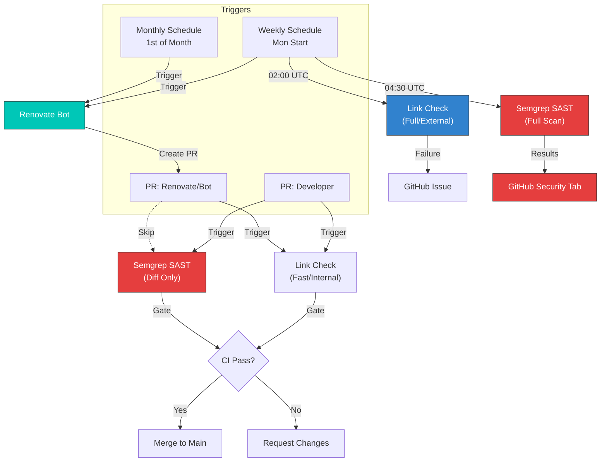

# Maintenance Guide

This document defines the operational procedures required to keep the **Team 4
Pro Coaching** website healthy, secure, and up-to-date.

## 📋 Table of Contents

- [Objectives](#-objectives)
- [Maintenance Lifecycle](#-maintenance-lifecycle)
- [Regular Maintenance Tasks](#-regular-maintenance-tasks)
- [Dependency Management](#-dependency-management)
- [Security Operations](#-security-operations)
- [Link Health Monitoring](#-link-health-monitoring)
- [Emergency Procedures](#-emergency-procedures)
- [Reference](#-reference)

---

## 🎯 Objectives

The maintenance strategy follows the design principles defined in the
[Architecture Overview](ARCHITECTURE.md):

| Principle              | Implementation                                     |
| :--------------------- | :------------------------------------------------- |
| **Automation First**   | Renovate and CI/CD do the heavy lifting            |
| **Proactive Security** | Fix vulnerabilities before they can be exploited   |
| **Stability**          | Updates accepted only if they pass strict CI gates |
| **Zero Downtime**      | Maintenance tasks never impact live site           |

### Roles & Responsibilities

| Role               | Responsibility                               | Frequency    |
| :----------------- | :------------------------------------------- | :----------- |
| **Maintainer**     | Review Renovate PRs, monitor Security Alerts | Weekly (Mon) |
| **Developer**      | Fix CI failures, implement feature updates   | Ad-hoc       |
| **Content Editor** | Verify content rendering on Preview          | Ad-hoc       |

---

## 🔄 Maintenance Lifecycle


```mermaid
graph TD
    subgraph "Triggers"
        Weekly[Weekly Schedule<br/>Mon Start]
        Monthly[Monthly Schedule<br/>1st of Month]
        PR_Human[PR: Developer]
        PR_Bot[PR: Renovate/Bot]
    end

    Weekly -->|Trigger| Renovate[Renovate Bot]
    Monthly -->|Trigger| Renovate

    Renovate -->|Create PR| PR_Bot

    PR_Human -->|Trigger| LinkFast["Link Check<br/>(Fast/Internal)"]
    PR_Human -->|Trigger| SemgrepDiff["Semgrep SAST<br/>(Diff Only)"]

    PR_Bot -->|Trigger| LinkFast
    PR_Bot -.->|Skip| SemgrepDiff

    Weekly -->|02:00 UTC| LinkFull["Link Check<br/>(Full/External)"]
    Weekly -->|04:30 UTC| SemgrepFull["Semgrep SAST<br/>(Full Scan)"]

    LinkFast -->|Gate| CI_Gate{CI Pass?}
    SemgrepDiff -->|Gate| CI_Gate

    LinkFull -->|Failure| Issue[GitHub Issue]
    SemgrepFull -->|Results| SecTab[GitHub Security Tab]

    CI_Gate -->|Yes| Merge[Merge to Main]
    CI_Gate -->|No| Fix[Request Changes]

    style SemgrepDiff fill:#e53e3e,stroke:#333,color:#fff
    style SemgrepFull fill:#e53e3e,stroke:#333,color:#fff
    style SecTab fill:#e53e3e,stroke:#333,color:#fff
    style Renovate fill:#00c7b7,stroke:#333,color:#fff
    style LinkFull fill:#3182ce,stroke:#333,color:#fff
```

---

## 📅 Regular Maintenance Tasks

### Weekly Routine (Mondays)

Renovate is configured to group updates and open PRs every Monday morning
(before 4am).

#### 1. Check Dependency Dashboard (5 min)

Navigate to: GitHub Issues → "📄 Dependency Updates Dashboard"

**Actions**:

- Look for errors or rate limits
- Check checkboxes to un-pause updates if needed

#### 2. Review Open PRs (10 min)

| PR Type              | Automation Level | Action               |
| :------------------- | :--------------- | :------------------- |
| **Code Quality**     | Auto-merge       | Monitor only         |
| **Patch/Minor**      | Auto-merge       | Monitor only         |
| **Astro Framework**  | Grouped, Manual  | Review rendering     |
| **Tailwind CSS**     | Grouped, Manual  | Verify styling       |
| **Major Updates**    | Manual           | Read changelog, test |
| **Security Updates** | Immediate        | Prioritize review    |

#### 3. Housekeeping (2 min)

- Delete stale branches if not auto-deleted
- Check for "Pending" status (Renovate limits concurrent PRs to 5)

### Monthly Tasks (As Needed)

#### 1. Review Security Alerts (5 min)

- Dependabot/GitHub security advisories
- Renovate PRs with `security` label
- Socket.dev warnings in recent PRs

#### 2. Review Documentation (15 min)

Check if updates needed:

- README.md
- docs/DEVELOPMENT.md
- docs/ARCHITECTURE.md
- docs/MAINTENANCE.md

#### 3. Check Deployment Health (5 min)

- Visit https://team4procoaching.com
- Verify site loads correctly
- Check Netlify dashboard for issues
- Review build times (should be <2 minutes)

### Quarterly Audit

#### 1. Unused Dependencies (15 min)

```bash
# List top-level dependencies
pnpm ls --depth=0

# Check for outdated packages Renovate might have missed
pnpm outdated
```

Remove unused dependencies from `package.json`.

#### 2. Config Validation (10 min)

```bash
# Validate Renovate config
pnpm validate:renovate

# Check for stricter Biome rules
pnpm check
```

#### 3. Runtime Sync (5 min)

Verify `engines` in `package.json` matches production environment.

---

## 📦 Dependency Management

We use **Renovate Bot** with configuration in
[`renovate.json`](../renovate.json).

### Update Strategy Matrix

| Type                | Example                         | Automation       | Schedule      |
| :------------------ | :------------------------------ | :--------------- | :------------ |
| **Patch/Minor**     | `1.0.1` → `1.1.0`               | Auto-merge       | Weekly (Mon)  |
| **Code Quality**    | Biome, Prettier, Husky          | Auto-merge       | Weekly (Mon)  |
| **Astro Framework** | `astro`, `@astrojs/*`           | Grouped + Manual | Weekly (Mon)  |
| **Tailwind CSS**    | `tailwindcss`, `@tailwindcss/*` | Grouped + Manual | Weekly (Mon)  |
| **Major**           | `1.0.0` → `2.0.0`               | Manual Review    | Weekly (Mon)  |
| **Runtime**         | Node, pnpm                      | Manual Review    | Monthly (1st) |
| **Security**        | CVE patches                     | Immediate        | Any time      |

### Handling Major Updates

Major updates often introduce breaking changes:

#### 1. Read the Changelog

Renovate embeds the changelog in the PR body. Look for "BREAKING CHANGES".

#### 2. Local Test

```bash
gh pr checkout <PR-NUMBER>
pnpm install

# Run full quality suite
pnpm check

# Verify visually
pnpm dev
```

#### 3. Fix Issues

- Linter errors: Run `pnpm fix`
- Logic breaks: Fix manually, commit, push to PR branch

---

## 🔒 Security Operations

We operate on a **Defense in Depth** model with automated scanning and strict
gates.

### Automated Scanning (Semgrep)

Configuration:
[`.github/workflows/semgrep.yml`](../.github/workflows/semgrep.yml)

| Scan Type     | Trigger          | Scope              | Behavior                              |
| :------------ | :--------------- | :----------------- | :------------------------------------ |
| **Diff Scan** | PR (Developers)  | Changed files only | Blocking (fails on high-severity)     |
| **Full Scan** | Monday 04:30 UTC | Entire Codebase    | Monitoring (detect drift)             |
| **Bot Skip**  | PR (Renovate)    | -                  | Skipped (deps checked via Socket.dev) |

**Rule Sources**:

- **Semgrep Platform**: Managed rulesets via `SEMGREP_APP_TOKEN`
- **Custom Rules**: `.semgrep/astro-rules.yml` — project-specific rules for
  Astro patterns (e.g., JSX comment placement). Loaded via `--config .semgrep/`
  in the workflow

**Viewing Results**:

- **PRs**: Failures in PR checks
- **Overview**: GitHub → Security → Code scanning

### Handling Security Alerts

#### Scenario A: Semgrep Fails on PR

1. Click "Details" on failing CI check
2. Review flagged code line
3. **Fix**: Rewrite code to be secure (e.g., sanitize input)
4. **False Positive**: Add `// nosemgrep: RULE_ID` with explanation

#### Scenario B: Supply Chain Alert (Socket.dev/Renovate)

1. **Assess Severity**: Critical/High requires immediate action
2. **Verify Context**: Is the vulnerable function actually used?
3. **Remediate**: Update package or use `pnpm.overrides` if no patch exists

#### Scenario C: Secrets Leaked (GitGuardian)

1. **REVOKE** credential immediately at the provider
2. **ROTATE** secrets in Netlify/GitHub
3. **CLEAN** git history (BFG or `git filter-repo`)

---

## 🔗 Link Health Monitoring

Broken links damage SEO and user trust. We use **Lychee** for automated link
validation.

Configuration: [`.github/workflows/links.yml`](../.github/workflows/links.yml)

### Scanning Strategy

| Mode          | Trigger          | Scope             | Purpose                             |
| :------------ | :--------------- | :---------------- | :---------------------------------- |
| **Fast Scan** | PR / Push        | Internal Only     | Prevents broken relative links      |
| **Full Scan** | Monday 02:00 UTC | Internal+External | Checks external resources are alive |

### Handling Link Failures

#### Scenario A: PR Check Failed

1. Check "Job Summary" in GitHub Actions
2. Fix broken internal link or typo
3. Push fix to update PR

#### Scenario B: Weekly Issue Created

Issue title: "🔗 Link Check Weekly Scan: Broken Links Detected"

1. **Analyze**: Read report snippet in issue body
2. **Verify**: Check if external site is down or blocking bots (403/429)
3. **Fix**:
   - **Dead Link**: Remove or replace in content
   - **False Positive**: Add URL to `.lycheeignore`

### Configuration (`.lycheeignore`)

Exclude specific URLs from checking:

```text
# Example .lycheeignore
https://www.linkedin.com/in/  # Blocks bots consistently
http://localhost:3000         # Local dev examples
https://example.com/protected # Requires login
```

---

## 🚨 Emergency Procedures

> **Critical**: In case of major security breach or site outage, follow these
> steps strictly.

### Scenario A: Secrets Leaked to GitHub

**Trigger**: GitGuardian alert or manual discovery.

1. **REVOKE** credential immediately at provider (stops attack)
2. **ROTATE** secrets in Netlify Environment Variables / GitHub Secrets
3. **CLEAN** git history:
   ```bash
   # Use BFG Repo-Cleaner or git filter-repo
   git push --force
   ```

### Scenario B: Production Broken (Bad Deploy)

**Trigger**: Site is offline or broken layout.

1. **Go to Netlify Dashboard** → **Deploys**
2. Find last successful deploy (green)
3. Click **"Publish deploy"** (instant rollback)
4. **Revert** bad merge in GitHub:
   ```bash
   git revert -m 1 <COMMIT-HASH>
   git push
   ```

### Scenario C: Build Failures

1. Check Netlify build logs for specific error
2. Test locally:
   ```bash
   rm -rf node_modules pnpm-lock.yaml
   pnpm install --frozen-lockfile
   pnpm build
   ```
3. Common causes: TypeScript errors, missing deps, invalid env vars, Node
   version mismatch

### Accessing Critical Systems

| System      | Access Method                        |
| :---------- | :----------------------------------- |
| **Netlify** | Contact organization owner           |
| **GitHub**  | Request repository access            |
| **DNS**     | Check registrar (documented offline) |

---

## 📚 Reference

### Project Documentation

| Document                              | Purpose                             |
| :------------------------------------ | :---------------------------------- |
| [ARCHITECTURE.md](ARCHITECTURE.md)    | System design & decision records    |
| [DEVELOPMENT.md](DEVELOPMENT.md)      | Setup, commands, and local workflow |
| [CONTRIBUTING.md](../CONTRIBUTING.md) | Contribution guidelines             |
| [ADR Log](adr/)                       | History of architectural decisions  |

### Configuration & Tooling

| Config                                        | Documentation                                             |
| :-------------------------------------------- | :-------------------------------------------------------- |
| [`renovate.json`](../renovate.json)           | [Renovate Docs](https://docs.renovatebot.com/)            |
| [`biome.json`](../biome.json)                 | [Biome Rules](https://biomejs.dev/linter/)                |
| [`.github/workflows/`](../.github/workflows/) | [GitHub Actions Docs](https://docs.github.com/en/actions) |

### Operational Dashboards

| Dashboard                                                                   | Purpose                   |
| :-------------------------------------------------------------------------- | :------------------------ |
| [Netlify Dashboard](https://app.netlify.com/)                               | Logs, Deploys, Domains    |
| [GitHub Security Tab](https://github.com/team4procoaching/website/security) | Code Scanning, Dependabot |
| [Netlify Status](https://www.netlifystatus.com/)                            | Platform Status           |
| [GitHub Status](https://www.githubstatus.com/)                              | Platform Status           |

---

**Remember**: Most maintenance is automated. Your job is to monitor, review, and
handle exceptions. Trust the automation for routine tasks.
